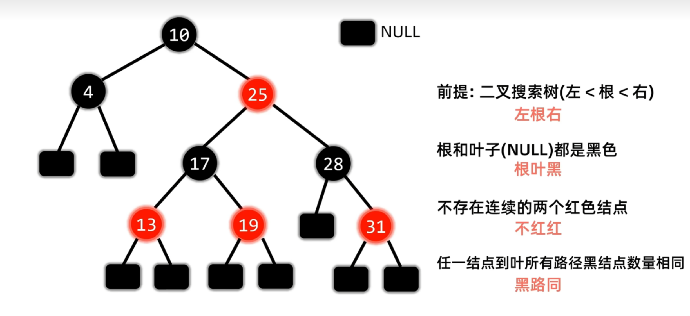
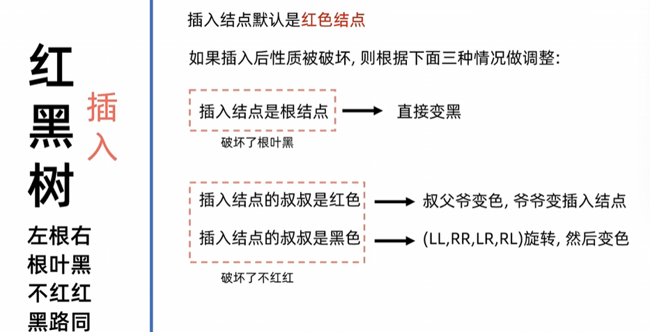
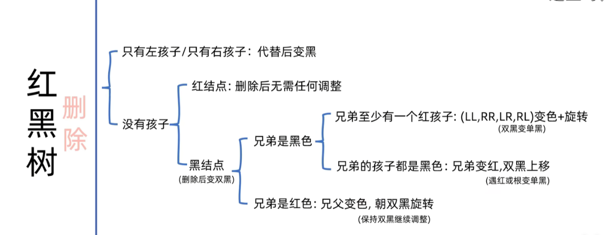

# C++ 学习笔记总整理

> 来源：`text.cpp`、`text2.cpp`、`text3.cpp` 及对应整理笔记。
> 范围：C++ 基础、面向对象、文件读写、模板、STL 容器、`map` / `multimap`、函数对象、谓词与常用算法。

## 总目录

1. 第一部分：C++ 基础与面向对象
2. 第二部分：文件读写与模板
3. 第三部分：STL 容器
4. 第四部分：`map`、函数对象与 STL 常用算法

## 第一部分：C++ 基础与面向对象


### 1. C++ 程序基础结构

常见头部：

```cpp
#define _CRT_SECURE_NO_WARNINGS
#include <iostream>
#include <string>
using namespace std;
```

说明：

- `#include <iostream>`：输入输出，如 `cout`、`cin`。
- `#include <string>`：使用 `string` 类型。
- `using namespace std;`：可以直接写 `cout`、`string`，不用写 `std::cout`、`std::string`。
- `_CRT_SECURE_NO_WARNINGS`：Visual Studio 中用于关闭某些 C 风格函数的安全警告。

学习阶段可以使用 `using namespace std;`；工程代码中更推荐写 `std::cout`、`std::string`，避免命名冲突。

### 2. 内存分区模型与 `new` / `delete`

C++ 程序运行时常被讲成四个主要区域：

| 区域 | 存放内容 | 生命周期 |
| --- | --- | --- |
| 代码区 | 函数编译后的二进制指令 | 由操作系统管理，只读、共享 |
| 全局区/静态区 | 全局变量、静态变量、全局常量、字符串常量等 | 程序结束后由操作系统释放 |
| 栈区 | 函数参数、局部变量等 | 编译器自动分配和释放 |
| 堆区 | `new` 申请的内存 | 程序员手动 `delete`，否则通常到程序结束才由系统回收 |

注意：这是一种常用教学模型，具体实现由编译器、操作系统、平台决定，C++ 标准本身不强制规定这些名字。

#### 2.1 全局变量、静态变量、局部变量

```cpp
int g_a = 10;              // 全局变量：通常在全局区/静态区
const int c_g_b = 10;      // 全局常量：通常在全局区/静态区

int* func()
{
    int* p = new int(10);  // 堆区
    return p;
}

int main()
{
    static int s_a = 10;   // 静态变量：通常在全局区/静态区
    int a = 10;            // 局部变量：栈区
    const int c_l_a = 10;  // 局部常量：通常仍在栈区或被优化

    cout << "字符串常量的地址: " << &"hello world" << endl;

    int* p = func();
    cout << *p << endl;

    delete p;
    p = nullptr;

    return 0;
}
```

#### 2.2 堆区申请和释放

单个对象：

```cpp
int* func()
{
    int* p = new int(10);
    return p;
}

void test01()
{
    int* p = func();
    cout << *p << endl;

    delete p;
    p = nullptr;
}
```

数组：

```cpp
void test02()
{
    int* arr = new int[10];

    for (int i = 0; i < 10; i++)
    {
        arr[i] = 100 + i;
    }

    delete[] arr;
    arr = nullptr;
}
```

记忆规则：

- `new int` 对应 `delete p`。
- `new int[10]` 对应 `delete[] arr`。
- 释放后把指针置为 `nullptr`，可以减少野指针风险。

### 3. 引用

引用可以理解成“给已有变量起别名”。初始化后，引用不能再绑定到别的对象。

```cpp
int a = 10;
int& b = a;   // b 是 a 的引用

b = 20;       // 修改 b 等价于修改 a
cout << a;    // 20
```

从实现角度看，很多编译器会把引用实现成类似“指针常量”的东西，例如 `int* const`，但在语言层面引用不是普通指针，使用时更像变量别名。

#### 3.1 引用作为函数参数

引用传参可以直接修改实参。

```cpp
void myswap(int& a, int& b)
{
    int temp = a;
    a = b;
    b = temp;
}

int main()
{
    int a = 10;
    int c = 30;

    myswap(a, c);

    cout << a << endl;  // 30
    cout << c << endl;  // 10
}
```

#### 3.2 引用作为函数返回值

不要返回局部变量的引用，因为局部变量会在函数结束后销毁。

可以返回静态变量的引用：

```cpp
int& test01()
{
    static int a = 10;
    return a;
}

int main()
{
    test01() = 1000;       // 返回引用，可以作为左值
    cout << test01();      // 1000
}
```

#### 3.3 常量引用

常量引用常用于函数形参，防止函数误修改数据。

```cpp
void showvalue(const int& val)
{
    cout << val << endl;
}

int main()
{
    int a = 100;
    showvalue(a);

    const int& ref = 10;
    // 编译器可理解为创建临时变量 int temp = 10，再让 ref 引用它
}
```

### 4. 函数进阶：默认参数、占位参数、函数重载

#### 4.1 默认参数

如果函数调用时没有传入参数，就使用默认值。

规则：

- 如果某个形参有默认值，那么它右边的所有形参都必须有默认值。
- 函数声明和函数实现中，只能有一个位置写默认参数，避免歧义。

```cpp
int func(int a, int b = 10, int c = 20)
{
    return a + b + c;
}
```

#### 4.2 占位参数

占位参数只有类型没有变量名，也可以有默认值。
没有默认值必须传如参数，有默认值可以省略
```cpp
void func(int a, int)
{
    cout << "占位参数" << endl;
}

void func2(int a, int = 10)
{
    cout << "带默认值的占位参数" << endl;
}
```

#### 4.3 函数重载

函数重载：同一个作用域中，函数名相同，但参数列表不同。

满足条件之一即可：

- 参数类型不同。
- 参数个数不同。
- 参数顺序不同。

注意：

- 返回值不能作为函数重载的判断条件。
- 引用参数、`const` 引用参数、默认参数都可能影响重载匹配。

```cpp
void func(int a, int)
{
    cout << "占位参数版本" << endl;
}

void func(int& a)
{
    cout << "int& 版本" << endl;
}

void func(const int& a)
{
    cout << "const int& 版本" << endl;
}

int main()
{
    int a = 10;

    func(10);  // 右值更适合匹配 const int&
    func(a);   // 左值更适合匹配 int&
}
```

### 5. 类和对象：封装与访问权限

封装：把一类事物的属性和行为放到一个类中。

类中的内容统称为成员：

- 成员变量：属性。
- 成员函数：行为、方法。

访问权限：

| 权限 | 类内访问 | 类外访问 | 子类访问 |
| --- | --- | --- | --- |
| `public` | 可以 | 可以 | 可以 |
| `protected` | 可以 | 不可以 | 可以 |
| `private` | 可以 | 不可以 | 不可以直接访问 |

`struct` 默认权限是 `public`，`class` 默认权限是 `private`。

#### 5.1 圆类示例

```cpp
const double PI = 3.14;

class Circle
{
public:
    int m_r;

    double calculateZC()
    {
        return 2 * PI * m_r;
    }
};

int main()
{
    Circle c1;
    c1.m_r = 10;

    cout << "圆的周长是: " << c1.calculateZC() << endl;
}
```

#### 5.2 学生类示例

```cpp
class Student
{
public:
    string m_number;
    string m_name;

    void setName(string name)
    {
        m_name = name;
    }

    void setNumber(string number)
    {
        m_number = number;
    }

    void showInform()
    {
        cout << "学号是: " << m_number << endl;
        cout << "姓名是: " << m_name << endl;
    }
};
```

#### 5.3 访问权限示例

```cpp
class Person
{
public:
    string m_name;

protected:
    string m_car;

private:
    int m_password;

public:
    void func()
    {
        m_name = "张三";
        m_car = "拖拉机";
        m_password = 123456;
    }
};

int main()
{
    Person p1;
    p1.m_name = "李四";

    // p1.m_car = "汽车";       // 类外不能访问 protected
    // p1.m_password = 123456;  // 类外不能访问 private
}
```

### 6. 成员属性私有化

把成员变量设为 `private`，通过公有函数读写，可以：

- 控制读写权限。
- 检测数据有效性。
- 隐藏内部实现。

```cpp
class Person
{
public:
    void setName(string name)
    {
        m_name = name;
    }

    string getName()
    {
        return m_name;
    }

    void setAge(int age)
    {
        if (age < 0 || age > 150)
        {
            cout << "年龄输入有误，输入失败" << endl;
            return;
        }

        m_age = age;
    }

    int getAge()
    {
        return m_age;
    }

    void setIdol(string idol)
    {
        m_idol = idol;
    }

private:
    string m_name;       // 可写可读
    int m_age = 18;      // 可读，写入时检查有效性
    string m_idol;       // 可写不可读
};
```

#### 6.1 立方体案例

类内成员函数比较：

```cpp
class Cube
{
public:
    void set(int l, int w, int h)
    {
        m_L = l;
        m_W = w;
        m_H = h;
    }

    int calculateS()
    {
        return 2 * m_L * m_W + 2 * m_H * m_W + 2 * m_H * m_L;
    }

    int calculateV()
    {
        return m_L * m_W * m_H;
    }

    int getL()
    {
        return m_L;
    }

    int getW()
    {
        return m_W;
    }

    int getH()
    {
        return m_H;
    }

    bool isSame(Cube& c2)
    {
        return m_L == c2.getL() && m_W == c2.getW() && m_H == c2.getH();
    }

private:
    int m_L;
    int m_W;
    int m_H;
};
```

全局函数比较：

```cpp
bool isSame(Cube& c1, Cube& c2)
{
    return c1.getL() == c2.getL()
        && c1.getW() == c2.getW()
        && c1.getH() == c2.getH();
}
```

### 7. 类的分文件编写

当类越来越大时，可以拆成头文件和源文件。

例如 `Circle.h`：

```cpp
#pragma once

class Circle
{
public:
    void setR(int r);
    int getR();

private:
    int m_r;
};
```

例如 `Circle.cpp`：

```cpp
#include "Circle.h"

void Circle::setR(int r)
{
    m_r = r;
}

int Circle::getR()
{
    return m_r;
}
```

要点：

- `.h` 文件里通常写类声明。
- `.cpp` 文件里写成员函数实现。
- 实现成员函数时要写作用域：`Circle::setR`。
- `#pragma once` 可以防止头文件被重复包含。

### 8. 构造函数、析构函数与拷贝构造

构造函数用于初始化对象。

规则：

- 没有返回值，不写 `void`。
- 函数名与类名相同。
- 可以有参数，可以重载。
- 创建对象时自动调用，只调用一次。

析构函数用于清理对象。

规则：

- 没有返回值，不写 `void`。
- 函数名与类名相同，前面加 `~`。
- 不可以有参数，不可以重载。
- 对象销毁前自动调用。

```cpp
class Person
{
public:
    Person()
    {
        cout << "Person 无参构造函数调用" << endl;
    }

    Person(int age)
    {
        m_age = age;
        cout << "Person 有参构造函数调用" << endl;
    }

    Person(const Person& p)
    {
        m_age = p.m_age;
        cout << "Person 拷贝构造函数调用" << endl;
    }

    ~Person()
    {
        cout << "析构函数调用" << endl;
    }

    int m_age = 0;
};
```

#### 8.1 构造函数调用方式

```cpp
void test01()
{
    Person p1;              // 默认构造，不要写 Person p1();
    Person p2(10);          // 括号法
    Person p3(p2);          // 拷贝构造

    Person p4 = Person(10); // 显式法
    Person p5 = Person(p2); // 显式法调用拷贝构造

    Person(10);             // 匿名对象，本行结束后立即销毁

    Person p6 = 10;         // 隐式转换法，相当于 Person p6(10)
}
```

注意：`Person p1();` 会被编译器理解为函数声明，不是创建对象。

#### 8.2 拷贝构造函数调用时机

常见时机：

- 用已经创建好的对象初始化新对象：`Person p2(p1);`
- 函数参数使用值传递：`void func(Person p);`
- 函数返回局部对象时，可能涉及拷贝或移动，也可能被编译器优化。

值传递会创建新对象，因此会调用拷贝构造；引用传递不会创建新对象。

```cpp
void funcByValue(Person p)
{
}

void funcByRef(Person& p)
{
}
```

#### 8.3 编译器默认提供的函数

如果没有显式编写，编译器通常会提供：

- 默认构造函数。
- 拷贝构造函数，默认做值拷贝。
- 拷贝赋值运算符，默认做值拷贝。
- 析构函数。

构造相关规则：

- 如果写了有参构造，编译器不再提供默认构造。
- 如果写了拷贝构造，编译器不再提供普通默认构造。
- 如果类中管理堆资源，通常需要自己写拷贝构造、拷贝赋值和析构函数。

### 9. 深拷贝与浅拷贝

浅拷贝：只复制指针地址，两个对象指向同一块堆内存。  
深拷贝：重新在堆区申请空间，把值复制过去，两个对象指向不同内存。

浅拷贝风险：

- 同一块内存被释放两次。
- 其中一个对象释放后，另一个对象里的指针变成野指针。

```cpp
class Person
{
public:
    Person(int age, int height)
    {
        m_age = age;
        m_height = new int(height);
    }

    Person(const Person& p)
    {
        m_age = p.m_age;
        m_height = new int(*p.m_height);
    }

    ~Person()
    {
        if (m_height != nullptr)
        {
            delete m_height;
            m_height = nullptr;
        }
    }

    int m_age;
    int* m_height;
};

void test02()
{
    Person p1(18, 160);
    Person p2(p1);  // 深拷贝，避免两个对象释放同一块内存
}
```

### 10. 初始化列表与对象成员

#### 10.1 初始化列表

初始化列表可以直接初始化成员变量。

```cpp
class Person
{
public:
    Person(int a, int b, int c) : m_A(a), m_B(b), m_C(c)
    {
    }

    int m_A;
    int m_B;
    int m_C;
};
```

#### 10.2 类对象作为成员

一个类中可以让另一个类的对象作为成员。

```cpp
class Phone
{
public:
    Phone(string pname)
    {
        m_pname = pname;
    }

    string m_pname;
};

class Person
{
public:
    Person(string name, string pname) : m_name(name), m_phone(pname)
    {
    }

    string m_name;
    Phone m_phone;
};

void test01()
{
    Person p("张三", "苹果20 Pro Max");
    cout << p.m_name << "拿着" << p.m_phone.m_pname << "手机" << endl;
}
```

构造和析构顺序：

- 当其他类对象作为本类成员时，先构造成员对象，再构造自身。
- 析构顺序相反：先析构自身，再析构成员对象。
- 多个成员对象的构造顺序由它们在类中的声明顺序决定，不由初始化列表顺序决定。

### 11. 静态成员

静态成员变量：

- 所有对象共享同一份数据。
- 编译阶段分配内存。
- 类内声明，类外初始化。

静态成员函数：

- 可以通过对象调用，也可以通过类名调用。
- 只能直接访问静态成员变量，不能直接访问非静态成员变量。

```cpp
class Person
{
public:
    static void func()
    {
        m_A = 100;
        cout << "static void func 调用" << endl;
    }

    static int m_A;
    int m_C;

private:
    static int m_B;
};

int Person::m_A = 100;
int Person::m_B = 200;

void test01()
{
    Person p;
    cout << p.m_A << endl;

    p.func();
    Person::func();

    Person p2;
    p2.m_A = 200;

    cout << p.m_A << endl;       // 200，说明所有对象共享
    cout << Person::m_A << endl; // 200
}
```

### 12. 类对象模型与 `this` 指针

#### 12.1 成员变量与成员函数分开存储

非静态成员变量属于对象。静态成员变量、非静态成员函数、静态成员函数都不存储在每个对象内部。

```cpp
class Person
{
    int m_A;              // 属于对象
    static int m_B;       // 不属于对象
    void func();          // 不属于对象
    static void func2();  // 不属于对象
};
```

空对象也占 1 个字节，用于区分不同空对象的地址。

```cpp
class Empty
{
};

int main()
{
    Empty e;
    cout << sizeof(e) << endl;  // 通常是 1
}
```

#### 12.2 `this` 指针

`this` 指针指向被调用成员函数所属的对象。

主要用途：

- 解决成员变量与形参重名。
- 返回对象本身，实现链式调用。

```cpp
class Person
{
public:
    Person(int age)
    {
        this->age = age;
    }

    Person& addAge(Person& p)
    {
        this->age += p.age;
        return *this;
    }

    int age;
};

void test02()
{
    Person p1(10);
    Person p2(18);

    p2.addAge(p1).addAge(p1).addAge(p1);
}
```

为什么链式调用要返回引用：

- 返回 `Person&`：后续调用继续作用在原对象上。
- 返回 `Person`：会返回临时副本，后续调用作用在副本上，原对象不会持续被修改。

#### 12.3 空指针调用成员函数

空指针调用成员函数需要特别注意：通过空指针调用成员函数在 C++ 中属于未定义行为，不推荐依赖。

```cpp
class Person
{
public:
    void showClassName()
    {
        cout << "this is a Person class" << endl;
    }

    void showPersonAge()
    {
        if (this == nullptr)
        {
            return;
        }

        cout << "age = " << this->m_age << endl;
    }

    int m_age;
};
```

虽然某些编译器上 `p->showClassName()` 可能看起来可以运行，但只要 `p` 是空指针，这种调用就不应该写在正常代码中。

### 13. `const` 成员函数、常对象与 `mutable`

普通成员函数里，`this` 的本质类似：

```cpp
Person* const this;
```

也就是 `this` 的指向不能变，但 `this` 指向的对象可以被修改。

`const` 成员函数中，`this` 类似：

```cpp
const Person* const this;
```

也就是不能修改对象中的普通成员变量。

```cpp
class Person
{
public:
    void showPerson() const
    {
        // m_age = 100;  // 错误：const 成员函数不能修改普通成员
        m_C = 100;       // 正确：mutable 成员可以修改
    }

    int m_age;
    int m_A;
    int m_B;
    mutable int m_C;
};

void test02()
{
    const Person p1;

    // p1.m_age = 10;     // 错误：常对象不能修改普通成员
    p1.m_C = 10;          // 正确：mutable 成员可以修改
    p1.showPerson();      // 常对象只能调用 const 成员函数
}
```

### 14. 友元

友元可以让函数或类访问另一个类的私有成员。

常见形式：

```cpp
friend void goodGay(Building* building); // 全局函数做友元
friend class GoodGay;                    // 类做友元
friend void GoodGay::visit();            // 成员函数做友元
```

友元会破坏一定封装性，所以要谨慎使用。

#### 14.1 全局函数做友元

```cpp
class Building
{
    friend void goodGay(Building* building);

public:
    Building()
    {
        m_sittingRoom = "客厅";
        m_bedRoom = "卧室";
    }

    string m_sittingRoom;

private:
    string m_bedRoom;
};

void goodGay(Building* building)
{
    cout << "访问: " << building->m_sittingRoom << endl;
    cout << "访问: " << building->m_bedRoom << endl;
}
```

#### 14.2 类做友元

```cpp
class Building
{
    friend class GoodGay;

public:
    Building();
    string m_sittingRoom;

private:
    string m_bedRoom;
};

class GoodGay
{
public:
    GoodGay();
    void visit();

private:
    Building* m_building;
};

Building::Building()
{
    m_sittingRoom = "客厅";
    m_bedRoom = "卧室";
}

GoodGay::GoodGay()
{
    m_building = new Building;
}

void GoodGay::visit()
{
    cout << "正在参观: " << m_building->m_sittingRoom << endl;
    cout << "正在参观: " << m_building->m_bedRoom << endl;
}
```

#### 14.3 成员函数做友元

```cpp
class Building;

class GoodGay
{
public:
    GoodGay();
    void visit();
    void visit2();

private:
    Building* m_building;
};

class Building
{
    friend void GoodGay::visit();

public:
    Building();
    string m_sittingRoom;

private:
    string m_bedRoom;
};
```

### 15. 运算符重载

运算符重载可以让自定义类型使用类似内置类型的运算符。

注意：

- 不要滥用，语义要自然。
- 运算符重载也可以发生函数重载。
- 部分运算符通常适合写成成员函数，部分适合写成全局函数。

#### 15.1 加号运算符重载

成员函数版本本质：

```cpp
p3 = p1.operator+(p2);
```

全局函数版本本质：

```cpp
p3 = operator+(p1, p2);
```

示例：

```cpp
class Person
{
public:
    int m_a;
    int m_b;
};

Person operator+(Person& p1, Person& p2)
{
    Person temp;
    temp.m_a = p1.m_a + p2.m_a;
    temp.m_b = p1.m_b + p2.m_b;
    return temp;
}

Person operator+(Person& p1, int a)
{
    Person temp;
    temp.m_a = p1.m_a + a;
    temp.m_b = p1.m_b;
    return temp;
}
```

#### 15.2 左移运算符重载

通常不用成员函数重载 `<<`，因为常见写法是：

```cpp
cout << p << endl;
```

而不是：

```cpp
p << cout;
```

示例：

```cpp
class Person
{
    friend ostream& operator<<(ostream& out, const Person& p);

public:
    Person(int a, int b)
    {
        m_a = a;
        m_b = b;
    }

private:
    int m_a;
    int m_b;
};

ostream& operator<<(ostream& out, const Person& p)
{
    out << "m_a = " << p.m_a << ", m_b = " << p.m_b;
    return out;
}
```

为什么 `ostream&` 要传引用、返回引用：

- `cout` 是 `ostream` 对象，不能随便拷贝。
- 返回引用才能继续链式调用：`cout << p << endl;`

#### 15.3 递增运算符 `++` 重载

前置递增返回引用，后置递增返回值。

```cpp
class MyInteger
{
    friend ostream& operator<<(ostream& out, const MyInteger& value);

public:
    MyInteger()
    {
        m_num = 0;
    }

    MyInteger& operator++()
    {
        ++m_num;
        return *this;
    }

    MyInteger operator++(int)
    {
        MyInteger temp = *this;
        m_num++;
        return temp;
    }

private:
    int m_num;
};

ostream& operator<<(ostream& out, const MyInteger& value)
{
    out << value.m_num;
    return out;
}
```

要点：

- `operator++()`：前置 `++`。
- `operator++(int)`：后置 `++`，其中 `int` 是占位参数，用于区分前置和后置。
- 后置递增返回的是临时旧值，函数结束后临时变量会销毁，所以不能返回局部变量引用。

#### 15.4 赋值运算符重载

如果类中有堆区资源，默认赋值运算符只做浅拷贝，容易造成重复释放。

```cpp
class Person
{
public:
    Person(int age)
    {
        m_age = new int(age);
    }

    ~Person()
    {
        delete m_age;
        m_age = nullptr;
    }

    Person& operator=(const Person& p)
    {
        if (this == &p)
        {
            return *this;
        }

        delete m_age;
        m_age = new int(*p.m_age);

        return *this;
    }

    int* m_age;
};
```

#### 15.5 关系运算符重载

```cpp
class Person
{
public:
    Person(string name, int age)
    {
        m_name = name;
        m_age = age;
    }

    bool operator==(const Person& p2)
    {
        return m_name == p2.m_name && m_age == p2.m_age;
    }

    bool operator!=(const Person& p2)
    {
        return !(*this == p2);
    }

    string m_name;
    int m_age;
};
```

#### 15.6 函数调用运算符重载

重载 `()` 后，对象可以像函数一样调用，这种对象常叫“仿函数”。

```cpp
class MyPrint
{
public:
    void operator()(string text)
    {
        cout << text << endl;
    }
};

class MyAdd
{
public:
    int operator()(int num1, int num2)
    {
        return num1 + num2;
    }
};

void test01()
{
    MyPrint myPrint;
    myPrint("hello world");

    MyAdd myAdd;
    cout << myAdd(10, 20) << endl;
}
```

仿函数写法很灵活，没有固定形式。

### 16. 继承

继承可以把多个类中重复的公共内容抽取到父类中，子类复用父类成员，并扩展自己的功能。

语法：

```cpp
class 子类 : 继承方式 父类
{
};
```

也叫：

- 子类：派生类。
- 父类：基类。

#### 16.1 普通页面案例到继承

不使用继承时，`Java`、`Cpp` 页面中会重复写公共头部、底部、左侧栏。

使用继承后：

```cpp
class BasePage
{
public:
    void header()
    {
        cout << "公共头部" << endl;
    }

    void footer()
    {
        cout << "公共底部" << endl;
    }

    void left()
    {
        cout << "公共左侧" << endl;
    }
};

class Java : public BasePage
{
public:
    void content()
    {
        cout << "Java 学科视频" << endl;
    }
};

void test01()
{
    Java ja;
    ja.header();
    ja.footer();
    ja.left();
    ja.content();
}
```

#### 16.2 继承方式

| 继承方式 | 父类 `public` 成员在子类中 | 父类 `protected` 成员在子类中 | 父类 `private` 成员 |
| --- | --- | --- | --- |
| `public` 继承 | `public` | `protected` | 不可直接访问 |
| `protected` 继承 | `protected` | `protected` | 不可直接访问 |
| `private` 继承 | `private` | `private` | 不可直接访问 |

```cpp
class Base1
{
public:
    int m_a = 10;

protected:
    int m_b = 10;

private:
    int m_c = 10;
};

class Son1 : public Base1
{
};

class Son2 : protected Base1
{
};

class Son3 : private Base1
{
};
```

#### 16.3 继承中的对象模型

父类中的非静态成员属性会被子类继承下去，包括 `private` 成员。只是 `private` 成员不能被子类直接访问。

```cpp
class Base
{
public:
    int m_a;

protected:
    int m_b;

private:
    int m_c;
};

class Son : public Base
{
public:
    int m_d;
};

void test01()
{
    cout << sizeof(Son) << endl;  // 常见情况下是 16
}
```

#### 16.4 继承中构造和析构顺序

```cpp
class Base
{
public:
    Base()
    {
        cout << "Base 构造函数" << endl;
    }

    ~Base()
    {
        cout << "Base 析构函数" << endl;
    }
};

class Son : public Base
{
public:
    Son()
    {
        cout << "Son 构造函数" << endl;
    }

    ~Son()
    {
        cout << "Son 析构函数" << endl;
    }
};
```

顺序：

- 构造：先父类，再子类。
- 析构：先子类，再父类。

#### 16.5 继承中同名成员处理

如果子类和父类有同名成员，访问父类同名成员需要加作用域。

```cpp
class Base
{
public:
    Base()
    {
        m_A = 100;
    }

    void func()
    {
        cout << "Base 中的 func 调用" << endl;
    }

    int m_A;
};

class Son : public Base
{
public:
    Son()
    {
        m_A = 200;
    }

    void func()
    {
        cout << "Son 中的 func 调用" << endl;
    }

    int m_A;
};

void test01()
{
    Son s1;

    cout << s1.m_A << endl;       // 子类 m_A
    cout << s1.Base::m_A << endl; // 父类 m_A

    s1.func();                    // 子类 func
    s1.Base::func();              // 父类 func
}
```

注意：如果子类中出现和父类同名的成员函数，子类同名函数会隐藏父类所有同名函数。要访问被隐藏的父类函数，必须加父类作用域。

#### 16.6 同名静态成员处理

静态成员变量不属于任何对象，不占用对象内存，通常要在类外初始化。

```cpp
class Base
{
public:
    static int m_A;
};

int Base::m_A = 100;

class Son : public Base
{
public:
    static int m_A;
};

int Son::m_A = 200;

void test01()
{
    cout << Son::m_A << endl;        // 200
    cout << Son::Base::m_A << endl;  // 100

    Son s1;
    cout << s1.m_A << endl;
    cout << s1.Base::m_A << endl;
}
```

#### 16.7 多继承

语法：

```cpp
class 子类 : 继承方式 父类1, 继承方式 父类2
{
};
```

同名成员可能产生二义性，需要加作用域区分。

```cpp
class Base1
{
public:
    int m_a;
};

class Base2
{
public:
    int m_a;
};

class Son : public Base1, public Base2
{
    int m_c;
    int m_d;
};

void test01()
{
    Son s1;
    cout << s1.Base1::m_a << endl;
    cout << s1.Base2::m_a << endl;
}
```

#### 16.8 菱形继承与虚继承

菱形继承会导致同一个基类数据在最终子类中出现多份，产生二义性和资源浪费。
Sheep子对象和Tuo子对象访问到的m_age，本质是同一个内存地址上的同一个变量，值永远是同步一致的。               
```cpp
class Animal
{
public:
    int m_age;
};

class Sheep : virtual public Animal
{
};

class Tuo : virtual public Animal
{
};

class SheepTuo : public Sheep, public Tuo
{
};
```

虚继承要点：

- `Animal` 称为虚基类。
- 虚继承可以让最终子类中只保留一份虚基类成员。
- 编译器常通过 `vbptr`（虚基类指针）和 `vbtable`（虚基类表）记录偏移量，从而找到虚基类成员的真实地址。

### 17. 多态

多态分为静态多态和动态多态。

- 静态多态：函数重载、运算符重载，编译阶段确定。
- 动态多态：继承 + 虚函数，运行阶段确定。

动态多态满足条件：

- 有继承关系。
- 子类重写父类虚函数。重写要求返回类型、函数名、参数列表完全相同。
- 使用父类指针或父类引用指向子类对象。

#### 17.1 动态多态基础

一、虚函数表的几个冷知识
虚函数表本身存在哪里
它是编译期就生成好的只读常量数据，存放在可执行文件的.rodata段（只读数据段），不是堆也不是栈，同一个类的所有对象共享同一份虚函数表，不需要每个对象各自存一份。每个对象里只单独存一个4/8字节的vfptr虚表指针，指向全局唯一的类虚函数表。

子类的虚函数表不是完全替换父类的
它的生成逻辑是：

先完整拷贝父类虚函数表的所有条目
如果你重写了某个虚函数，就把对应下标的函数地址替换成子类自己的实现
子类自己新增的新虚函数，追加到虚函数表的尾部
这样可以保证父类和子类的虚函数下标是完全对齐的，父类指针拿到虚表后，按相同下标就能拿到子类的重写版本，这是动态绑定能跑通的核心前提。
二、多继承场景下的虚表布局细节
如果一个子类同时继承多个带虚函数的父类，子类对象里会生成对应数量的独立vfptr，每个vfptr分别对应一张父类衍生出来的虚函数表：

重写任意一个父类的虚函数时，只会修改对应那张虚表里面的函数地址
子类自己新增的独有虚函数，会被追加到第一个父类对应的虚函数表尾部，复用第一张表的空间
这也是为什么把父类指针指向子类对象做转换时，编译器有时候会自动调整指针偏移：父类子对象在子类内存里不是从头开始的，指针需要跳转到对应vfptr的起始位置，才能正确访问父类的虚表。

传入的是cat类的对象，就找cat类的vfptr，然后找到对应的vftable，然后找到对应的函数实际入口
指针指向的那块内存的开头，存的依然是Cat类专属的vfptr，这个指针根本不会管自己的声明类型是Animal，它只会老老实实读取当前指向的那片内存最开头的vfptr，这个vfptr天生就指向Cat类的vftable，不会指向Animal的虚表。
```cpp
class Animal
{
public:
    virtual void speak()
    {
        cout << "动物在说话" << endl;
    }
};

class Cat : public Animal
{
public:
    void speak()
    {
        cout << "小猫在说话" << endl;
    }
};

class Dog : public Animal
{
public:
    void speak()
    {
        cout << "小狗在说话" << endl;
    }
};

void doSpeak(Animal& animal)
{
    animal.speak();
}

void test01()
{
    Cat cat;
    Dog dog;

    doSpeak(cat);
    doSpeak(dog);
}
```

虚函数底层理解：

- 有虚函数的类对象中通常会有 `vfptr`，即虚函数表指针。
- `vfptr` 指向 `vftable`，即虚函数表。
- 父类虚函数表记录父类虚函数地址。
- 子类继承后也有虚函数表；如果子类重写虚函数，表中对应地址会替换为子类函数地址。
- 父类引用或指针指向子类对象时，程序会根据对象中的虚函数表在运行阶段决定调用哪个函数，这就是动态绑定。

如果函数没有加 `virtual`，调用地址通常在编译阶段确定。变量或参数声明是什么类型，就调用那个类型中的函数版本，这叫静态绑定。

#### 17.2 计算器案例：普通写法与多态写法

普通写法：

```cpp
class Calculate
{
public:
    int getResult(string oper)
    {
        if (oper == "+")
        {
            return m_Num1 + m_Num2;
        }

        if (oper == "-")
        {
            return m_Num1 - m_Num2;
        }

        if (oper == "*")
        {
            return m_Num1 * m_Num2;
        }

        return 0;
    }

    int m_Num1;
    int m_Num2;
};
```

缺点：如果想扩展新功能，比如除法，需要修改原类代码。真实开发中通常提倡“开闭原则”：对扩展开放，对修改关闭。

多态写法：

```cpp
class AbstractCalculate
{
public:
    virtual int getResult()
    {
        return 0;
    }

    int m_Num1;
    int m_Num2;
};

class AddCalculate : public AbstractCalculate
{
public:
    int getResult()
    {
        return m_Num1 + m_Num2;
    }
};

class SubCalculate : public AbstractCalculate
{
public:
    int getResult()
    {
        return m_Num1 - m_Num2;
    }
};

class MulCalculate : public AbstractCalculate
{
public:
    int getResult()
    {
        return m_Num1 * m_Num2;
    }
};

void test01()
{
    AbstractCalculate* abc = new AddCalculate;

    abc->m_Num1 = 10;
    abc->m_Num2 = 10;

    cout << abc->m_Num1 << " + " << abc->m_Num2
         << " = " << abc->getResult() << endl;

    delete abc;
    abc = nullptr;
}
```

多态优点：

- 组织结构清晰。
- 可读性强。
- 扩展和维护更方便。

#### 17.3 纯虚函数与抽象类

纯虚函数写法：

```cpp
virtual 返回值类型 函数名(参数列表) = 0;
```

规则：

- 类中有纯虚函数，这个类称为抽象类。
- 抽象类不能实例化对象。
- 子类必须重写父类中的纯虚函数，否则子类仍然是抽象类。

```cpp
class Base
{
public:
    virtual void func() = 0;
};

class Son : public Base
{
public:
    void func()
    {
    }
};

void test01()
{
    Base* abc = new Son;
    abc->func();
    delete abc;
}
```

#### 17.4 多态案例：制作饮品

这是模板方法模式的雏形：父类定义制作流程，子类实现具体步骤。

```cpp
class AbstractDrinking
{
public:
    virtual void boil() = 0;
    virtual void brew() = 0;
    virtual void pourInCup() = 0;
    virtual void putSomething() = 0;

    void makeDrink()
    {
        boil();
        brew();
        pourInCup();
        putSomething();
    }
};

class Coffee : public AbstractDrinking
{
public:
    void boil()
    {
        cout << "煮农夫山泉" << endl;
    }

    void brew()
    {
        cout << "冲泡咖啡" << endl;
    }

    void pourInCup()
    {
        cout << "倒入咖啡杯" << endl;
    }

    void putSomething()
    {
        cout << "加糖和牛奶" << endl;
    }
};

class Tea : public AbstractDrinking
{
public:
    void boil()
    {
        cout << "煮矿泉水" << endl;
    }

    void brew()
    {
        cout << "冲泡龙井" << endl;
    }

    void pourInCup()
    {
        cout << "倒入茶杯" << endl;
    }

    void putSomething()
    {
        cout << "加入枸杞" << endl;
    }
};

void doWork(AbstractDrinking* abs)
{
    abs->makeDrink();
    delete abs;
}

void doWork2(AbstractDrinking& abs)
{
    abs.makeDrink();
}
```

注意：如果要通过父类指针 `delete` 子类对象，父类析构函数应该写成虚析构。即使案例中没有堆资源，规范写法仍应加虚析构。

#### 17.5 虚析构与纯虚析构

如果父类指针指向子类对象，并且通过父类指针释放对象，父类析构函数必须是虚函数，否则可能只调用父类析构，不调用子类析构，导致子类资源泄漏。

虚析构：

```cpp
class Animal
{
public:
    virtual void speak() = 0;

    virtual ~Animal()
    {
        cout << "Animal 析构函数" << endl;
    }
};
```

纯虚析构：

```cpp
class Animal
{
public:
    Animal()
    {
        cout << "Animal 构造函数" << endl;
    }

    virtual void speak() = 0;

    virtual ~Animal() = 0;
};

Animal::~Animal()
{
    cout << "Animal 纯虚析构函数调用" << endl;
}

class Cat : public Animal
{
public:
    Cat(string name)
    {
        m_name = new string(name);
        cout << "Cat 构造函数" << endl;
    }

    void speak()
    {
        cout << *m_name << " 小猫在说话" << endl;
    }

    ~Cat()
    {
        delete m_name;
        m_name = nullptr;
        cout << "Cat 析构函数" << endl;
    }

private:
    string* m_name;
};

void test01()
{
    Animal* abc = new Cat("Tom");
    abc->speak();

    delete abc;
}
```

要点：

- 虚析构和纯虚析构都可以解决父类指针释放子类对象的问题。
- 纯虚析构也必须提供函数实现。
- 有了纯虚析构后，这个类也属于抽象类，不能实例化对象。
- 析构顺序：先调用子类析构，再调用父类析构。

### 18. 多态综合案例：电脑组装

需求：

- 抽象出三个零件接口：`CPU`、`VideoCard`、`Memory`。
- 不同厂商实现不同零件。
- `Computer` 组合这些零件，通过父类指针调用各零件工作函数，实现多态。

更规范的写法：给抽象基类增加虚析构，并使用 `override` 标明重写。

```cpp
#include <iostream>
#include <string>
using namespace std;

class CPU
{
public:
    virtual void calculate() = 0;
    virtual ~CPU() = default;
};

class VideoCard
{
public:
    virtual void display() = 0;
    virtual ~VideoCard() = default;
};

class Memory
{
public:
    virtual void storage() = 0;
    virtual ~Memory() = default;
};

class IntelCPU : public CPU
{
public:
    void calculate() override
    {
        cout << "Intel 的 CPU 开始计算了" << endl;
    }
};

class IntelVideoCard : public VideoCard
{
public:
    void display() override
    {
        cout << "Intel 的显卡开始显示了" << endl;
    }
};

class IntelMemory : public Memory
{
public:
    void storage() override
    {
        cout << "Intel 的内存条开始存储了" << endl;
    }
};

class LenovoCPU : public CPU
{
public:
    void calculate() override
    {
        cout << "Lenovo 的 CPU 开始计算了" << endl;
    }
};

class LenovoVideoCard : public VideoCard
{
public:
    void display() override
    {
        cout << "Lenovo 的显卡开始显示了" << endl;
    }
};

class LenovoMemory : public Memory
{
public:
    void storage() override
    {
        cout << "Lenovo 的内存条开始存储了" << endl;
    }
};

class Computer
{
public:
    Computer(CPU* cpu, VideoCard* videoCard, Memory* memory)
    {
        m_cpu = cpu;
        m_videoCard = videoCard;
        m_memory = memory;
    }

    void work()
    {
        m_cpu->calculate();
        m_videoCard->display();
        m_memory->storage();
    }

    ~Computer()
    {
        delete m_cpu;
        delete m_videoCard;
        delete m_memory;

        m_cpu = nullptr;
        m_videoCard = nullptr;
        m_memory = nullptr;
    }

private:
    CPU* m_cpu;
    VideoCard* m_videoCard;
    Memory* m_memory;
};

void test01()
{
    CPU* intelCPU = new IntelCPU;
    VideoCard* intelCard = new IntelVideoCard;
    Memory* intelMemory = new IntelMemory;

    Computer* computer1 = new Computer(intelCPU, intelCard, intelMemory);
    computer1->work();

    delete computer1;
}

int main()
{
    test01();
    return 0;
}
```

这个案例对应的知识点：

- `CPU`、`VideoCard`、`Memory` 是抽象类。
- `IntelCPU`、`LenovoCPU` 等具体类重写纯虚函数。
- `Computer` 持有基类指针，运行时根据真实对象类型调用对应函数。
- 因为 `Computer` 通过基类指针释放派生类对象，所以基类析构函数必须是 `virtual`。

### 19. 易错点速查

| 易错点 | 正确理解 |
| --- | --- |
| `Person p();` | 这是函数声明，不是创建对象；默认构造应写 `Person p;` |
| `new[]` 和 `delete` 混用 | `new[]` 必须配 `delete[]` |
| 返回局部变量引用 | 局部变量函数结束就销毁，不能返回其引用 |
| 拷贝构造参数不写引用 | 会再次触发拷贝构造，可能无限递归 |
| 类中有指针成员还用默认拷贝 | 默认浅拷贝可能导致重复释放 |
| 链式调用返回值而不是引用 | 后续调用可能作用在临时副本上 |
| 通过空指针调用成员函数 | 属于未定义行为，不要依赖 |
| 子类和父类同名成员 | 访问父类版本要加作用域，如 `s.Base::m_A` |
| 多继承同名成员 | 需要加作用域区分，如 `s.Base1::m_a` |
| 菱形继承 | 使用虚继承避免公共基类成员重复 |
| 基类指针删除派生类对象 | 基类析构函数必须是 `virtual` |
| 纯虚析构只声明不实现 | 纯虚析构也必须在类外提供实现 |
| 静态成员变量只在类内声明 | 通常还需要类外初始化，如 `int Person::m_A = 100;` |
| 常对象调用普通成员函数 | 常对象只能调用 `const` 成员函数 |
| `mutable` | 即使在常对象或 `const` 成员函数中也可以被修改 |

### 复习路线

复习顺序：

1. 先掌握内存、引用、函数重载。
2. 再掌握类的封装、构造析构、深浅拷贝。
3. 然后学习静态成员、`this`、`const` 成员函数、友元和运算符重载。
4. 最后重点理解继承和多态，尤其是虚函数、虚析构、纯虚函数。

如果只看一个核心线索：C++ 面向对象的重点是“对象如何构造、如何拷贝、如何释放、如何通过继承和虚函数实现一套接口多种行为”。

## 第二部分：文件读写与模板


### 1. 文件读写总览

C++ 文件读写需要头文件：

```cpp
#include <fstream>
```

常用文件流类：

| 类 | 作用 | 记忆 |
| --- | --- | --- |
| `ofstream` | 写文件 | output file stream |
| `ifstream` | 读文件 | input file stream |
| `fstream` | 既能读也能写 | file stream |

常用打开方式：

| 打开方式 | 含义 |
| --- | --- |
| `ios::in` | 为读文件而打开 |
| `ios::out` | 为写文件而打开 |
| `ios::ate` | 打开后初始位置在文件尾 |
| `ios::app` | 追加方式写文件，写入内容加到文件末尾 |
| `ios::trunc` | 如果文件存在，先清空再创建 |
| `ios::binary` | 以二进制方式读写 |

组合打开方式用 `|`：

```cpp
ofstream ofs("test.txt", ios::out | ios::app);
ifstream ifs("test.dat", ios::in | ios::binary);
```

注意：相对路径例如 `"test.txt"`，不是一定在源码所在目录，而是相对程序运行时的工作目录。Visual Studio 中通常可以在项目属性里设置“工作目录”。

### 2. 文本文件写入

写文本文件的基本流程：

1. 包含头文件 `<fstream>`。
2. 创建 `ofstream` 对象。
3. 打开文件。
4. 写入内容。
5. 关闭文件。

```cpp
#include <iostream>
#include <fstream>
#include <string>
using namespace std;

void writeTextFile()
{
    ofstream ofs;
    ofs.open("test.txt", ios::out);

    if (!ofs.is_open())
    {
        cout << "文件打开失败" << endl;
        return;
    }

    ofs << "姓名：张三" << endl;
    ofs << "性别：男" << endl;
    ofs << "年龄：18" << endl;

    ofs.close();
}
```

也可以在构造时直接打开：

```cpp
ofstream ofs("test.txt", ios::out);
```

常见模式：

```cpp
ofstream ofs1("test.txt", ios::out);              // 写入，通常会覆盖旧内容
ofstream ofs2("test.txt", ios::out | ios::app);   // 追加写入
ofstream ofs3("test.txt", ios::out | ios::trunc); // 清空后写入
```

### 3. 文本文件读取

读文本文件基本流程：

1. 包含头文件 `<fstream>`。
2. 创建 `ifstream` 对象。
3. 打开文件。
4. 判断文件是否打开成功。
5. 读取内容。
6. 关闭文件。

```cpp
#include <iostream>
#include <fstream>
#include <string>
using namespace std;

void readTextFile()
{
    ifstream ifs;
    ifs.open("test.txt", ios::in);

    if (!ifs.is_open())
    {
        cout << "文件打开失败" << endl;
        return;
    }

    string line;
    while (getline(ifs, line))
    {
        cout << line << endl;
    }

    ifs.close();
}
```

getline函数执行时会按顺序检查停止条件，满足任意一条就会终止读取：

先清空目标字符串str的原有内容，再从输入流逐个读取字符追加到str中
遇到流的文件末尾EOF，会设置流的eofbit状态位
读到指定的分隔符（默认是换行符）：会把分隔符从流中取出并直接丢弃，不会存入str里
存入的字符数达到字符串的最大容量str.max_size()，会设置流的failbit状态位
如果全程没有读取到任何有效字符，函数也会设置failbit并返回
函数最终会把输入流本身作为返回值，所以可以直接放在循环条件里判断读取是否成功。


#### 3.1 读取方式一：`>>`

```cpp
char buf[1024];
while (ifs >> buf)
{
    cout << buf << endl;
}
```

特点：

- 按空白字符分割。
- 遇到空格、换行、制表符就结束本次读取。
- 不适合完整读取一整行中文文本。
- 第二次循环会直接覆盖buf

#### 3.2 读取方式二：成员函数 `getline`

```cpp
char buf[1024] = { 0 };
while (ifs.getline(buf, sizeof(buf)))
{
    cout << buf << endl;
}
```

特点：

- 读取一整行。
- 使用 C 风格字符数组。

这类写法不会直接返回布尔值，而是靠返回的流对象隐式转换为 `bool`：流处于 `good()` 状态时为 `true`，触发 `failbit` 或 `eofbit` 时为 `false`。

#### 3.3 读取方式三：全局函数 `getline`

```cpp
string buf;
while (getline(ifs, buf))
{
    cout << buf << endl;
}
```

特点：

- 读取一整行。
- 使用 `string`，更适合 C++。
- 初学阶段推荐优先掌握这种。
它的返回值类型和成员版一致，也是 `istream&`，返回传入文件流对象的引用。

#### 3.4 读取方式四：逐字符读取

逐字符读取常见写法：

```cpp
char c;
while ((c = ifs.get()) != EOF)
{
    cout << c;
}
```

更推荐写成：

```cpp
char c;
while (ifs.get(c))
{
    cout << c;
}
```

原因：

- `ifs.get()` 无参版本返回的不是普通 `char`，而是可以表示 EOF 的类型。
- 用 `char` 接收再和 `EOF` 比较，可能有隐患。
- `while (ifs.get(c))` 更清晰，也更安全。

逐字符读取适合处理每个字符，但效率和便利性通常不如按行读取。

### 4. 二进制文件读写

二进制读写使用：

```cpp
write(const char* buffer, streamsize size);
read(char* buffer, streamsize size);
```

原理：把对象在内存中的一段字节直接写入文件，再按同样大小读回来。

#### 4.1 二进制写入

```cpp
#include <iostream>
#include <fstream>
using namespace std;

class Person
{
public:
    char m_name[64];
    int m_age;
};

void writeBinaryFile()
{
    ofstream ofs("test2.txt", ios::out | ios::binary);

    if (!ofs.is_open())
    {
        cout << "文件打开失败" << endl;
        return;
    }

    Person p = { "张三", 18 };

    ofs.write(reinterpret_cast<const char*>(&p), sizeof(Person));//更安全
    //等效于  ofs.write((const char*)(&p), sizeof(Person));，这是C语言风格写法

    ofs.close();
}
```

#### 4.2 二进制读取

二进制读取时需要保持对象一致：

```cpp
Person p2;
ifs.read((char*)&p, sizeof(Person));
cout << p.m_name << endl << p.m_age << endl;
```

如果创建的是 `p2`，就应该读取到 `p2`，并输出 `p2`：

```cpp
void readBinaryFile()
{
    ifstream ifs("test2.txt", ios::in | ios::binary);

    if (!ifs.is_open())
    {
        cout << "文件打开失败" << endl;
        return;
    }

    Person p2;
    ifs.read(reinterpret_cast<char*>(&p2), sizeof(Person));

    cout << p2.m_name << endl;
    cout << p2.m_age << endl;

    ifs.close();
}
```

完整示例：

```cpp
#include <iostream>
#include <fstream>
using namespace std;

class Person
{
public:
    char m_name[64];
    int m_age;
};

void test01()
{
    ofstream ofs("test2.txt", ios::out | ios::binary);
    Person p = { "张三", 18 };
    ofs.write(reinterpret_cast<const char*>(&p), sizeof(Person));
    ofs.close();

    ifstream ifs("test2.txt", ios::in | ios::binary);
    if (!ifs.is_open())
    {
        cout << "文件打开失败" << endl;
        return;
    }

    Person p2;
    ifs.read(reinterpret_cast<char*>(&p2), sizeof(Person));
    cout << p2.m_name << endl << p2.m_age << endl;
    ifs.close();
}
```

### 5. 文件读写易错点

| 易错点 | 正确理解 |
| --- | --- |
| 忘记 `#include <fstream>` | 文件流类在 `<fstream>` 里 |
| 文件打不开还继续读写 | 先用 `is_open()` 判断 |
| 相对路径找不到文件 | 相对的是运行目录，不一定是源码目录 |
| `ios::out` 覆盖旧内容 | 要追加用 `ios::app` |
| `ifs >> buf` 读不了整行 | 它按空白分割，整行读取用 `getline` |
| `char c; while ((c = ifs.get()) != EOF)` | 推荐 `while (ifs.get(c))` |
| 二进制读写直接保存 `string` | 不建议，`string` 内部有指针或动态资源 |
| 二进制文件跨平台读取 | 可能受字节序、结构体对齐、编码影响 |

二进制直接写对象适合演示或简单固定结构。真实项目中更常见的是设计稳定的数据格式，例如文本、CSV、JSON，或者明确规定结构体布局和版本。

### 6. 模板总览

模板的核心作用：让代码中的“类型”变成参数，从而写一份代码，适配多种类型。

可以把模板理解成“编译期的代码生成器”：

```cpp
template<class T>
void mySwap(T& a, T& b)
{
    T temp = a;
    a = b;
    b = temp;
}
```

调用时：

```cpp
int a = 10;
int b = 20;
mySwap(a, b);
```

编译器会根据 `int` 实例化出类似下面的函数：

```cpp
void mySwap(int& a, int& b)
{
    int temp = a;
    a = b;
    b = temp;
}
```

模板主要分两类：

| 类型 | 例子 | 用途 |
| --- | --- | --- |
| 函数模板 | `template<class T> void mySwap(T& a, T& b)` | 生成不同类型版本的函数 |
| 类模板 | `template<class T> class MyArray` | 生成不同类型版本的类 |

`typename` 和 `class` 在模板参数里大多数情况下等价：

```cpp
template<typename T>
template<class T>
```

初学阶段可以先认为二者都表示“这里有一个类型参数”。

### 7. 函数模板

#### 7.1 函数模板基本语法

```cpp
template<typename T>
void mySwap(T& a, T& b)
{
    T temp = a;
    a = b;
    b = temp;
}
```

调用方式：

```cpp
int a = 10;
int b = 200;

mySwap(a, b);        // 自动类型推导，T 推导为 int
mySwap<int>(a, b);   // 显式指定类型，T 指定为 int
```

注意：

- 自动类型推导必须能推导出一致的 `T`。
- 模板必须确定出 `T` 的类型后才能使用。

#### 7.2 没有形参使用 `T` 时，需要显式指定类型

这一点可以理解为：

```cpp
template<typename T>
void func()
{
    cout << "func 调用" << endl;
}
```

因为函数参数里没有出现 `T`，编译器无法从实参推导 `T`。

错误：

```cpp
func();
```

正确：

```cpp
func<int>();
```

虽然函数体里没用到 `T`，但只要它是模板函数，编译器仍然要求模板参数能够确定。

#### 7.3 函数模板案例：排序

降序排序可以写为：

```cpp
template<typename T>
void mySort(T arr[], int len)
{
    for (int i = 0; i < len; i++)
    {
        int max = i;

        for (int j = i + 1; j < len; j++)
        {
            if (arr[max] < arr[j])
            {
                max = j;
            }
        }

        if (i != max)
        {
            mySwap(arr[max], arr[i]);
        }
    }
}
```

调用：

```cpp
int arr[] = { 3, 5, 1, 4, 2 };
int len = sizeof(arr) / sizeof(arr[0]);

mySort(arr, len);
```

这个模板要求元素类型支持：

- `operator<`，因为代码里用了 `arr[max] < arr[j]`。
- 赋值操作，因为交换时要 `a = b`。

所以 `int`、`char`、`double` 通常可以。自定义类如果没有重载 `<`，就不能直接用这个排序模板。

### 8. 普通函数与函数模板

#### 8.1 普通函数与函数模板的区别

普通函数可以发生隐式类型转换：

```cpp
int add(int a, int b)
{
    return a + b;
}

int main()
{
    cout << add(20, 'c') << endl; // 'c' 可以隐式转换成 int
}
```

函数模板自动类型推导时，一般不会为了凑成同一个 `T` 而做隐式类型转换：

```cpp
template<class T>
T add(T a, T b)
{
    return a + b;
}

int main()
{
    add(10, 20);      // 可以，T 是 int
    // add(10, 'c');  // 不可以，T 既像 int 又像 char，推导冲突
}
```

如果显式指定类型，则可以发生转换：

```cpp
add<int>(10, 'c');    // 可以，'c' 转成 int
```

#### 8.2 普通函数与函数模板调用规则

规则整理：

1. 如果普通函数和函数模板都可以调用，并且匹配程度一样，优先调用普通函数。
2. 可以通过空模板参数列表 `函数名<>(参数)` 强制调用函数模板。
3. 函数模板也可以重载。
4. 如果函数模板匹配得更好，优先调用函数模板。

示例：

```cpp
void myPrint(int a, int b)
{
    cout << "调用普通函数" << endl;
}

template<class T>
void myPrint(T a, T b)
{
    cout << "调用函数模板" << endl;
}

template<class T>
void myPrint(T a, T b, T c)
{
    cout << "调用函数重载模板" << endl;
}

void test01()
{
    int a = 10;
    int b = 20;
    int c = 30;

    myPrint(a, b);       // 普通函数和模板都能用，优先普通函数
    myPrint('a', 'b');   // 模板更匹配，调用函数模板
    myPrint<>(a, b);     // 强制调用函数模板
    myPrint(a, b, c);    // 调用三个参数的函数模板
}
```

实际开发中，不建议写很多“看起来差不多”的普通函数和模板函数，否则调用规则容易让人困惑。

### 9. 函数模板的局限性与具体化

模板不是万能的。模板里的代码对 `T` 有隐含要求。

例如比较函数：

```cpp
template<class T>
bool myCompare(T& p1, T& p2)
{
    return p1 == p2;
}
```

这要求 `T` 支持 `==`。对于 `int` 没问题，但自定义类不一定支持。

#### 9.1 解决方式一：给类重载运算符

```cpp
class Person
{
public:
    Person(string name, int age) : m_name(name), m_age(age)
    {
    }

    bool operator==(const Person& other) const
    {
        return m_name == other.m_name && m_age == other.m_age;
    }

private:
    string m_name;
    int m_age;
};
```

这样通用模板就可以继续使用。

#### 9.2 解决方式二：函数模板具体化

具体化就是给某一种特殊类型单独写一个版本。

```cpp
class Person
{
public:
    Person(string name, int age) : m_name(name), m_age(age)
    {
    }

    string m_name;
    int m_age;
};

template<class T>
bool myCompare(const T& p1, const T& p2)
{
    return p1 == p2;
}

template<>
bool myCompare<Person>(const Person& p1, const Person& p2)
{
    return p1.m_name == p2.m_name && p1.m_age == p2.m_age;
}
```

`template<>` 表示“这是模板的特例版本”。

### 10. 类模板

类模板用于让类中的成员类型变成参数。

#### 10.1 类模板基本语法

```cpp
template<class NameType, class AgeType>
class Person
{
public:
    Person(NameType name, AgeType age)
    {
        this->m_name = name;
        this->m_age = age;
    }

    void showPerson()
    {
        cout << "name: " << m_name << "\t"
             << "age: " << m_age << endl;
    }

    NameType m_name;
    AgeType m_age;
};
```

调用：

```cpp
Person<string, int> p1("张三", 18);
p1.showPerson();
```

这里的 `showPerson` 是类模板 `Person<string, int>` 的成员函数，不是独立的函数模板，所以调用时不需要写：

```cpp
p1.showPerson<int>(); // 不需要，也不对
```

#### 10.2 类模板与函数模板的区别

核心对比：

| 对比 | 函数模板 | 类模板 |
| --- | --- | --- |
| 类型推导 | 可以根据实参自动推导 | 课程阶段通常要显式写类型 |
| 默认模板参数 | 可以有，但不常作为入门重点 | 很常用 |

传统学习写法中，类模板要写：

```cpp
Person<string, int> p1("张三", 18);
```

补充：C++17 后有“类模板参数推导”，某些情况下可以少写 `<...>`，但入门阶段先按显式指定类型掌握，更稳定。

#### 10.3 类模板默认模板参数

类模板默认参数示例：

```cpp
template<class NameType, class AgeType>
class person
{
public:
    person(NameType name, AgeType age = int)
    {
    }
};
```

这个写法不对。`int` 是类型，不是默认值。

如果想让年龄类型默认是 `int`，应该把默认参数写在模板参数列表里：

```cpp
template<class NameType, class AgeType = int>
class Person
{
public:
    Person(NameType name, AgeType age)
    {
        this->m_name = name;
        this->m_age = age;
    }

    NameType m_name;
    AgeType m_age;
};

int main()
{
    Person<string> p1("张三", 18); // AgeType 默认是 int
}
```

### 11. 类模板成员函数的创建时机

类模板中的成员函数不是一开始全部生成，而是在调用时才实例化。

示例：

```cpp
class Person1
{
public:
    void showPerson1()
    {
        cout << "Person1 show" << endl;
    }
};

class Person2
{
public:
    void showPerson2()
    {
        cout << "Person2 show" << endl;
    }
};

template<class T>
class MyClass
{
public:
    void func1()
    {
        obj.showPerson1();
    }

    void func2()
    {
        obj.showPerson2();
    }

    T obj;
};

void test01()
{
    MyClass<Person1> m;
    m.func1();

    // m.func2(); // 如果调用这里才会报错，因为 Person1 没有 showPerson2
}
```

理解方式：

- `MyClass<Person1>` 确定了 `T` 是 `Person1`。
- `func1()` 被调用，所以编译器生成 `func1()`，它里面调用 `showPerson1()`，没问题。
- `func2()` 没被调用，所以它暂时不会生成，也不会立刻报错。
- 一旦调用 `m.func2()`，编译器就要生成它，此时发现 `Person1` 没有 `showPerson2()`，才报错。

### 12. 类模板对象作为函数参数

类模板对象作为函数参数有三种常见方式。

#### 12.1 指定传入类型

最常用，简单明确。

```cpp
template<class T1, class T2>
class Person
{
public:
    Person(T1 name, T2 age) : m_name(name), m_age(age)
    {
    }

    void showPerson()
    {
        cout << "姓名：" << m_name << "\t年龄：" << m_age << endl;
    }

    T1 m_name;
    T2 m_age;
};

void printPerson(Person<string, int>& p)
{
    p.showPerson();
}
```

特点：只能接收 `Person<string, int>`。

#### 12.2 参数模板化

```cpp
template<class T1, class T2>
void printPerson2(Person<T1, T2>& p)
{
    p.showPerson();
}
```

特点：可以接收任意 `Person<T1, T2>`。

例如：

```cpp
Person<string, int> p1("张三", 18);
Person<string, double> p2("李四", 18.5);

printPerson2(p1);
printPerson2(p2);
```

#### 12.3 整个类模板化

```cpp
template<class T>
void printPerson3(T& p)
{
    p.showPerson();
}
```

特点：

- 最灵活，不限制参数一定是 `Person`。
- 但约束也最弱，只要传入对象没有 `showPerson()`，调用时就会报错。

三种方式对比：

| 写法 | 接收范围 | 推荐场景 |
| --- | --- | --- |
| 指定传入类型 | 最窄 | 只处理固定类型 |
| 参数模板化 | 中等 | 处理同一个类模板的不同实例 |
| 整个类模板化 | 最宽 | 泛型函数，要求对象具有某种行为 |

### 13. 类模板与继承

如果父类是类模板，子类继承时必须让父类模板参数能够确定。

#### 13.1 普通类继承类模板

普通子类不是模板，所以必须直接指定父类的类型：

```cpp
template<class T>
class Base
{
    T m;
};

class Son : public Base<int>
{
};
```

这里 `Son` 继承的是 `Base<int>`。

#### 13.2 类模板继承类模板

如果子类本身也是模板，可以把子类的模板参数传给父类：

```cpp
template<class T>
class Base
{
    T m;
};

template<class T1, class T2>
class Son2 : public Base<T2>
{
    T1 obj;
};

void test01()
{
    Son2<int, char> s1;
}
```

例如：

- `T1` 是 `int`，用于 `Son2` 自己的成员 `obj`。
- `T2` 是 `char`，传给父类，所以父类部分是 `Base<char>`。

### 14. 类模板成员函数类外实现

类模板成员函数可以在类外实现，但语法比普通类多两步：

1. 每个类外实现前都要写模板参数列表。
2. 类名后要带模板参数：`Person<T1, T2>::`。

正确示例：

```cpp
template<class T1, class T2>
class Person
{
public:
    Person(T1 name, T2 age);
    void showPerson();

    T1 m_name;
    T2 m_age;
};

template<class T1, class T2>
Person<T1, T2>::Person(T1 name, T2 age)
{
    this->m_name = name;
    this->m_age = age;
}

template<class T1, class T2>
void Person<T1, T2>::showPerson()
{
    cout << m_name << "\t" << m_age << endl;
}
```

成员名大小写需要一致：

```cpp
this->m_Name = name;
```

类里成员变量叫 `m_name`，所以应该写：

```cpp
this->m_name = name;
```

### 15. 类模板分文件编写

普通类常见写法：

- `.h` 放声明。
- `.cpp` 放实现。

但类模板不太一样。因为模板只有在实例化时才生成具体代码，所以编译器在使用模板时必须能看到模板函数的完整实现。

如果只在 `.h` 中写声明，把实现放 `.cpp`，别的文件只包含 `.h` 时，可能链接失败。

#### 15.1 方法一：直接包含 `.cpp`

```cpp
#include "Person.cpp"
```

能解决问题，但不太推荐。因为 `.cpp` 通常表示编译单元，被直接包含会让项目结构变混乱。

#### 15.2 方法二：写成 `.hpp`

推荐初学阶段这样写：

```cpp
// Person.hpp
#pragma once
#include <iostream>
#include <string>
using namespace std;

template<class T1, class T2>
class Person
{
public:
    Person(T1 name, T2 age);
    void showPerson();

private:
    T1 m_name;
    T2 m_age;
};

template<class T1, class T2>
Person<T1, T2>::Person(T1 name, T2 age)
{
    this->m_name = name;
    this->m_age = age;
}

template<class T1, class T2>
void Person<T1, T2>::showPerson()
{
    cout << m_name << "\t" << m_age << endl;
}
```

然后在 `main.cpp` 中：

```cpp
#include "Person.hpp"

int main()
{
    Person<string, int> p("张三", 18);
    p.showPerson();
}
```

记忆：模板的声明和实现通常放在同一个头文件里，常用后缀 `.hpp`。

### 16. 类模板与友元

友元的作用：让外部函数访问类的私有成员。

类模板里友元有两种常见写法：

1. 全局函数类内实现。
2. 全局函数类外实现。

#### 16.1 全局函数类内实现

这种写法简单，初学更容易掌握。

```cpp
template<class T1, class T2>
class Person
{
public:
    friend void printPerson(Person<T1, T2> p)
    {
        cout << p.m_name << "\t" << p.m_age << endl;
    }

    Person(T1 name, T2 age)
    {
        this->m_name = name;
        this->m_age = age;
    }

private:
    T1 m_name;
    T2 m_age;
};
```

调用：

```cpp
Person<string, int> p("张三", 18);
printPerson(p);
```

#### 16.2 全局函数类外实现

类外实现时，需要提前声明类模板和函数模板。

```cpp
template<class T1, class T2>
class Person;//为了声明函数而提前声明类

template<class T1, class T2>
void printPerson2(Person<T1, T2> p);//提前声明函数

template<class T1, class T2>
class Person
{
public:
    friend void printPerson2<>(Person<T1, T2> p);

    Person(T1 name, T2 age)
    {
        this->m_name = name;
        this->m_age = age;
    }

private:
    T1 m_name;
    T2 m_age;
};

template<class T1, class T2>
void printPerson2(Person<T1, T2> p)
{
    cout << p.m_name << "\t" << p.m_age << endl;
}//函数实现
```

重点是这句：

```cpp
friend void printPerson2<>(Person<T1, T2> p);
```

`<>` 表示这里声明的是前面那个函数模板的某个实例。没有 `<>` 时，编译器可能把它当成普通函数声明。

更推荐的参数写法：

```cpp
template<class T1, class T2>
void printPerson2(const Person<T1, T2>& p);
```

用 `const 引用` 可以避免拷贝，也表示函数不会修改对象。

### 17. 类模板案例：自定义数组 `MyArray`

这个案例实现了一个简化版动态数组：

```cpp
template <class T>
class MyArray
```

它的目标是：用同一套数组代码存储不同类型，比如：

```cpp
MyArray<int> arr1(5);
MyArray<Person> arr2(4);
```

这正是类模板最典型的用途。

#### 17.1 成员变量含义

```cpp
T* pAddress;     // 指向堆区数组
int m_capacity;  // 数组容量
int m_size;      // 当前元素个数
```

容量和大小的区别：

| 名称 | 含义 |
| --- | --- |
| `m_capacity` | 最多能放多少个元素 |
| `m_size` | 当前已经放了多少个元素 |

例如 `MyArray<int> arr(5)`：

- 容量是 5。
- 刚创建时大小是 0。
- 每 `push_back` 一次，大小加 1。

#### 17.2 构造函数

```cpp
MyArray(int capacity)
{
    this->m_capacity = capacity;
    this->m_size = 0;
    this->pAddress = new T[this->m_capacity];
}
```

作用：

- 记录容量。
- 当前大小设为 0。
- 在堆区创建 `T` 类型数组。

注意：`new T[capacity]` 要求 `T` 能够默认构造。  
因此 `Person` 类中需要：

```cpp
Person() {};
```

这是因为：

```cpp
new Person[4];
```

会先创建 4 个默认的 `Person` 对象。如果 `Person` 只有有参构造，没有无参构造，就无法这样创建数组。

#### 17.3 拷贝构造函数

```cpp
MyArray(const MyArray& arr)
{
    this->m_capacity = arr.m_capacity;
    this->m_size = arr.m_size;
    this->pAddress = new T[this->m_capacity];

    for (int i = 0; i < this->m_size; i++)
    {
        this->pAddress[i] = arr.pAddress[i];
    }
}
```

这是深拷贝。

为什么必须深拷贝：

- `pAddress` 指向堆区。
- 如果只复制地址，两个 `MyArray` 会指向同一块数组。
- 两个对象析构时会 `delete[]` 同一块内存，导致错误。

#### 17.4 赋值运算符重载

赋值运算符重载的基本思路：

1. 先释放自己原来的堆区数组。
2. 再按右边对象的容量重新申请空间。
3. 把元素一个个拷贝过来。
4. 返回 `*this` 支持链式赋值。

补充一个更稳的版本：

```cpp
MyArray& operator=(const MyArray& arr)
{
    if (this == &arr)
    {
        return *this;
    }

    delete[] this->pAddress;

    this->m_capacity = arr.m_capacity;
    this->m_size = arr.m_size;
    this->pAddress = new T[this->m_capacity];

    for (int i = 0; i < this->m_size; i++)
    {
        this->pAddress[i] = arr.pAddress[i];
    }

    return *this;
}
```

这里的：

```cpp
if (this == &arr)
```

用于处理自我赋值：

```cpp
arr1 = arr1;
```

没有这个判断，可能会先释放当前对象的数据，再从已经被破坏的数据中拷贝，导致逻辑错误。

#### 17.5 尾插 `push_back`

```cpp
void push_back(const T& value)
{
    if (this->m_capacity == this->m_size)
    {
        return;
    }

    this->pAddress[this->m_size] = value;
    this->m_size++;
}
```

作用：把新元素放到数组末尾。

注意：

- 当前版本容量满了就直接 `return`。
- 它不会自动扩容。
- 如果想像 `vector` 一样自动扩容，需要重新申请更大的数组，再拷贝旧元素。

#### 17.6 尾删 `delete_back`

```cpp
void delete_back()
{
    if (this->m_size == 0)
    {
        return;
    }

    this->m_size--;
}
```

作用：逻辑上删除最后一个元素。

它只是让 `m_size--`，并没有真的清除内存中的旧值。  
这没问题，因为数组只把 `[0, m_size)` 范围看作有效元素。

更常见的命名是：

```cpp
pop_back()
```

#### 17.7 `operator[]`

```cpp
T& operator[](int index)
{
    return this->pAddress[index];
}
```

作用：让自定义数组可以像普通数组一样访问：

```cpp
arr[0]
arr[1]
```

返回 `T&` 的原因：

```cpp
arr[0] = 100;
```

如果返回引用，就可以修改数组中的真实元素。  
如果返回值，只会修改临时副本。

补充：当前版本没有越界检查。也就是说：

```cpp
arr[100]
```

可能导致未定义行为。

#### 17.8 `getcapacity` 和 `getsize`

```cpp
int getcapacity()
{
    return this->m_capacity;
}

int getsize()
{
    return this->m_size;
}
```

更规范的写法是加 `const`：

```cpp
int getCapacity() const
{
    return this->m_capacity;
}

int getSize() const
{
    return this->m_size;
}
```

这样 `const MyArray<int>&` 也能调用。

访问函数可以写为：

```cpp
// const修饰不允许调用没有const修饰的成员函数
```

意思是，如果函数写成这样：

```cpp
void printPersonArray(const MyArray<Person>& arr)
```

那么里面只能调用 `const` 成员函数。  
所以 `getSize()` 和 `operator[]` 也需要提供 `const` 版本。

#### 17.9 析构函数

```cpp
~MyArray()
{
    if (this->pAddress != NULL)
    {
        delete[] this->pAddress;
        this->pAddress = NULL;
    }
}
```

作用：释放堆区数组。

补充：

```cpp
delete[] nullptr;
```

本身是安全的，所以也可以简写为：

```cpp
~MyArray()
{
    delete[] this->pAddress;
}
```

#### 17.10 `MyArray` 中体现的 Rule of Three

只要一个类自己管理堆区资源，通常至少要写这三个函数：

1. 析构函数。
2. 拷贝构造函数。
3. 拷贝赋值运算符。

`MyArray` 写了这三个函数，是一个适合练习资源管理的模板案例。

原因：

- 析构函数负责释放 `new[]` 出来的数组。
- 拷贝构造函数负责新对象初始化时深拷贝。
- 赋值运算符负责已有对象之间赋值时深拷贝。

#### 17.11 整理后的 `MyArray` 示例

下面是整理后的完整版本，逻辑不扩展太多，保持入门可读。

```cpp
#include <iostream>
#include <string>
using namespace std;

template <class T>
class MyArray
{
public:
    MyArray(int capacity)
    {
        this->m_capacity = capacity;
        this->m_size = 0;
        this->pAddress = new T[this->m_capacity];
    }

    MyArray(const MyArray& arr)
    {
        this->m_capacity = arr.m_capacity;
        this->m_size = arr.m_size;
        this->pAddress = new T[this->m_capacity];

        for (int i = 0; i < this->m_size; i++)
        {
            this->pAddress[i] = arr.pAddress[i];
        }
    }

    MyArray& operator=(const MyArray& arr)
    {
        if (this == &arr)
        {
            return *this;
        }

        delete[] this->pAddress;

        this->m_capacity = arr.m_capacity;
        this->m_size = arr.m_size;
        this->pAddress = new T[this->m_capacity];

        for (int i = 0; i < this->m_size; i++)
        {
            this->pAddress[i] = arr.pAddress[i];
        }

        return *this;
    }

    void push_back(const T& value)
    {
        if (this->m_size == this->m_capacity)
        {
            return;
        }

        this->pAddress[this->m_size] = value;
        this->m_size++;
    }

    void pop_back()
    {
        if (this->m_size == 0)
        {
            return;
        }

        this->m_size--;
    }

    T& operator[](int index)
    {
        return this->pAddress[index];
    }

    const T& operator[](int index) const
    {
        return this->pAddress[index];
    }

    int getCapacity() const
    {
        return this->m_capacity;
    }

    int getSize() const
    {
        return this->m_size;
    }

    ~MyArray()
    {
        delete[] this->pAddress;
        this->pAddress = nullptr;
    }

private:
    T* pAddress;
    int m_capacity;
    int m_size;
};

class Person
{
public:
    Person()
    {
    }

    Person(string name, int age)
    {
        this->m_name = name;
        this->m_age = age;
    }

    string m_name;
    int m_age;
};

void printPersonArray(const MyArray<Person>& arr)
{
    for (int i = 0; i < arr.getSize(); i++)
    {
        cout << arr[i].m_name << "\t" << arr[i].m_age << endl;
    }
}

void test02()
{
    Person p1("张三", 18);
    Person p2("李四", 19);
    Person p3("王五", 20);
    Person p4("赵六", 21);

    MyArray<Person> arr(4);
    arr.push_back(p1);
    arr.push_back(p2);
    arr.push_back(p3);
    arr.push_back(p4);

    printPersonArray(arr);
}

int main()
{
    test02();
    return 0;
}
```

### 18. 模板学习主线与易错点速查

#### 18.1 学习主线

模板这部分可以按下面顺序理解：

1. 函数模板：先把“一个函数适配多种类型”搞懂。
2. 自动类型推导：理解 `mySwap(a, b)` 怎么推出 `T`。
3. 显式指定类型：理解 `mySwap<int>(a, b)`。
4. 普通函数和模板的调用规则：知道为什么有时调用普通函数，有时调用模板。
5. 模板局限性：模板里的操作要求类型本身支持这些操作。
6. 类模板：把类中的成员类型参数化。
7. 类模板成员函数调用时才创建：这是类模板报错时机特殊的原因。
8. 类模板对象作为函数参数：掌握指定类型、参数模板化、整体模板化三种写法。
9. 类模板继承、类外实现、分文件编写、友元。
10. `MyArray` 案例：把模板、堆区、深拷贝、运算符重载串起来。

#### 18.2 一句话理解模板

函数模板：

```cpp
template<class T>
void func(T value);
```

意思是：让编译器根据 `T` 生成不同类型版本的函数。

类模板：

```cpp
template<class T>
class MyArray;
```

意思是：让编译器根据 `T` 生成不同类型版本的类。

#### 18.3 易错点速查

| 易错点 | 正确理解 |
| --- | --- |
| `template<class T>` 后面忘记紧跟函数或类 | 模板参数列表只作用于紧跟着的声明或定义 |
| 函数模板没有参数用到 `T` | 无法自动推导，必须 `func<int>()` |
| `add(10, 'a')` 模板推导失败 | 自动类型推导不会强行把两个不同类型凑成同一个 `T` |
| 普通函数和模板都能调用 | 匹配程度一样时优先普通函数 |
| 想强制调用模板 | 用 `myPrint<>(a, b)` |
| 模板函数里写 `a < b` | 类型 `T` 必须支持 `<` |
| 类模板默认类型写到构造函数参数里 | 应写在模板参数列表：`template<class T = int>` |
| 类模板成员函数类外实现忘写模板参数 | 要写 `template<class T1, class T2>` 和 `Person<T1, T2>::` |
| 类模板分 `.h` 和 `.cpp` 后链接错误 | 模板实现需要对使用处可见，常放 `.hpp` |
| 类模板友元类外实现不加 `<>` | 可能被当成普通函数，不是函数模板 |
| `new T[capacity]` 编译失败 | `T` 需要有默认构造函数 |
| 自定义类管理堆内存只写析构 | 还要写拷贝构造和赋值运算符 |
| `operator[]` 返回值不是引用 | `arr[i] = value` 修改不到真实元素 |
| `const MyArray&` 调不了 `getsize()` | 成员函数要加 `const`，如 `getSize() const` |

#### 18.4 易错写法修正

| 易错点 | 修正写法 |
| --- | --- |
| 二进制读取时创建 `p2` 却读入 `p` | 改成 `ifs.read((char*)&p2, sizeof(Person));` 并输出 `p2` |
| 逐字符读取用 `char c` 比较 `EOF` | 改成 `while (ifs.get(c))` |
| 类模板默认参数写成 `AgeType age=int` | 改成 `template<class NameType, class AgeType = int>` |
| `this->m_Name = name` | 成员名是 `m_name`，大小写要一致 |
| 两个函数都叫 `printperson2` | 第三个示例改名为 `printperson3`，避免混淆 |
| `MyArray::operator=` 没判断自我赋值 | 加 `if (this == &arr) return *this;` |
| `getsize()`、`getcapacity()` 没有 `const` | 改成 `getSize() const`、`getCapacity() const` |
| `delete_back` 命名 | 常见写法叫 `pop_back` |

文件读写偏“API 记忆”，模板偏“编译器如何根据类型生成代码”。模板容易显得混乱，因为它不是运行时逻辑，而是编译期逻辑。核心理解是：模板不是一个具体函数或具体类，它是生成具体函数、具体类的模具。

## 第三部分：STL 容器


### 1. STL 初识

C++ 中提高复用性的两条重要路线：

- 面向对象：封装、继承、多态。
- 泛型编程：模板。

STL 是 Standard Template Library，即标准模板库。STL 几乎所有代码都采用模板类和模板函数实现。

STL 广义上分为：

| 部分 | 作用 |
| --- | --- |
| 容器 | 存放数据 |
| 算法 | 操作数据 |
| 迭代器 | 连接容器和算法 |

容器和算法之间通过迭代器进行连接。

```cpp
vector<int> v;
sort(v.begin(), v.end());
```

例如：

- `vector<int>` 是容器。
- `sort` 是算法。
- `v.begin()`、`v.end()` 返回迭代器。

#### 1.1 STL 六大组件

| 组件 | 作用 | 例子 |
| --- | --- | --- |
| 容器 | 各种数据结构，用来存放数据 | `vector`、`list`、`deque`、`set`、`map` |
| 算法 | 常用算法 | `sort`、`find`、`copy`、`for_each` |
| 迭代器 | 容器和算法之间的桥梁 | `vector<int>::iterator` |
| 仿函数 | 行为类似函数，可以作为算法策略 | 重载 `operator()` 的类 |
| 适配器 | 修饰容器、仿函数或迭代器接口 | `stack`、`queue` |
| 空间配置器 | 负责空间配置和管理 | `allocator` |

#### 1.2 容器分类

| 分类 | 特点 | 例子 |
| --- | --- | --- |
| 序列式容器 | 强调元素顺序，每个元素有固定位置 | `vector`、`deque`、`list` |
| 关联式容器 | 常用树结构组织元素，元素按规则排序 | `set`、`multiset`、`map`、`multimap` |

序列式容器强调“位置”。  
关联式容器强调“排序规则、查找规则”。

#### 1.3 算法分类

常见算法：

```cpp
sort
find
copy
for_each
```

算法可以分为：

- 质变算法：会改变容器内容或顺序，例如 `sort`、`copy`。
- 非质变算法：不改变容器内容，例如 `find`、`for_each` 中只打印时。

### 2. 迭代器

迭代器是容器和算法之间的胶合剂。算法需要通过迭代器访问容器中的数据。

每个容器都有自己的迭代器类型：

```cpp
vector<int>::iterator
deque<int>::iterator
list<int>::iterator
set<int>::iterator
```

#### 2.1 `begin()` 和 `end()`

```cpp
v.begin(); // 指向第一个元素
v.end();   // 指向最后一个元素的下一个位置
```

`end()` 不指向有效元素，不能解引用。

正确遍历：

```cpp
for (vector<int>::iterator it = v.begin(); it != v.end(); it++)
{
    cout << *it << endl;
}
```

#### 2.2 迭代器种类

| 迭代器类型 | 能力 |
| --- | --- |
| 输入迭代器 | 只读，只能向前 |
| 输出迭代器 | 只写，只能向前 |
| 前向迭代器 | 读写，只能向前 |
| 双向迭代器 | 读写，可以向前向后 |
| 随机访问迭代器 | 可以跳跃访问，支持 `+ n`、`- n` |

今天涉及的容器：

| 容器 | 迭代器类型 |
| --- | --- |
| `vector` | 随机访问迭代器 |
| `deque` | 随机访问迭代器 |
| `list` | 双向迭代器 |
| `set` | 双向迭代器 |

标准算法 `sort` 要求随机访问迭代器，所以：

```cpp
sort(v.begin(), v.end()); // vector 可以
sort(d.begin(), d.end()); // deque 可以
```

`list` 不支持随机访问，因此不能使用标准 `sort`：

```cpp
// sort(l.begin(), l.end()); // 错误
l.sort();                    // 正确
```

### 3. `vector` 基础遍历

头文件：

```cpp
#include <vector>
#include <algorithm>
```

`vector` 是一个模板类：

```cpp
vector<int> v;
```

#### 3.1 插入数据

```cpp
vector<int> v;

v.push_back(10);
v.push_back(20);
v.push_back(30);
v.push_back(40);
v.push_back(50);
v.push_back(60);
```

`push_back` 表示尾部插入。

#### 3.2 使用迭代器遍历

```cpp
vector<int>::iterator itBegin = v.begin();
vector<int>::iterator itEnd = v.end();

while (itBegin != itEnd)
{
    cout << *itBegin << endl;
    itBegin++;
}
```

常见写法：

```cpp
for (vector<int>::iterator it = v.begin(); it != v.end(); it++)
{
    cout << *it << endl;
}
```

#### 3.3 使用 `for_each`

```cpp
void myPrint(int val)
{
    cout << val << endl;
}

void test01()
{
    vector<int> v;
    v.push_back(10);
    v.push_back(20);
    v.push_back(30);

    for_each(v.begin(), v.end(), myPrint);
}
```

`for_each(v.begin(), v.end(), myPrint)` 的底层逻辑可以理解为：

```cpp
for (vector<int>::iterator it = v.begin(); it != v.end(); it++)
{
    myPrint(*it);
}
```

因此，函数参数类型要能接收 `*it` 的类型。

### 4. `vector` 存放自定义类型

#### 4.1 存放对象

```cpp
class Person
{
public:
    Person(string name, int age)
    {
        this->m_name = name;
        this->m_age = age;
    }

    string m_name;
    int m_age;
};
```

```cpp
void test01()
{
    vector<Person> v;

    Person p1("aaa", 10);
    Person p2("baa", 10);
    Person p3("caa", 10);
    Person p4("daa", 10);
    Person p5("eaa", 10);

    v.push_back(p1);
    v.push_back(p2);
    v.push_back(p3);
    v.push_back(p4);
    v.push_back(p5);

    for (vector<Person>::iterator it = v.begin(); it != v.end(); it++)
    {
        cout << (*it).m_name << "\t" << (*it).m_age << endl;
    }
}
```

也可以写成：

```cpp
cout << it->m_name << "\t" << it->m_age << endl;
```

#### 4.2 `for_each` 打印对象

```cpp
void myPrint(const Person& p)
{
    cout << p.m_name << "\t" << p.m_age << endl;
}

for_each(v.begin(), v.end(), myPrint);
```

参数写成 `const Person&` 可以避免拷贝，并且表示函数不修改对象。

#### 4.3 存放对象指针

```cpp
void test02()
{
    vector<Person*> v;

    Person p1("aaa", 10);
    Person p2("baa", 10);
    Person p3("caa", 10);
    Person p4("daa", 10);
    Person p5("eaa", 10);

    v.push_back(&p1);
    v.push_back(&p2);
    v.push_back(&p3);
    v.push_back(&p4);
    v.push_back(&p5);

    for (vector<Person*>::iterator it = v.begin(); it != v.end(); it++)
    {
        cout << (*it)->m_name << "\t" << (*it)->m_age << endl;
    }
}
```

类型关系：

```text
it       是 vector<Person*>::iterator
*it      是 Person*
(*it)->  通过 Person* 访问成员
```

如果容器中存的是局部对象地址，不能在对象生命周期结束后继续使用这些指针。

### 5. 容器嵌套容器

`vector<vector<int>>` 表示外层 `vector` 中的每个元素都是一个 `vector<int>`。

```cpp
void myPrint(const vector<int>& v)
{
    for (vector<int>::const_iterator it = v.begin(); it != v.end(); it++)
    {
        cout << *it << " ";
    }
    cout << endl;
}

void test01()
{
    vector<vector<int>> v;

    vector<int> v1;
    vector<int> v2;
    vector<int> v3;
    vector<int> v4;

    for (int i = 0; i < 4; i++)
    {
        v1.push_back(i);
        v2.push_back(i + 1);
        v3.push_back(i + 2);
        v4.push_back(i + 3);
    }

    v.push_back(v1);
    v.push_back(v2);
    v.push_back(v3);
    v.push_back(v4);

    for_each(v.begin(), v.end(), myPrint);
}
```

外层容器：

```cpp
vector<vector<int>> v;
```

外层每个元素：

```cpp
vector<int>
```

`for_each` 底层是：

```cpp
myPrint(*it);
```

所以 `myPrint` 的参数类型应为 `vector<int>` 或 `const vector<int>&`。

### 6. `string` 容器

`string` 是一个类，内部封装了字符序列，可以理解为封装了 `char*` 的容器。

头文件：

```cpp
#include <string>
```

#### 6.1 字符串赋值

常用函数：

```cpp
string& operator=(const char* s);
string& operator=(const string& s);
string& operator=(char c);
string& assign(const char* s);
string& assign(const char* s, int n);
string& assign(const string& s);
string& assign(int n, char c);
```

示例：

```cpp
void test01()
{
    string str1 = "helloworld";
    string str2 = str1;

    string str3;
    str3 = 'a';

    string str4;
    str4.assign("helloworld");

    string str5;
    str5.assign("helloworld", 5);

    string str6;
    str6.assign(str5);

    string str7;
    str7.assign(10, 'w');
}
```

说明：

- `assign("helloworld", 5)` 取前 5 个字符。
- `assign(10, 'w')` 得到 10 个字符 `w`。

#### 6.2 字符串拼接

常用函数：

```cpp
string& operator+=(const char* str);
string& operator+=(const char c);
string& operator+=(const string& str);
string& append(const char* s);
string& append(const char* s, int n);
string& append(const string& s);
string& append(const string& s, int pos, int n);
```

示例：

```cpp
void test01()
{
    string str1 = "我";
    str1 += "爱玩游戏";
    str1 += ':';

    string str2 = "地下城";
    str1 += str2;

    string str3 = "I";
    str3.append(" LOVE");
    str3.append("023415230156410.015", 10);

    string str4 = "abcdef";
    str3.append(str4, 1, 3); // 从下标 1 开始取 3 个字符，即 bcd
}
```

#### 6.3 查找和替换

常用函数：

```cpp
int find(const string& str, int pos = 0) const;
int find(const char* s, int pos = 0) const;
int find(const char* s, int pos, int n) const;//在字符串中查找字符在整段序列中第n次出现的位置下标。
int find(const char c, int pos = 0) const;

int rfind(const string& str, int pos = npos) const;
int rfind(const char* s, int pos = npos) const;
int rfind(const char* s, int pos, int n) const;
int rfind(const char c, int pos = 0) const;

string& replace(int pos, int n, const string& str);//把从pos开始的n个字符替换成str
string& replace(int pos, int n, const char* s);
```

示例：

```cpp
void test01()
{
    string str1 = "abcdefg";

    cout << str1.find("de") << endl;
    cout << str1.rfind("de") << endl;
}
```

区别：

- `find` 从左往右查找第一次出现的位置。
- `rfind` 从右往左查找最后一次出现的位置。
- 找不到返回 `string::npos`。
- npos的本质：它是std::string类内部定义的一个静态常量，类型是size_t（无符号整数类型），值为-1。

判断是否找到：

```cpp
if (str.find("de") != string::npos)
{
    cout << "找到了" << endl;
}
```

替换：

```cpp
string str = "abcdefg";
str.replace(1, 3, "111");
cout << str << endl; // a111efg
```

#### 6.4 字符串比较

常用函数：

```cpp
int compare(const string& s) const;
int compare(const char* s) const;
```

返回值：

| 返回值 | 含义 |
| --- | --- |
| `0` | 两个字符串相等 |
| 正数 | 当前字符串大于参数字符串 |
| 负数 | 当前字符串小于参数字符串 |

示例：

```cpp
void test01()
{
    string str1 = "helloworld";
    string str2 = "hello";

    if (str1.compare(str2) == 0)
    {
        cout << "str1 = str2" << endl;
    }
}
```

#### 6.5 字符存取

常用函数：

```cpp
char& operator[](int n);
char& at(int n);
```

示例：

```cpp
void test01()
{
    string str = "hello";

    for (int i = 0; i < str.size(); i++)
    {
        cout << str[i] << endl;
        cout << str.at(i) << endl;
    }
}
```
- 可以修改元素
区别：
- `[]` 不做越界检查。
- `at()` 做越界检查，越界会抛异常。

#### 6.6 插入和删除

常用函数：

```cpp
string& insert(int pos, const char* s);
string& insert(int pos, const string& str);
string& insert(int pos, int n, char c);
string& erase(int pos, int n = npos);
```

示例：

```cpp
void test01()
{
    string str1 = "hello";

    cout << str1.insert(1, "333") << endl; // h333ello
    cout << str1.erase(1, 3) << endl;      // hello
}
```

#### 6.7 子串

常用函数：

```cpp
string substr(int pos, int n = npos) const;
```

示例：

```cpp
void test01()
{
    string str = "abc";
    cout << str.substr(1, 2) << endl; // bc

    string str2 = "zhangsan@sina.com";
    string username = str2.substr(0, str2.find("@"));
    cout << username << endl; // zhangsan
}
```

`substr(pos, n)` 表示从 `pos` 开始取 `n` 个字符。  
如果省略 `n`，默认取到字符串末尾。

### 7. `vector` 容器详解

`vector` 是单端数组，可以动态扩展。

特点：

- 支持随机访问。
- 尾部插入、尾部删除效率高。
- 头部和中间插入删除效率低。
- 迭代器支持随机访问。

动态扩展的过程：

```text
原空间不够
申请更大的新空间
把原数据拷贝或移动到新空间
释放原空间
更新内部指针
```

因此 `vector` 扩容后，之前保存的迭代器、指针、引用可能失效。

#### 7.1 构造函数

常用函数：

```cpp
vector<T> v;
vector(v.begin(), v.end());
vector(n, elem);
vector(const vector& vec);
```

示例：

```cpp
void printVector(const vector<int>& v)
{
    for (vector<int>::const_iterator it = v.begin(); it != v.end(); it++)
    {
        cout << *it << endl;
    }
}

void test01()
{
    vector<int> v1;

    for (int i = 0; i < 10; i++)
    {
        v1.push_back(i);
    }

    vector<int> v2(v1.begin(), v1.end());
    vector<int> v3(10, 100);
    vector<int> v4(v2);
}
```

同一作用域中不能重复定义同名变量：

```cpp
vector<int> v3(10, 100);
vector<int> v4(v2);
```

#### 7.2 赋值

常用函数：

```cpp
vector& operator=(const vector& vec);
assign(beg, end);
assign(n, elem);
```

示例：

```cpp
void test01()
{
    vector<int> v1;

    for (int i = 0; i < 10; i++)
    {
        v1.push_back(i);
    }

    vector<int> v2;
    v2 = v1;

    vector<int> v3;
    v3.assign(v2.begin(), v2.end());

    vector<int> v4;
    v4.assign(10, 100);
}
```

#### 7.3 容量和大小

常用函数：

```cpp
empty();
capacity();
size();
resize(int num);
resize(int num, elem);
```

区别：

| 函数 | 含义 |
| --- | --- |
| `empty()` | 判断容器是否为空 |
| `capacity()` | 容器容量，即已分配空间最多能容纳多少元素 |
| `size()` | 容器当前元素个数 |
| `resize(num)` | 重新指定元素个数，变长时默认填充 |
| `resize(num, elem)` | 重新指定元素个数，变长时用 `elem` 填充 |

示例：

```cpp
void test01()
{
    vector<int> v1;

    for (int i = 0; i < 10; i++)
    {
        v1.push_back(i);
    }

    if (v1.empty())
    {
        cout << "v1为空" << endl;
    }

    cout << v1.capacity() << endl;
    cout << v1.size() << endl;

    v1.resize(15);      // 新位置默认填 0
    v1.resize(20, 100); // 新位置填 100
    v1.resize(3);       // 末尾超出长度的元素被删除
}
```

`resize` 改变 `size`。  
`reserve` 只预留 `capacity`，不改变 `size`。

#### 7.4 插入和删除

常用函数：

```cpp
push_back(ele);
pop_back();
insert(const_iterator pos, ele);
insert(const_iterator pos, int count, ele);
erase(const_iterator pos);
erase(const_iterator start, const_iterator end);
clear();
```

示例：

```cpp
void test01()
{
    vector<int> v1;

    for (int i = 0; i < 10; i++)
    {
        v1.push_back(i);
    }

    v1.pop_back();
    v1.insert(v1.begin(), 3, 100);
    v1.erase(v1.begin(), v1.begin() + 3);
    v1.clear();
}
```

区间规则：

```cpp
[start, end)
```

包含 `start`，不包含 `end`。

#### 7.5 数据存取

常用函数：

```cpp
at(int idx);
operator[];
front();
back();
```

示例：

```cpp
void test01()
{
    vector<int> v1;

    for (int i = 0; i < 10; i++)
    {
        v1.push_back(i);
    }

    for (int i = 0; i < v1.size(); i++)
    {
        cout << v1[i] << endl;
        cout << v1.at(i) << endl;
    }

    cout << v1.front() << endl;
    cout << v1.back() << endl;
}
```

区别：

- `[]` 不做越界检查。
- `at()` 做越界检查。
- `front()` 返回第一个元素。
- `back()` 返回最后一个元素。

#### 7.6 互换 `swap`

基本使用：

```cpp
void test01()
{
    vector<int> v1;
    for (int i = 0; i < 10; i++)
    {
        v1.push_back(i);
    }

    vector<int> v2;
    for (int i = 10; i > 0; i--)
    {
        v2.push_back(i);
    }

    v1.swap(v2);
}
```

`swap` 会交换两个容器管理的数据。

#### 7.7 使用 `swap` 收缩内存空间

`resize` 变短后，`size` 会变小，但 `capacity` 通常不会立刻变小。

```cpp
void test02()
{
    vector<int> v;

    for (int i = 0; i < 1000000; i++)
    {
        v.push_back(i);
    }

    cout << v.capacity() << endl;
    cout << v.size() << endl;

    v.resize(3);

    cout << v.capacity() << endl;
    cout << v.size() << endl;

    vector<int>(v).swap(v);

    cout << v.capacity() << endl;
    cout << v.size() << endl;
}
```

`vector<int>(v).swap(v)` 的过程：

1. `vector<int>(v)` 通过拷贝构造创建临时匿名对象。
2. 临时对象只保存当前有效元素，容量通常接近当前 `size`。
3. 临时对象和 `v` 交换底层空间。
4. 当前语句结束后，临时匿名对象析构。
5. `v` 中的大量冗余空间被释放。

核心理解：

```text
swap 交换的是容器内部管理的资源，不只是一个个交换元素。
```

#### 7.8 预留空间 `reserve`

常用函数：

```cpp
reserve(int len);
```

作用：

- 预留 `len` 个元素的容量。
- 预留空间不初始化。
- 元素不可以直接访问。
- 减少动态扩容次数。

示例：

```cpp
void test01()
{
    vector<int> v;
    v.reserve(100000);

    int num = 0;
    int* p = NULL;

    for (int i = 0; i < 100000; i++)
    {
        v.push_back(i);

        if (p != &v[0])
        {
            p = &v[0];
            num++;
        }
    }

    cout << num << endl;
}
```

`&v[0]` 表示底层数组首元素地址。  
如果地址变化，说明发生过重新分配。

错误写法：

```cpp
vector<int> v;
v.reserve(10);
v[0] = 100; // 错误，size 仍然是 0
```

正确写法：

```cpp
vector<int> v;
v.reserve(10);
v.push_back(100);
```

### 8. `deque` 容器

`deque` 是双端数组，可以对头端和尾端进行插入删除操作。

头文件：

```cpp
#include <deque>
```

#### 8.1 `deque` 和 `vector` 的区别

| 对比 | `vector` | `deque` |
| --- | --- | --- |
| 结构 | 单端数组 | 双端数组 |
| 头部插入删除 | 效率低 | 效率较高 |
| 尾部插入删除 | 效率高 | 效率高 |
| 随机访问 | 快 | 支持，但通常比 `vector` 慢 |
| 容量接口 | 有 `capacity()` | 没有常用 `capacity()` |

`vector` 访问元素速度通常比 `deque` 快。  
`deque` 对头部插入删除速度通常比 `vector` 快。
`deque` 的迭代器支持随机访问
#### 8.2 构造

```cpp
deque<T> deqT;
deque(beg, end);
deque(n, elem);
deque(const deque& deq);
```

示例：

```cpp
deque<int> d1;

for (int i = 0; i < 10; i++)
{
    d1.push_back(i);
}

deque<int> d2(d1.begin(), d1.end());
deque<int> d3(10, 100);
deque<int> d4(d3);
```

#### 8.3 赋值

常用函数：

```cpp
deque& operator=(const deque& deq);
assign(beg, end);
assign(n, elem);
```

示例：

```cpp
deque<int> d1;

for (int i = 0; i < 10; i++)
{
    d1.push_back(i);
}

deque<int> d2;
d2 = d1;

deque<int> d3;
d3.assign(d1.begin(), d1.end());

deque<int> d4;
d4.assign(10, 100);
```

#### 8.4 大小操作

常用函数：

```cpp
empty();
size();
resize(num);
resize(num, elem);
```

`deque` 没有 `capacity()`。

#### 8.5 插入和删除

两端插入删除：

```cpp
push_back(elem);
push_front(elem);
pop_back();
pop_front();
```

指定位置操作：

```cpp
insert(pos, elem);
insert(pos, n, elem);
insert(pos, beg, end);
clear();
erase(beg, end);
erase(pos);
```

示例：

```cpp
void test01()
{
    deque<int> d1;

    for (int i = 0; i < 10; i++)
    {
        d1.push_back(i);
        d1.push_front(i);
    }

    d1.pop_back();
    d1.pop_front();

    d1.insert(d1.begin(), 1000);
    d1.insert(d1.begin(), 2, 1000);

    d1.erase(d1.begin());
    d1.clear();
}
```

#### 8.6 数据存取

常用函数：

```cpp
at(int idx);
operator[];
front();
back();
```

示例：

```cpp
void test01()
{
    deque<int> d1;

    for (int i = 0; i < 10; i++)
    {
        d1.push_back(i);
    }

    for (int i = 0; i < d1.size(); i++)
    {
        cout << d1[i] << " ";
        cout << d1.at(i) << " ";
    }

    cout << endl;
    cout << d1.front() << endl;
    cout << d1.back() << endl;
}
```

#### 8.7 排序

`deque` 支持随机访问迭代器，因此可以使用标准算法 `sort`。

```cpp
void test01()
{
    deque<int> d1;

    d1.push_back(100);
    d1.push_back(600);
    d1.push_back(300);
    d1.push_back(900);

    sort(d1.begin(), d1.end()); // 默认从小到大
}
```

支持随机访问迭代器的容器，可以使用标准 `sort` 排序。  
例如 `vector`、`deque`。

### 9. 案例：评委打分

需求：

1. 创建选手，存入 `vector<Person>`。
2. 每名选手有 10 个评委打分。
3. 分数存入 `deque<int>`。
4. 排序后去掉最高分和最低分。
5. 剩余分数求平均值。
6. 平均分写入选手对象。

#### 9.1 选手类

```cpp
class Person
{
public:
    Person(string name, int score)
    {
        this->m_name = name;
        this->ave_score = score;
    }

    string m_name;
    int ave_score;
};
```

#### 9.2 创建选手

```cpp
void createPerson(vector<Person>& v)
{
    string str = "ABCDE";

    for (int i = 0; i < 5; i++)
    {
        string name = "选手";
        name += str[i];

        Person p(name, 0);
        v.push_back(p);
    }
}
```

#### 9.3 设置分数

```cpp
void setScore(vector<Person>& v)
{
    srand((unsigned int)time(NULL));

    for (int i = 0; i < v.size(); i++)
    {
        deque<int> d;

        for (int j = 0; j < 10; j++)
        {
            int score = rand() % 41 + 60; // 60 到 100
            d.push_back(score);
            cout << score << " ";
        }

        cout << endl;

        sort(d.begin(), d.end());

        d.pop_back();  // 去掉最高分
        d.pop_front(); // 去掉最低分

        int sum = 0;
        for (int j = 0; j < d.size(); j++)
        {
            sum += d[j];
            cout << d[j] << " ";
        }

        cout << endl;

        v[i].ave_score = sum / d.size();
        cout << v[i].m_name << "\t" << v[i].ave_score << endl;
    }
}
```

头文件：

```cpp
#include <vector>
#include <deque>
#include <algorithm>
#include <ctime>
#include <cstdlib>
```

循环变量不要重复使用同一个名字，外层用 `i`，内层用 `j`，可读性更好。

### 10. `stack` 容器

`stack` 是栈，特点是先进后出。

```text
先入栈的后出栈
后入栈的先出栈
```

头文件：

```cpp
#include <stack>
```

常用接口：

```cpp
stack<T> stk;
stack(const stack& stk);

stack& operator=(const stack& stk);

push(elem);
pop();
top();

empty();
size();
```

示例：

```cpp
void test01()
{
    stack<int> s;

    s.push(10);
    s.push(20);
    s.push(30);
    s.push(40);
    s.push(50);

    if (s.empty())
    {
        cout << "栈为空" << endl;
    }

    cout << s.size() << endl;
    cout << s.top() << endl;

    s.pop();
}
```

注意：

- `top()` 返回栈顶元素。
- `pop()` 删除栈顶元素，但不返回被删除的元素。
- `stack` 只能访问栈顶，不允许遍历。

### 11. `queue` 容器

`queue` 是队列，特点是先进先出。

```text
先入队的先出队
后入队的后出队
```

头文件：

```cpp
#include <queue>
```

常用接口：

```cpp
queue<T> que;
queue(const queue& que);

queue& operator=(const queue& que);

push(elem);
pop();
back();
front();

empty();
size();
```

示例：

```cpp
class Person
{
public:
    Person(string name, int age)
    {
        this->m_age = age;
        this->m_name = name;
    }

    int m_age;
    string m_name;
};

void test01()
{
    queue<Person> q;

    Person p1("tangseng", 18);
    Person p2("shaseng", 18);
    Person p3("sunwukong", 18);
    Person p4("bailongma", 18);
    Person p5("xiaolongnv", 18);

    q.push(p1);
    q.push(p2);
    q.push(p3);
    q.push(p4);
    q.push(p5);

    if (!q.empty())
    {
        cout << q.front().m_name << "\t" << q.front().m_age << endl;
        cout << q.back().m_name << "\t" << q.back().m_age << endl;
    }

    cout << q.size() << endl;
}
```

注意：

- `front()` 返回队头元素。
- `back()` 返回队尾元素。
- `pop()` 删除队头元素。
- `queue` 只有队头和队尾可以访问，不允许遍历。

### 12. `list` 容器

`list` 是双向链表容器。

头文件：

```cpp
#include <list>
```

特点：

- 可以对任意位置进行快速插入和删除。
- 插入删除不会造成大量元素移动。
- 不会像 `vector` 那样因为预留空间造成较多空间浪费。
- 遍历速度相对慢。
- 每个节点需要额外保存前后指针，占用空间较大。
- 不支持随机访问。

#### 12.1 构造

常用函数：

```cpp
list<T> lst;
list(beg, end);
list(n, elem);
list(const list& lst);
```

示例：

```cpp
void test01()
{
    list<int> l;

    l.push_back(10);
    l.push_back(20);
    l.push_back(30);
    l.push_back(40);
    l.push_back(50);
    l.push_back(60);

    list<int> l2(l);
    list<int> l3(l.begin(), l.end());
    list<int> l4(10, 1000);
}
```

#### 12.2 赋值和交换

常用函数：

```cpp
assign(beg, end);
assign(n, elem);
list& operator=(const list& lst);
swap(lst);
```

示例：

```cpp
void test01()
{
    list<int> l;

    l.push_back(10);
    l.push_back(20);
    l.push_back(30);

    list<int> l2 = l;

    list<int> l3;
    l3.assign(l2.begin(), l2.end());

    list<int> l4;
    l4.assign(10, 100);

    l3.swap(l4);
}
```

#### 12.3 大小操作

常用函数：

```cpp
size();
empty();
resize(num);
resize(num, elem);
```

规则：

- 容器变长：新位置默认填充，或用指定元素填充。
- 容器变短：末尾超出长度的元素被删除。

#### 12.4 插入和删除

常用函数：

```cpp
push_back(elem);
pop_back();
push_front(elem);
pop_front();

insert(pos, elem);
insert(pos, n, elem);
insert(pos, beg, end);

clear();
erase(beg, end);
erase(pos);
remove(elem);
```

示例：

```cpp
void test01()
{
    list<int> l;

    l.push_back(10);
    l.push_back(20);
    l.push_back(30);
    l.push_back(40);

    l.push_front(100);
    l.push_front(300);

    l.pop_back();
    l.pop_front();

    l.insert(l.begin(), 1000);
    l.insert(l.end(), 3, 1000);

    l.remove(1000);
}
```

`remove(elem)` 删除容器中所有值等于 `elem` 的元素。

#### 12.5 数据存取

常用函数：

```cpp
front();
back();
```

`list` 内存空间不连续，因此不存在：

```cpp
operator[]
at()
```

`list` 迭代器支持双向访问：

```cpp
++it;
--it;
```

不支持随机访问：

```cpp
// it + 5; // 错误
```

#### 12.6 反转和排序

常用函数：

```cpp
reverse();
sort();
```

示例：

```cpp
bool myCompare(int v1, int v2)
{
    return v1 > v2;
}

void test01()
{
    list<int> l;

    l.push_back(10);
    l.push_back(40);
    l.push_back(20);
    l.push_back(80);

    l.reverse();

    l.sort();          // 默认从小到大
    l.sort(myCompare); // 从大到小
}
```

所有不支持随机访问迭代器的容器，不可以使用标准排序算法 `sort`。  
不支持随机访问迭代器的容器，如果需要排序，通常会提供适合自身结构的成员函数。`list` 使用 `list::sort()`。

#### 12.7 `list` 自定义类型排序

```cpp
class Person
{
public:
    Person(string name, int age, int height)
    {
        this->m_age = age;
        this->m_height = height;
        this->m_name = name;
    }

    string m_name;
    int m_age;
    int m_height;
};
```

排序规则：年龄升序；年龄相同时，身高升序。

```cpp
bool myCompare(const Person& p1, const Person& p2)
{
    if (p1.m_age != p2.m_age)
    {
        return p1.m_age < p2.m_age;
    }
    else
    {
        return p1.m_height < p2.m_height;
    }
}
```

比较函数的含义：

```text
如果 p1 应该排在 p2 前面，返回 true。
```

因此：

```cpp
return p1.m_age < p2.m_age;
```

表示年龄小的排前面，即从小到大。

完整使用：

```cpp
void test01()
{
    list<Person> l;

    l.push_back(Person("liubei", 24, 180));
    l.push_back(Person("guanyu", 20, 190));
    l.push_back(Person("caocao", 23, 183));
    l.push_back(Person("zhangfei", 20, 172));
    l.push_back(Person("zhugeliang", 25, 189));
    l.push_back(Person("zhouyu", 20, 180));

    l.sort(myCompare);
}
```

比较函数应返回 `bool`。

`"\t"` 是制表符，会把后续文本移动到下一个预设对齐位置，通常相当于跳到 8 个字符宽度的对齐点。

### 13. `set` / `multiset` 容器

头文件：

```cpp
#include <set>
```

`set` / `multiset` 属于有序关联式容器，常见底层结构是红黑树。

特点：

- 插入时自动排序。
- `set` 不允许重复元素。
- `multiset` 允许重复元素。
- 插入使用 `insert`，没有 `push_back`。

“插入时自动排序”指的是 `set` / `multiset` 这类有序关联容器，不是所有容器。

#### 13.1 构造和赋值

常用函数：

```cpp
set<T> st;
set(const set& st);
set& operator=(const set& st);
```

示例：

```cpp
void test01()
{
    set<int> s1;

    s1.insert(10);
    s1.insert(60);
    s1.insert(40);
    s1.insert(90);
    s1.insert(1000);
    s1.insert(789);
    s1.insert(488);

    set<int> s2(s1);

    set<int> s3;
    s3 = s2;
}
```

遍历：

```cpp
void printSet(const set<int>& s)
{
    for (set<int>::const_iterator it = s.begin(); it != s.end(); it++)
    {
        cout << *it << endl;
    }
}
```

#### 13.2 大小和交换

常用函数：

```cpp
size();
empty();
swap(st);
```

`set` 中的数据不能重复，因此没有 `resize`。

#### 13.3 插入和删除

常用函数：

```cpp
insert(elem);
clear();
erase(pos);
erase(beg, end);
erase(elem);
```

示例：

```cpp
void test01()
{
    set<int> s1;

    s1.insert(10);
    s1.insert(80);
    s1.insert(30);
    s1.insert(40);
    s1.insert(5);

    s1.erase(s1.begin());
    s1.erase(30);
    s1.clear();
}
```

删除某个位置的后一个元素时，可以拆开写：

```cpp
set<int>::iterator it = s1.begin();
++it;
s1.erase(it);
```

#### 13.4 查找和统计

常用函数：

```cpp
find(key);
count(key);
```

`find(key)`：

- 找到返回该元素迭代器。
- 找不到返回 `set.end()`。

示例：

```cpp
void test01()
{
    set<int> s1;

    s1.insert(10);
    s1.insert(80);
    s1.insert(30);
    s1.insert(40);
    s1.insert(5);

    set<int>::const_iterator it = s1.find(5);

    if (it == s1.end())
    {
        cout << "没找到" << endl;
    }
    else
    {
        cout << "找到了：" << *it << endl;
    }
}
```

`count(key)`：

- 对 `set`，结果只能是 `0` 或 `1`。
- 对 `multiset`，结果可以大于 `1`。

#### 13.5 `set` 和 `multiset` 的区别

| 对比 | `set` | `multiset` |
| --- | --- | --- |
| 是否允许重复 | 不允许 | 允许 |
| 插入是否检查重复 | 检查 | 不阻止重复 |
| `insert` 返回值 | `pair<iterator, bool>` | 迭代器 |

`set` 插入数据时会返回插入结果：

```cpp
void test01()
{
    set<int> s;

    pair<set<int>::iterator, bool> ret = s.insert(10);

    if (ret.second)
    {
        cout << "第一次插入成功" << endl;
    }

    ret = s.insert(10);

    if (ret.second)
    {
        cout << "第二次插入成功" << endl;
    }
    else
    {
        cout << "第二次插入失败，元素重复" << endl;
    }
}
```

`pair<set<int>::iterator, bool>` 中：

- `first` 是迭代器。
- `second` 是布尔值，表示插入是否成功。

`multiset` 允许重复：

```cpp
void test02()
{
    multiset<int> s1;

    s1.insert(10);
    s1.insert(10);
    s1.insert(10);
    s1.insert(40);
    s1.insert(5);
}
```

#### 13.6 `pair` 对组

`pair` 用于把两个数据组合成一组。

```cpp
void test01()
{
    pair<string, int> p("Tom", 18);
    cout << p.first << "\t" << p.second << endl;

    pair<string, int> p2 = make_pair("Jerry", 18);
}
```

`first` 表示第一个数据。  
`second` 表示第二个数据。

#### 13.7 `set` 内置类型排序

`set` 默认从小到大排序。

默认排序规则来自 `set` 的第二个模板参数：

```cpp
template
<
    class T,
    class Compare = std::less<T>,
    class Allocator = std::allocator<T>
>
class set;
```

其中：

```cpp
Compare = std::less<T>
```

表示默认使用小于比较，即从小到大排序。

自定义从大到小排序：

```cpp
class MyCompare
{
public:
    bool operator()(int v1, int v2) const
    {
        return v1 > v2;
    }
};

void test01()
{
    set<int, MyCompare> s2;

    s2.insert(10);
    s2.insert(20);
    s2.insert(30);
    s2.insert(40);
    s2.insert(50);

    for (set<int, MyCompare>::const_iterator it = s2.begin(); it != s2.end(); it++)
    {
        cout << *it << " ";
    }
}
```

`MyCompare` 是仿函数。因为它重载了 `operator()`，所以对象可以像函数一样调用：

```cpp
MyCompare comp;
comp(10, 20);
```

`set` 内部保存比较器对象，在需要比较两个元素 `a`、`b` 时调用：

```cpp
comp(a, b);
```

在某些标准库实现中，内部比较器成员可能类似 `_M_comp`，排序和查找时会出现类似：

```cpp
_M_comp(a, b);
```

只要编译器看到比较器对象能被这样调用，模板就能实例化通过。

#### 13.8 使用函数指针作为 `set` 排序规则

除了仿函数，函数指针也可以作为比较规则。

```cpp
bool myCompare(int v1, int v2)
{
    return v1 > v2;
}

void test01()
{
    set<int, bool(*)(int, int)> s3(myCompare);
}
```

`bool(*)(int, int)` 是函数指针类型：

```text
指向一个函数；
函数参数是两个 int；
函数返回值是 bool。
```

函数名 `myCompare` 在很多表达式中可以自动转换为函数指针。

`set<int, bool(*)(int, int)> s3(myCompare);` 的含义：

```text
set 中元素类型是 int；
比较器类型是 bool(*)(int, int)；
实际使用 myCompare 这个函数作为比较规则。
```

函数指针也可以用函数调用语法：

```cpp
comp(a, b);
```

它等价于：

```cpp
(*comp)(a, b);
```

因此仿函数对象和函数指针都能满足 `set` 对比较器的要求：

```cpp
comp(a, b)
```

模板不要求比较器一定是某个固定类型，只要求传入的比较器能被合法调用，并返回可用于判断的结果。

#### 13.9 `set` 存放自定义类型

自定义类型必须指定排序规则。

```cpp
class Person
{
public:
    Person(string name, int age)
    {
        this->m_name = name;
        this->m_age = age;
    }

    string m_name;
    int m_age;
};
```

比较规则：

```cpp
class ComparePerson
{
public:
    bool operator()(const Person& p1, const Person& p2) const
    {
        return p1.m_age > p2.m_age;
    }
};
```

使用：

```cpp
void test01()
{
    set<Person, ComparePerson> s;

    Person p1("liubei", 24);
    Person p2("guanyu", 28);
    Person p3("zhangfei", 25);
    Person p4("zhaoyun", 21);

    s.insert(p1);
    s.insert(p2);
    s.insert(p3);
    s.insert(p4);

    for (set<Person, ComparePerson>::const_iterator it = s.begin(); it != s.end(); it++)
    {
        cout << it->m_name << "\t" << it->m_age << endl;
    }
}
```

比较规则不仅决定排序，也决定 `set` 判断元素是否重复。

如果比较规则只比较年龄：

```cpp
return p1.m_age > p2.m_age;
```

那么两个年龄相同但姓名不同的人，在 `set` 中可能被认为是等价元素。  
因为：

```cpp
comp(p1, p2) == false
comp(p2, p1) == false
```

这表示二者没有先后关系，`set` 会把它们看成同一类元素。

如果需要年龄相同也能按姓名区分：

```cpp
class ComparePerson
{
public:
    bool operator()(const Person& p1, const Person& p2) const
    {
        if (p1.m_age != p2.m_age)
        {
            return p1.m_age > p2.m_age;
        }

        return p1.m_name < p2.m_name;
    }
};
```

排序规则：

```text
先按年龄降序；
年龄相同，再按姓名升序。
```

比较函数要满足严格弱序，不能写出前后矛盾的规则。

### 14. 容器选择速查

| 需求 | 推荐容器 |
| --- | --- |
| 经常尾部插入，频繁按下标访问 | `vector` |
| 头尾都经常插入删除 | `deque` |
| 经常中间插入删除，不需要下标访问 | `list` |
| 后进先出 | `stack` |
| 先进先出 | `queue` |
| 自动排序且不允许重复 | `set` |
| 自动排序且允许重复 | `multiset` |
| 按键值对保存数据，键不重复 | `map` |
| 一个键对应多个值 | `multimap` |

迭代器能力：

| 容器 | 迭代器能力 | 能否使用标准 `sort` |
| --- | --- | --- |
| `vector` | 随机访问 | 可以 |
| `deque` | 随机访问 | 可以 |
| `list` | 双向 | 不可以，用 `list::sort()` |
| `set` | 双向 | 不需要，自动有序 |
| `map` | 双向 | 不需要，按 key 自动有序 |
| `stack` | 不提供遍历迭代器 | 不可以 |
| `queue` | 不提供遍历迭代器 | 不可以 |

访问方式：

| 容器 | `[]` | `at()` | `front()` | `back()` |
| --- | --- | --- | --- | --- |
| `string` | 可以 | 可以 | 可以 | 可以 |
| `vector` | 可以 | 可以 | 可以 | 可以 |
| `deque` | 可以 | 可以 | 可以 | 可以 |
| `list` | 不可以 | 不可以 | 可以 | 可以 |
| `stack` | 不可以 | 不可以 | 不适用 | 不适用 |
| `queue` | 不可以 | 不可以 | 可以 | 可以 |
| `set` | 不可以 | 不可以 | 不常用 | 不常用 |
| `map` | 可以用 `m[key]` 访问 value | 不可以 | 不常用 | 不常用 |


### 15. 红黑树补充图




## 第四部分：`map`、函数对象与 STL 常用算法


### 1. 本节总览

本节继续 STL 的学习主线：

```text
关联式容器 map / multimap
    -> 函数对象
    -> 谓词
    -> 内建函数对象
    -> 常用算法
```

`map`、`set` 都属于关联式容器，底层根据键或比较规则自动维护顺序。函数对象和谓词则常作为 STL 算法的策略参数，用来决定“怎么比较”“怎么判断”“怎么转换”。

常用头文件：

```cpp
#include <iostream>
#include <string>
#include <vector>
#include <map>
#include <algorithm>
#include <functional>
#include <numeric>
#include <ctime>
using namespace std;
```

### 2. `map` / `multimap` 容器

`map` 中所有元素都是 `pair`：

```text
pair.first  -> key，键，起索引和排序作用
pair.second -> value，值，保存真正的数据
```

`map` 会根据 `key` 自动排序；`map` 不允许键重复，`multimap` 允许键重复。

#### 2.1 构造、赋值、大小和交换

常用接口：

| 接口 | 作用 |
| --- | --- |
| `map<T1, T2> m;` | 默认构造 |
| `map<T1, T2> m2(m);` | 拷贝构造 |
| `m2 = m;` | 赋值 |
| `m.empty();` | 判断是否为空 |
| `m.size();` | 返回元素个数 |
| `m.swap(m2);` | 交换两个 `map` |

示例：

```cpp
#include <iostream>
#include <map>
using namespace std;

void printMap(const map<int, int>& m)
{
    for (map<int, int>::const_iterator it = m.begin(); it != m.end(); ++it)
    {
        cout << it->first << "\t" << it->second << endl;
    }
}

void test01()
{
    map<int, int> m;
    m.insert(pair<int, int>(1, 10));
    m.insert(pair<int, int>(2, 20));
    m.insert(pair<int, int>(3, 30));
    m.insert(pair<int, int>(9, 0));
    m.insert(pair<int, int>(5, 50));

    printMap(m); // 按 key 自动排序

    map<int, int> m2(m);
    map<int, int> m3 = m;

    cout << m3.empty() << endl;
    cout << m3.size() << endl;

    m3.swap(m2);
}
```

#### 2.2 插入和删除

常用接口：

| 接口 | 作用 |
| --- | --- |
| `insert(elem);` | 插入元素 |
| `clear();` | 清空所有元素 |
| `erase(pos);` | 删除迭代器 `pos` 指向的元素，返回下一个有效迭代器 |
| `erase(beg, end);` | 删除 `[beg, end)` 区间中的元素 |
| `erase(key);` | 按键删除元素，返回实际删除数量 |

`map` 的插入方式：

```cpp
map<int, int> m;

m.insert(pair<int, int>(1, 10));
m.insert(make_pair(2, 20));
m.insert(map<int, int>::value_type(3, 30));
m[4] = 40;
```

`operator[]` 可以通过 `key` 访问 `value`，但它不建议作为单纯插入方式：

```cpp
cout << m[8] << endl;
```

如果 `key = 8` 不存在，`m[8]` 会创建一个新对组，`key` 为 `8`，`value` 使用默认值初始化。对于 `int` 来说，默认值是 `0`。

示例：

```cpp
void test01()
{
    map<int, int> m;
    m.insert(pair<int, int>(1, 10));
    m.insert(make_pair(2, 20));
    m.insert(map<int, int>::value_type(3, 30));
    m[4] = 40;

    cout << m[8] << endl; // key 不存在时会插入 {8, 0}

    m.erase(m.begin());
    m.erase(3);
    m.erase(m.begin(), m.end());
    m.clear();
}
```

注意：`clear()` 会移除容器中的所有元素。对于 `vector` 来说，`clear()` 不一定释放容量；对于 `map` 这类节点式容器，没有 `capacity()` 这种容量概念。

#### 2.3 查找和统计

常用接口：

| 接口 | 作用 |
| --- | --- |
| `find(key);` | 查找 `key`，找到返回对应迭代器，找不到返回 `end()` |
| `count(key);` | 统计 `key` 的数量 |

`map` 中一个 `key` 最多出现一次，所以 `count(key)` 的返回值只能是 `0` 或 `1`。`multimap` 允许重复键，因此 `count(key)` 可能大于 `1`。

示例：

```cpp
void test01()
{
    map<int, int> m;
    m.insert(make_pair(1, 10));
    m.insert(make_pair(2, 20));
    m.insert(make_pair(3, 30));
    m.insert(make_pair(4, 40));

    map<int, int>::iterator it = m.find(3);
    if (it != m.end())
    {
        cout << it->second << endl;
    }

    cout << m.count(6) << endl;
}
```

#### 2.4 排序规则

`map` 的排序规则作用在 `key` 上。默认使用 `less<Key>`，也就是按键从小到大排序。

自定义降序排序：

```cpp
class MyCompare
{
public:
    bool operator()(int v1, int v2) const
    {
        return v1 > v2;
    }
};

void printMap(const map<int, int, MyCompare>& m)
{
    for (map<int, int, MyCompare>::const_iterator it = m.begin(); it != m.end(); ++it)
    {
        cout << it->first << "\t" << it->second << endl;
    }
}

void test01()
{
    map<int, int, MyCompare> m;
    m.insert(make_pair(1, 10));
    m.insert(make_pair(7, 20));
    m.insert(make_pair(4, 30));
    m.insert(make_pair(9, 40));
    m.insert(make_pair(0, 50));

    printMap(m);
}
```

`map<int, int, MyCompare>` 中第三个模板参数是比较规则类型。它和 `set` 的比较器逻辑一致：只要比较器对象能以 `comp(a, b)` 的形式调用，并返回 `bool`，容器就可以用它判断键的先后顺序。

### 3. 案例：员工分组

需求：

```text
创建若干员工
    -> 随机分配到策划、美术、研发三个部门
    -> 使用 multimap<int, Worker> 按部门编号分组
    -> 按部门输出员工信息
```

部门编号：

```cpp
#define CEHUA 1
#define MEISHU 2
#define YANFA 3
```

员工类：

```cpp
class Worker
{
public:
    string m_name;
    int m_salary;
};
```

完整示例：

```cpp
#include <iostream>
#include <string>
#include <vector>
#include <map>
#include <ctime>
using namespace std;

#define CEHUA 1
#define MEISHU 2
#define YANFA 3

class Worker
{
public:
    string m_name;
    int m_salary;
};

void createWorker(vector<Worker>& v)
{
    string nameSeed = "ABCDEFGHIJ";

    for (int i = 0; i < 10; ++i)
    {
        Worker w;
        w.m_name = "员工";
        w.m_name += nameSeed[i];
        w.m_salary = rand() % 10000 + 10001;
        v.push_back(w);
    }
}

void setGroup(const vector<Worker>& v, multimap<int, Worker>& m)
{
    for (vector<Worker>::const_iterator it = v.begin(); it != v.end(); ++it)
    {
        int deptId = rand() % 3 + 1;
        m.insert(make_pair(deptId, *it));
    }
}

void printDepartment(const multimap<int, Worker>& m, int deptId, const string& deptName)
{
    cout << deptName << ":" << endl;

    multimap<int, Worker>::const_iterator pos = m.find(deptId);
    int count = m.count(deptId);

    for (int i = 0; i < count && pos != m.end(); ++i, ++pos)
    {
        cout << pos->second.m_name << "\t" << pos->second.m_salary << endl;
    }
}

void showWorker(const multimap<int, Worker>& m)
{
    printDepartment(m, CEHUA, "策划部门");
    printDepartment(m, MEISHU, "美术部门");
    printDepartment(m, YANFA, "研发部门");
}

int main()
{
    srand((unsigned int)time(NULL));

    vector<Worker> v;
    createWorker(v);

    multimap<int, Worker> m;
    setGroup(v, m);
    showWorker(m);

    return 0;
}
```

本质理解：

```text
multimap<int, Worker>
```

中，`int` 是部门编号，`Worker` 是员工对象。`multimap` 允许相同部门编号出现多次，所以适合“一组键对应多个值”的分组场景。

输出某个部门时，可以先用 `count(deptId)` 得到该部门人数，再用 `find(deptId)` 找到这一组元素的起始位置，然后向后遍历 `count` 次。

随机数种子通常在 `main` 中设置一次即可，避免在多个函数中短时间重复调用 `srand(time(NULL))` 得到相同种子。

### 4. 函数对象

重载函数调用运算符 `operator()` 的类，其对象称为函数对象。函数对象使用起来像函数，因此也叫仿函数。

```text
函数对象本质是对象，不是普通函数。
```

#### 4.1 像普通函数一样调用

```cpp
class MyAdd
{
public:
    int operator()(int a, int b)
    {
        return a + b;
    }
};

void test01()
{
    MyAdd myAdd;
    cout << myAdd(10, 20) << endl;
}
```

`myAdd(10, 20)` 的写法看起来像函数调用，底层实际调用的是：

```cpp
myAdd.operator()(10, 20);
```

#### 4.2 函数对象可以有自己的状态

普通函数本身不能直接保存一份对象状态；函数对象是类对象，可以通过成员变量记录状态。

```cpp
class MyPrint
{
public:
    MyPrint()
    {
        count = 0;
    }

    void operator()(const string& text)
    {
        cout << text << endl;
        ++count;
    }

    int count;
};

void test02()
{
    MyPrint myPrint;

    myPrint("hello world");
    myPrint("hello world");
    myPrint("hello world");

    cout << myPrint.count << endl;
}
```

这里 `count` 会记录 `myPrint` 被调用了几次。这就是函数对象比普通函数更灵活的地方：它既能被调用，又能保存状态。

#### 4.3 函数对象可以作为参数传递

```cpp
class MyPrint
{
public:
    void operator()(const string& text)
    {
        cout << text << endl;
    }
};

void doPrint(MyPrint& myPrint, const string& text)
{
    myPrint(text);
}

void test03()
{
    MyPrint myPrint;
    doPrint(myPrint, "hello");
}
```

很多 STL 算法接收的“策略参数”就是函数对象、函数指针或 Lambda。

### 5. 谓词

谓词是一个能接收参数并返回 `bool` 的可调用对象。

```text
谓词 = 可调用 + 返回 bool
```

它可以是普通函数、仿函数，也可以是 Lambda。STL 算法用谓词判断“当前元素是否符合要求”或“两个元素谁应该排在前面”。

#### 5.1 一元谓词

一元谓词接收一个参数，常用于 `find_if`、`count_if`。

```cpp
class GreaterFive
{
public:
    bool operator()(int value) const
    {
        return value > 5;
    }
};

void test01()
{
    vector<int> v;
    for (int i = 0; i < 10; ++i)
    {
        v.push_back(i);
    }

    vector<int>::iterator it = find_if(v.begin(), v.end(), GreaterFive());
    if (it != v.end())
    {
        cout << *it << endl;
    }
}
```

`find_if` 的第三个参数需要一个一元谓词。`GreaterFive()` 创建了一个临时函数对象，算法遍历容器时会把每个元素传给它判断。

底层逻辑可以理解为：

```cpp
for (vector<int>::iterator it = v.begin(); it != v.end(); ++it)
{
    if (GreaterFive()(*it))
    {
        return it;
    }
}
return v.end();
```

所以 `find_if` 本质上只需要一个“判别函数”：算法把容器中的元素传入谓词，谓词返回 `true` 就表示找到了符合条件的元素。仿函数比普通函数更常用，是因为仿函数可以保存状态，也可以通过类型参与模板推导和优化。

自定义类型示例：

```cpp
class Person
{
public:
    Person(string name, int age)
    {
        m_name = name;
        m_age = age;
    }

    string m_name;
    int m_age;
};

class AgeGreater40
{
public:
    bool operator()(const Person& p) const
    {
        return p.m_age > 40;
    }
};

void test02()
{
    vector<Person> v;
    v.push_back(Person("张三", 18));
    v.push_back(Person("张寺", 20));
    v.push_back(Person("张五", 24));
    v.push_back(Person("张六", 17));
    v.push_back(Person("张七", 28));
    v.push_back(Person("张八", 42));

    vector<Person>::iterator it = find_if(v.begin(), v.end(), AgeGreater40());
    if (it != v.end())
    {
        cout << it->m_name << "\t" << it->m_age << endl;
    }
}
```

#### 5.2 二元谓词

二元谓词接收两个参数，常用于 `sort` 这样的排序算法。

```cpp
class MyCompare
{
public:
    bool operator()(int a, int b) const
    {
        return a > b;
    }
};

void test01()
{
    vector<int> v;
    v.push_back(10);
    v.push_back(70);
    v.push_back(40);
    v.push_back(20);
    v.push_back(90);
    v.push_back(0);

    sort(v.begin(), v.end());              // 默认从小到大
    sort(v.begin(), v.end(), MyCompare()); // 从大到小
}
```

`sort(v.begin(), v.end(), MyCompare())` 的比较逻辑是：

```text
如果 MyCompare()(a, b) 返回 true，说明 a 应该排在 b 前面。
```

因此 `return a > b;` 表示较大的元素排在前面，也就是降序。

### 6. 内建函数对象

标准库在 `<functional>` 中提供了一些常用函数对象。

#### 6.1 算术仿函数

| 仿函数 | 作用 |
| --- | --- |
| `plus<T>` | 加法 |
| `minus<T>` | 减法 |
| `multiplies<T>` | 乘法 |
| `divides<T>` | 除法 |
| `modulus<T>` | 取模 |
| `negate<T>` | 取反 |

示例：

```cpp
#include <functional>

void test01()
{
    negate<int> n;
    cout << n(50) << endl; // -50

    plus<int> p;
    cout << p(100, 300) << endl; // 400
}
```

#### 6.2 关系仿函数

| 仿函数 | 作用 |
| --- | --- |
| `equal_to<T>` | 等于 |
| `not_equal_to<T>` | 不等于 |
| `greater<T>` | 大于 |
| `greater_equal<T>` | 大于等于 |
| `less<T>` | 小于 |
| `less_equal<T>` | 小于等于 |

示例：

```cpp
void test01()
{
    vector<int> v;
    v.push_back(10);
    v.push_back(20);
    v.push_back(30);
    v.push_back(40);

    sort(v.begin(), v.end(), greater<int>());
}
```

`greater<int>()` 是一个二元谓词，表示大的元素排在前面。

#### 6.3 逻辑仿函数

| 仿函数 | 作用 |
| --- | --- |
| `logical_and<T>` | 逻辑与 |
| `logical_or<T>` | 逻辑或 |
| `logical_not<T>` | 逻辑非 |

示例：

```cpp
#include <algorithm>
#include <functional>
#include <vector>

void test01()
{
    vector<bool> v;
    v.push_back(true);
    v.push_back(false);
    v.push_back(true);
    v.push_back(false);

    vector<bool> v2;
    v2.resize(v.size());

    transform(v.begin(), v.end(), v2.begin(), logical_not<bool>());
}
```

`logical_not<bool>()` 会把 `true` 转成 `false`，把 `false` 转成 `true`。

### 7. STL 常用算法总览

常用算法主要由三个头文件提供：

| 头文件 | 作用 |
| --- | --- |
| `<algorithm>` | 比较、交换、查找、遍历、复制、修改、排序等 |
| `<numeric>` | 序列上的简单数学运算，如 `accumulate` |
| `<functional>` | 标准函数对象，如 `greater`、`plus`、`logical_not` |

算法和容器之间通过迭代器连接。算法通常不直接关心容器类型，而是关心迭代器区间：

```cpp
algorithm_name(begin_iterator, end_iterator, other_args);
```

### 8. 常用遍历算法

#### 8.1 `for_each`

作用：遍历容器，并对每个元素执行指定函数或函数对象。

```cpp
for_each(iterator beg, iterator end, function);
```

示例：

```cpp
void myPrint(int value)
{
    cout << value << endl;
}

void test01()
{
    vector<int> v;
    for (int i = 0; i < 10; ++i)
    {
        v.push_back(i);
    }

    for_each(v.begin(), v.end(), myPrint);
}
```

`for_each(v.begin(), v.end(), myPrint)` 的底层逻辑可以理解为：

```cpp
for (vector<int>::iterator it = v.begin(); it != v.end(); ++it)
{
    myPrint(*it);
}
```

第三个参数相当于提供了一个处理元素的函数接口。函数参数类型取决于 `*it` 的类型。

#### 8.2 `transform`

作用：将一个容器区间中的元素搬运到另一个容器中，搬运时可以顺便做转换。

```cpp
transform(iterator beg1, iterator end1, iterator beg2, function);
```

注意：目标容器必须提前开辟足够空间。

```cpp
class Transform
{
public:
    int operator()(int value) const
    {
        return value;
    }
};

void myPrint(int value)
{
    cout << value << endl;
}

void test01()
{
    vector<int> v;
    for (int i = 0; i < 10; ++i)
    {
        v.push_back(i);
    }

    vector<int> v2;
    v2.resize(v.size());

    transform(v.begin(), v.end(), v2.begin(), Transform());
    for_each(v2.begin(), v2.end(), myPrint);
}
```

`transform` 的第四个参数可以是函数、函数对象或 Lambda。算法会把源容器中的每个元素传给它，并把返回值写入目标容器。

底层逻辑可以理解为：

```cpp
for (auto it = v.begin(); it != v.end(); ++it)
{
    *dest = Transform()(*it);
    ++dest;
}
```

所以转换函数的返回值类型需要能赋值给目标容器元素类型。

### 9. 常用查找算法

#### 9.1 `find`

作用：查找指定元素。

```cpp
find(iterator beg, iterator end, value);
```

找到返回目标元素的迭代器，找不到返回 `end()`。

```cpp
void test01()
{
    vector<int> v;
    for (int i = 0; i < 10; ++i)
    {
        v.push_back(i);
    }

    vector<int>::iterator it = find(v.begin(), v.end(), 5);
    if (it == v.end())
    {
        cout << "没找到" << endl;
    }
    else
    {
        cout << "找到了: " << *it << endl;
    }
}
```

`find` 的底层本质是遍历区间，并用 `==` 比较每个元素和第三个参数：

```cpp
for (auto it = beg; it != end; ++it)
{
    if (*it == value)
    {
        return it;
    }
}
return end;
```

因此，自定义类型使用 `find` 时，需要提供可用的 `operator==`。如果没有匹配的 `==`，通常会编译失败。

```cpp
class Person
{
public:
    Person(string name, int age)
    {
        m_name = name;
        m_age = age;
    }

    bool operator==(const Person& other) const
    {
        return m_name == other.m_name && m_age == other.m_age;
    }

    string m_name;
    int m_age;
};
```

#### 9.2 `find_if`

作用：按条件查找元素。

```cpp
find_if(iterator beg, iterator end, predicate);
```

第三个参数是一元谓词，返回 `true` 表示当前元素符合条件。

```cpp
class GreaterFive
{
public:
    bool operator()(int value) const
    {
        return value > 5;
    }
};

void test01()
{
    vector<int> v;
    v.push_back(0);
    v.push_back(2);
    v.push_back(4);
    v.push_back(5);
    v.push_back(7);

    vector<int>::iterator it = find_if(v.begin(), v.end(), GreaterFive());
}
```

#### 9.3 `adjacent_find`

作用：查找相邻重复元素。

```cpp
adjacent_find(iterator beg, iterator end);
```

返回相邻重复元素中第一个元素的位置；如果没找到，返回 `end()`。

```cpp
void test01()
{
    vector<int> v;
    v.push_back(0);
    v.push_back(1);
    v.push_back(2);
    v.push_back(1);
    v.push_back(2);
    v.push_back(2);

    vector<int>::iterator it = adjacent_find(v.begin(), v.end());
    if (it != v.end())
    {
        cout << *it << endl;
    }
}
```

#### 9.4 `binary_search`

作用：二分查找指定元素。

```cpp
binary_search(iterator beg, iterator end, value);
```

找到返回 `true`，找不到返回 `false`。

注意：`binary_search` 只能用于有序序列。无序序列不能直接使用。

```cpp
void test01()
{
    vector<int> v;
    v.push_back(0);
    v.push_back(236);
    v.push_back(79);
    v.push_back(73);
    v.push_back(78);
    v.push_back(62);

    std::sort(v.begin(), v.end(), std::less<int>());

    bool ret = binary_search(v.begin(), v.end(), 78);
    if (!ret)
    {
        cout << "没找到" << endl;
    }
}
```

`std` 是 `standard` 的缩写，C++ 标准库组件都放在 `std` 命名空间中。当作用域里可能出现多个同名 `sort` 时，写 `std::sort` 可以明确表示使用 `<algorithm>` 中的标准库排序算法。

#### 9.5 `count`

作用：统计元素出现次数。

```cpp
count(iterator beg, iterator end, value);
```

`count` 和 `find` 一样，底层需要用 `==` 比较元素。

```cpp
class Person
{
public:
    Person(string name, int age)
    {
        m_name = name;
        m_age = age;
    }

    bool operator==(const Person& other) const
    {
        return m_age == other.m_age;
    }

    string m_name;
    int m_age;
};

void test01()
{
    vector<Person> v;
    v.push_back(Person("liubei", 12));
    v.push_back(Person("liqing", 17));
    v.push_back(Person("liubei", 20));
    v.push_back(Person("guanyu", 20));

    cout << count(v.begin(), v.end(), Person("liubei", 20)) << endl;
}
```

如果 `operator==` 只比较年龄，那么 `count` 统计的是年龄相同的元素个数；如果要按姓名和年龄一起判断，需要在 `operator==` 中同时比较这两个成员。

#### 9.6 `count_if`

作用：按条件统计元素个数。

```cpp
count_if(iterator beg, iterator end, predicate);
```

```cpp
class AgeGreater19
{
public:
    bool operator()(const Person& p) const
    {
        return p.m_age > 19;
    }
};

void test01()
{
    vector<Person> v;
    v.push_back(Person("liubei", 12));
    v.push_back(Person("liqing", 17));
    v.push_back(Person("liubei", 20));
    v.push_back(Person("guanyu", 20));

    cout << count_if(v.begin(), v.end(), AgeGreater19()) << endl;
}
```

`count_if` 的第三个参数也是一元谓词。算法会把每个元素传入谓词，返回 `true` 的元素会被计数。

### 10. 常用排序算法

常用接口：

| 算法 | 作用 |
| --- | --- |
| `sort` | 对容器内元素排序 |
| `random_shuffle` | 将指定范围内元素随机打乱 |
| `merge` | 合并两个有序容器，并存储到另一个容器中 |
| `reverse` | 反转指定范围内元素 |

#### 10.1 `sort`

```cpp
sort(iterator beg, iterator end);
sort(iterator beg, iterator end, predicate);
```

默认从小到大排序；第三个参数可以传二元谓词控制排序规则。

```cpp
bool myCompare(const Person& p1, const Person& p2)
{
    return p1.m_age > p2.m_age;
}

sort(v.begin(), v.end(), myCompare);
```

`sort` 的底层会反复调用二元谓词。若 `myCompare(a, b)` 返回 `true`，表示 `a` 应该排在 `b` 前面。

#### 10.2 `random_shuffle`

```cpp
random_shuffle(iterator beg, iterator end);
```

作用：将指定范围内的元素随机打乱。

```cpp
srand((unsigned int)time(NULL));
random_shuffle(v.begin(), v.end());
```

注意：`random_shuffle` 在旧版 C++ 学习资料中常见；C++14 后逐步推荐使用 `shuffle`，C++17 起 `random_shuffle` 已被移除。入门阶段看到旧示例时，先理解它的作用是“打乱顺序”。

#### 10.3 `merge`

```cpp
merge(iterator beg1, iterator end1,
      iterator beg2, iterator end2,
      iterator dest);
```

作用：合并两个有序序列，并把结果存储到目标容器。

注意：

- 两个输入区间必须已经有序。
- 目标容器必须提前开辟足够空间。
- 目标容器元素类型需要能接收输入元素。

示例：

```cpp
vector<int> v1;
vector<int> v2;

v1.push_back(1);
v1.push_back(3);
v1.push_back(5);

v2.push_back(2);
v2.push_back(4);
v2.push_back(6);

vector<int> target;
target.resize(v1.size() + v2.size());

merge(v1.begin(), v1.end(), v2.begin(), v2.end(), target.begin());
```

这个过程类似归并排序中的合并步骤：两个输入序列有序，合并后的目标序列也有序。

#### 10.4 `reverse`

```cpp
reverse(iterator beg, iterator end);
```

作用：反转指定范围内元素。

```cpp
reverse(v.begin(), v.end());
```

### 11. 常用拷贝和替换算法

常用接口：

| 算法 | 作用 |
| --- | --- |
| `copy` | 将指定范围内元素拷贝到另一容器 |
| `replace` | 将范围内的旧值替换为新值 |
| `replace_if` | 将范围内满足条件的元素替换为新值 |
| `swap` | 交换两个容器的元素 |

示例：

```cpp
bool lessThan20(int value)
{
    return value < 20;
}

void myPrint(int value)
{
    cout << value << endl;
}

void test01()
{
    vector<int> v1;
    v1.push_back(0);
    v1.push_back(1);
    v1.push_back(2);
    v1.push_back(3);
    v1.push_back(4);
    v1.push_back(5);

    vector<int> v2;
    v2.resize(v1.size());
    copy(v1.begin(), v1.end(), v2.begin());

    replace(v1.begin(), v1.end(), 2, 2000);
    replace_if(v1.begin(), v1.end(), lessThan20, 3000);

    for_each(v1.begin(), v1.end(), myPrint);

    vector<int> v3;
    v3.resize(v1.size());
    swap(v1, v3);
}
```

`replace` 是按具体值替换；`replace_if` 是按谓词条件替换。

### 12. 常用算术生成算法

需要头文件：

```cpp
#include <numeric>
```

#### 12.1 `accumulate`

作用：计算容器元素累计总和。

```cpp
accumulate(iterator beg, iterator end, value);
```

第三个参数是起始累加值。

```cpp
void test01()
{
    vector<int> v;
    v.push_back(1);
    v.push_back(1);
    v.push_back(1);

    int total = accumulate(v.begin(), v.end(), 0);
    cout << total << endl;
}
```

#### 12.2 `fill`

作用：将指定范围内的数据填充为同一个值。

```cpp
fill(iterator beg, iterator end, value);
```

```cpp
void test02()
{
    vector<int> v;
    v.resize(20);

    fill(v.begin(), v.end(), 100);
}
```

### 13. 常用集合算法

常用接口：

| 算法 | 作用 |
| --- | --- |
| `set_intersection` | 求两个容器的交集 |
| `set_union` | 求两个容器的并集 |
| `set_difference` | 求两个容器的差集 |

注意：两个输入集合必须都是有序序列，并且比较规则应保持一致。

#### 13.1 交集

```cpp
set_intersection(beg1, end1, beg2, end2, dest);
```

返回值是目标容器中交集结果的结束位置。

#### 13.2 并集

```cpp
set_union(beg1, end1, beg2, end2, dest);
```

返回值是目标容器中并集结果的结束位置。

#### 13.3 差集

```cpp
set_difference(beg1, end1, beg2, end2, dest);
```

差集表示前一个序列中存在、后一个序列中不存在的元素。

完整示例：

```cpp
void myPrint(int value)
{
    cout << value << " ";
}

void test01()
{
    vector<int> v1;
    v1.push_back(1);
    v1.push_back(2);
    v1.push_back(3);
    v1.push_back(4);
    v1.push_back(5);
    v1.push_back(6);
    v1.push_back(7);
    v1.push_back(8);

    vector<int> v2;
    v2.push_back(4);
    v2.push_back(5);
    v2.push_back(6);
    v2.push_back(7);
    v2.push_back(8);
    v2.push_back(9);

    vector<int> result;
    result.resize(v1.size() + v2.size());

    vector<int>::iterator endIt;

    endIt = set_intersection(v1.begin(), v1.end(), v2.begin(), v2.end(), result.begin());
    for_each(result.begin(), endIt, myPrint);
    cout << endl;

    endIt = set_union(v1.begin(), v1.end(), v2.begin(), v2.end(), result.begin());
    for_each(result.begin(), endIt, myPrint);
    cout << endl;

    endIt = set_difference(v1.begin(), v1.end(), v2.begin(), v2.end(), result.begin());
    for_each(result.begin(), endIt, myPrint);
    cout << endl;
}
```

结果范围只应该遍历到算法返回的 `endIt`，不要直接遍历整个 `result`。因为 `result` 预留的空间可能比真实结果更大，后面剩余位置不是集合算法的有效结果。

### 14. 速查表

#### 14.1 `map` / `multimap`

| 需求 | 使用方式 |
| --- | --- |
| 键值对存储 | `map<Key, Value>` |
| 一个键只对应一个值 | `map` |
| 一个键可以对应多个值 | `multimap` |
| 按键查找 | `find(key)` |
| 按键统计 | `count(key)` |
| 按键删除 | `erase(key)` |
| 自定义排序 | 第三个模板参数传比较器类型 |

#### 14.2 谓词和函数对象

| 名称 | 含义 | 常见用途 |
| --- | --- | --- |
| 函数对象 | 重载 `operator()` 的类对象 | 作为算法策略 |
| 一元谓词 | 接收一个参数，返回 `bool` | `find_if`、`count_if` |
| 二元谓词 | 接收两个参数，返回 `bool` | `sort` |
| 内建函数对象 | 标准库提供的仿函数 | `greater<int>()`、`plus<int>()` |

#### 14.3 常用算法

| 类别 | 算法 |
| --- | --- |
| 遍历 | `for_each`、`transform` |
| 查找 | `find`、`find_if`、`adjacent_find`、`binary_search`、`count`、`count_if` |
| 排序 | `sort`、`random_shuffle`、`merge`、`reverse` |
| 拷贝替换 | `copy`、`replace`、`replace_if`、`swap` |
| 算术生成 | `accumulate`、`fill` |
| 集合 | `set_intersection`、`set_union`、`set_difference` |

