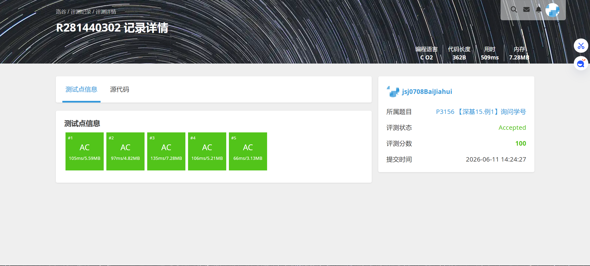
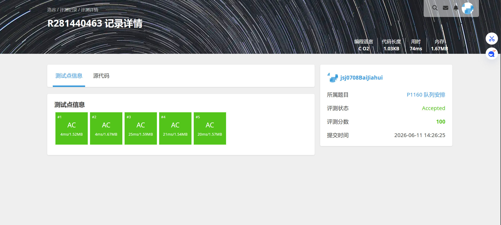

# 解题报告

姓名：白家辉

班级：计算机大类2508

学号：8208250831

日期：2026.6.11

# 总览

本次解题报告中，共完成 4 道题目。

| 题目名称 | 难度 | 知识点 |
| -------- | ---- | ------ |
|校门外的树 |入门|布尔数组|
|P3156 询问学号|入门|数组、顺序存储|
|P1996 约瑟夫问题|普及|队列、模拟|
|P1160 队列安排|普及/提高-|双向链表、链表模拟|

# （一）题目名称
1.校门外的树
2.询问学号
3.约瑟夫问题
4.队列安排
## 题目信息

题目链接：[https://www.luogu.com.cn/problem/P1047](https://www.luogu.com.cn/problem/P1047)

知识点：布尔数组

## 题目简述

> 某校大门外长度为 $l$ 的马路上有一排树，每两棵相邻的树之间的间隔都是 $1$ 米。我们可以把马路看成一个数轴，马路的一端在数轴 $0$ 的位置，另一端在 $l$ 的位置；数轴上的每个整数点，即 $0,1,2,\dots,l$，都种有一棵树。现在要把这些区域中的树（包括区域端点处的两棵树）移走。你的任务是计算将这些树都移走后，马路上还有多少棵树。
> 
> 对于 $20\%$ 的数据，保证区域之间没有重合的部分。
> 对于 $100\%$ 的数据，保证 $1 \leq l \leq 10^4$，$1 \leq m \leq 100$，$0 \leq u \leq v \leq l$
> 
> 1.00s，125MB

## 题目分析

### 1. 读题
马路长度为`l`，从`0`到`l`每个整数点共种植`l+1`棵树。现在给出`m`个待移除区间，要求移除区间内所有树（包含端点），区间可能存在重叠，计算移除完成后剩余的树木数量，核心需要处理重叠部分的重复计数问题。

### 2. 性质观察
本题可以通过转换思路简化问题：`剩余树数 = 总树数(l+1) - 不重复的移除树总数`，只需要统计出实际移除的树的数量即可得到结果。由于树仅存在于整数点，所有区间端点也均为整数，因此可以直接对每个待移除点做标记来去重。

### 3. 程序设计思路
暴力标记法实现简单，适配本题的数据范围,逻辑为：初始化所有位置为未移除状态，遍历每个待移除区间标记对应位置为已移除，最后统计所有未移除位置的数量即可。区间合并法复杂度更低，但实现稍复杂。

### 4. 数据结构与算法选择
选择暴力标记法，数据结构仅需要一个长度为`l+1`的布尔数组，用来记录每个位置的树是否被移除。算法流程为：
1. 初始化数组所有元素为`false`，表示初始都未移除；
2. 依次读入每个区间`[u, v]`，将区间内所有位置标记为`true`；
3. 最后遍历数组统计`false`元素的数量，即为剩余树的数量。

### 5. 时空复杂度分析
- 时间复杂度：$O(l \times m)$，根据数据范围$l \le 10^4, m \le 100$，总操作次数不超过$10^6$，完全符合时间要求。
- 空间复杂度：$O(l)$，仅需要一个长度为`l+1`的布尔数组，空间占用极低，满足题目限制。


## 代码实现


```c
#include<stdio.h>
#include<stdlib.h>
int main()
{
    int l=0;
    int n=0;
    int sum=0;
    scanf("%d %d",&l,&n);
    int* arr=(int*)malloc((l+1)*sizeof(int));
    for(int i=0;i<n;i++)
    {
        int a,b;
        scanf("%d %d",&a,&b);
        for(int i=a;i<=b;i++)
            arr[i]++;
    }
    for(int i=0;i<=l;i++)
    {
        if(arr[i]==0)
        {
            sum++;
        }
    }
    printf("%d",sum);
}
```

# （二）P3156 【深基15.例1】询问学号

## 题目信息

题目链接：[https://www.luogu.com.cn/problem/P3156](https://www.luogu.com.cn/problem/P3156)

知识点：数组、顺序存储

## 题目简述

> 按进入教室的顺序给出 $n$ 名同学的学号，老师会进行 $m$ 次询问。每次询问给出一个位置 $i$，要求输出第 $i$ 个进入教室的同学的学号。
>
> 题目中同学进入教室的顺序在输入完成后不再变化，因此本质上是在一段静态序列上做多次按位置查询。
>
> 对于 $100\%$ 的数据，$n \le 2 \times 10^6$，学号在 $1$ 到 $10^9$ 之间，询问次数 $m \le 10^5$。
>
> 1.00s，128MB。

## 题目分析

### 1. 读题
题目只做两件事：先读入所有同学的学号顺序，再多次询问“第 $i$ 个进入教室的人是谁”。这里没有交换、删除、插入等修改操作，因此进入顺序就是一份固定不变的数据。

### 2. 性质观察
第 $i$ 个进入教室的同学的学号，实际上就是输入序列中的第 $i$ 个数。因此只要把输入顺序原样保存下来，之后所有询问都可以直接按位置访问。由于 $n$ 最大达到 $2 \times 10^6$，如果每次询问都重新从头数一遍，会产生很大的重复工作，不适合采用线性扫描。

### 3. 程序设计思路
先开一个数组，把所有学号按输入顺序存到数组中。随后依次读入每个询问位置 $x$，直接输出数组第 $x$ 个位置保存的学号即可。整个过程不需要额外变换数据，也不需要排序。

### 4. 数据结构与算法选择
最合适的数据结构是顺序表，也就是数组。因为：
1. 输入本身就是一段线性序列；
2. 题目只需要通过位置访问元素；
3. 数组支持按下标 $O(1)$ 访问，能够高效回答大量查询。

算法上采用直接存储加直接查询即可，不需要更复杂的数据结构。

### 5. 时空复杂度分析
- 时间复杂度：$O(n+m)$。读入学号需要 $O(n)$，回答全部询问需要 $O(m)$。
- 空间复杂度：$O(n)$。只需要一个长度为 $n$ 的数组保存所有学号。

在题目给定的数据范围下，这一做法完全可行。

## 代码实现



```c
Talk is weak，show your code plz.
```

---

# （三）P1996 约瑟夫问题

## 题目信息

题目链接：[https://www.luogu.com.cn/problem/P1996](https://www.luogu.com.cn/problem/P1996)

知识点：队列、模拟

## 题目简述

> $n$ 个人围成一圈，从第一个人开始报数，数到 $m$ 的人出圈，然后由下一个人重新从 $1$ 开始报数。如此反复，直到所有人都出圈为止。
>
> 题目要求输出所有人依次出圈的编号顺序。需要特别注意，本题要求的是“全部出圈”的过程，而不是只求最后剩下的那个人。
>
> 对于 $100\%$ 的数据，$1 \le n,m \le 100$。
>
> 1.00s，128MB。

## 题目分析

### 1. 读题
题目描述的是一个典型的循环报数过程。每轮都会从当前的人开始继续数，报到 $m$ 的人离开队伍，下一位再从 $1$ 重新开始。最终要输出完整的出圈顺序。

### 2. 性质观察
所谓“围成一圈”，本质上表示当前还没出圈的人始终保持一个循环顺序。某个人如果这轮没有出圈，那么下一轮他仍然会在队伍里，只不过排到后面继续等待。因此这个过程和“队首出队后，不满足条件就回到队尾”的队列过程非常相似。又由于 $n,m$ 的范围都很小，完全可以直接模拟整个报数过程。

### 3. 程序设计思路
先把编号 $1 \sim n$ 的人依次放入队列中。之后不断执行以下操作：
1. 取出队首元素，表示当前报数的人；
2. 将计数器加一；
3. 如果当前计数器等于 $m$，则说明此人出圈，输出其编号，并将计数器重新置为 $0$；
4. 如果当前计数器还没到 $m$，则把这个人重新放回队尾。

重复上述过程，直到队列为空为止。

### 4. 数据结构与算法选择
本题选择队列最自然。因为队列能够很好地表示“当前轮到谁报数”和“没有出圈的人重新排到队尾”这一过程。相比直接套公式，队列模拟更容易输出完整的出圈顺序，也更贴合题目要求。

### 5. 时空复杂度分析
- 时间复杂度：$O(nm)$。每淘汰一个人最多经历一轮长度为 $m$ 的报数过程。
- 空间复杂度：$O(n)$。队列中最多同时存放 $n$ 个人。

由于题目规模只有 $100$ 级别，直接模拟可以稳定通过。

## 代码实现


```c
Talk is weak，show your code plz.
```

---

# （四）P1160 队列安排

## 题目信息

题目链接：[https://www.luogu.com.cn/problem/P1160](https://www.luogu.com.cn/problem/P1160)

知识点：双向链表、链表模拟

## 题目简述

> 先将 $1$ 号同学放入队列。之后对于每个 $i(2 \le i \le N)$，给出一名已经在队列中的同学 $k$ 和一个方向标记 $p$，表示把 $i$ 插入到 $k$ 的左边或右边。
>
> 在所有插入完成后，再执行 $M$ 次删除操作。每次给出一个编号 $x$，表示将该同学从队列中删去；如果该同学已经不在队列中，则忽略这次删除。
>
> 最终要求输出队列从左到右的所有同学编号。对于 $100\%$ 的数据，$1 < M \le N \le 10^5$。
>
> 1.00s，128MB。

## 题目分析

### 1. 读题
题目的操作分成两类：一类是在某个已知同学的左边或右边插入新同学，另一类是按编号删除某位同学。最后输出整个队列的排列结果。显然，这是一道动态维护线性序列的问题。

### 2. 性质观察
如果使用普通数组来维护整个队列，那么每次在中间插入或删除元素时，都需要移动后面大量元素。在 $N$ 达到 $10^5$ 时，这种做法的总复杂度会非常高。另一方面，题目每次都直接给出“参考同学的编号”，因此我们真正需要维护的是每个同学左右相邻的是谁，而不是他当前排在第几位。

### 3. 程序设计思路
可以用数组模拟双向链表：
1. `L[i]` 表示编号 $i$ 左边的同学；
2. `R[i]` 表示编号 $i$ 右边的同学；
3. 再用一个标记数组记录某个同学当前是否还在队列中，避免重复删除。

插入到左边或右边时，只需要修改常数个结点之间的连接关系；删除某个同学时，只需要把他的左右邻居直接连起来即可。全部操作结束后，从队首沿着右指针一路遍历，就能得到最终队列顺序。

### 4. 数据结构与算法选择
本题最适合使用双向链表。又因为同学编号天然是连续的 $1 \sim N$，所以直接使用数组模拟双向链表会比动态开结点更加方便。这样既能通过编号直接定位元素，又能在 $O(1)$ 时间内完成插入和删除。

### 5. 时空复杂度分析
- 时间复杂度：$O(N+M)$。每次插入、删除都是 $O(1)$，最后遍历输出一次队列也是线性的。
- 空间复杂度：$O(N)$。需要若干个长度为 $N$ 的数组维护左右邻接关系和删除标记。

这一复杂度能够满足 $10^5$ 级别数据的时限要求。

## 代码实现



```c
Talk is weak，show your code plz.
```
