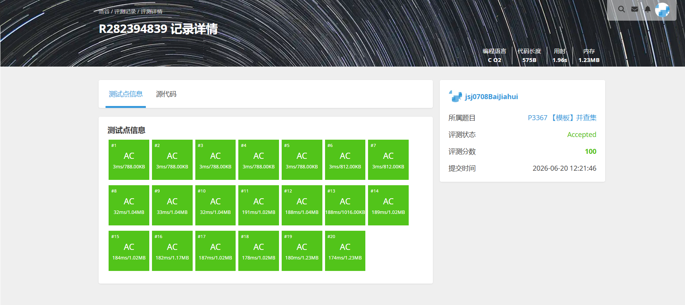
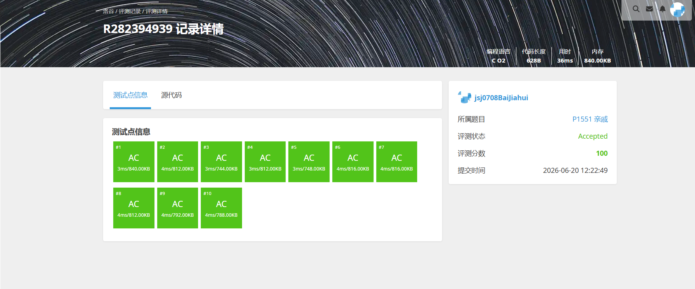

# 解题报告

姓名：白家辉

班级：计算机大类2508

学号：8208250831

日期：2026.6.12

# 总览

本次解题报告中，共完成 4 道题目。

| 题目名称 | 难度 | 知识点 |
| -------- | ---- | ------ |
|P11615 哈希表|普及/提高-|哈希表、拉链法、快速读入|
|P3367 并查集|普及/提高-|并查集、路径压缩、连通性查询|
|P1551 亲戚|普及/提高-|并查集、传递关系、连通性判断|
|B2168 哈夫曼编码|普及/提高-|哈夫曼树、贪心、树上回溯编码|

# （一）哈希表

## 题目信息

题目链接：[https://www.luogu.com.cn/problem/P11615](https://www.luogu.com.cn/problem/P11615)

知识点：哈希表、拉链法、快速读入

## 题目简述

> 需要维护一个从 `uint64` 到 `uint64` 的映射，初始时所有位置的值都为 `0`。每次操作先查询当前 `f(x)`，再把它改成 `y`。
>
> 题目最后并不逐次输出查询结果，而是要求输出 `sum(i * ans_i) mod 2^64`。对于全部数据，`n <= 5 * 10^6`，并且 `x,y` 都在 `64` 位无符号整数范围内。
>
> 1.00s，512MB。

## 题目分析

### 1. 读题
这题的核心不是复杂的数学关系，而是要在极大数据量下稳定维护键值映射。每次操作只有两件事：先读旧值，再写新值，而且整个过程中没有删除。

### 2. 性质观察
由于键空间是 `2^64`，显然不能直接开数组。另一方面，`n` 达到 `5 * 10^6`，如果直接依赖通用容器，常数、哈希冲突和读入速度都会成为问题。

当前代码采用的是“手写拉链法哈希表”。它先把桶数扩成不小于 `2n` 的二次幂，再用 `splitmix64` 配合随机 `seed` 做哈希，把出现过的键值对存进 `head + next + key + val` 这些数组里。这样既能压住常数，也能尽量避免被特殊数据卡哈希。

### 3. 程序设计思路
1. 使用手写快读函数 `rd()` 读入全部操作；
2. 为每个键计算哈希桶下标，在对应链表中顺着 `next` 查找；
3. 如果找到了键 `x`，就先取出旧值 `cur`，再把它改成新值 `y`；
4. 如果没找到，就说明当前 `f(x)=0`，此时把新键值对插入对应桶链表表头；
5. 每次操作都用 `ans += i * cur` 更新答案；
6. 最后直接输出 `unsigned long long` 累计结果。

### 4. 数据结构与算法选择
当前实现选择的是“拉链法哈希表 + 自定义哈希函数 + 快速读入”。其中：
1. `head` 记录每个桶链表表头；
2. `next` 负责串起同桶元素；
3. `key` 与 `val` 保存实际映射关系；
4. `splitmix64` 用来减少冲突风险。

### 5. 时空复杂度分析
- 时间复杂度：平均为 $O(n)$，单次查询和修改均摊 $O(1)$。
- 空间复杂度：$O(n)$，需要保存所有出现过的键值对。

## 代码实现


```c
#include <stdio.h>
#include <stdlib.h>
#include <stdint.h>
#include <time.h>

typedef unsigned long long ull;
typedef unsigned int u32;

static char buf[1 << 23];
static size_t p1 = 0, p2 = 0;

static inline int gc(void) 
{
    if (p1 == p2) 
    {
        p2 = fread(buf, 1, sizeof(buf), stdin);
        p1 = 0;
        if (p1 == p2) return EOF;
    }
    return buf[p1++];
}

static inline ull rd(void) 
{
    ull x = 0;
    int ch = gc();
    while (ch < '0' || ch > '9') ch = gc();
    while (ch >= '0' && ch <= '9') 
    {
        x = x * 10 + (ull)(ch - '0');
        ch = gc();
    }
    return x;
}

static inline ull splitmix64(ull x) 
{
    x += 0x9e3779b97f4a7c15ULL;
    x = (x ^ (x >> 30)) * 0xbf58476d1ce4e5b9ULL;
    x = (x ^ (x >> 27)) * 0x94d049bb133111ebULL;
    return x ^ (x >> 31);
}

int main(void) 
{
    u32 n = (u32)rd();
    u32 m = 1;
    u32 tot = 0;
    ull ans = 0;
    ull seed;

    while (m < (n << 1)) m <<= 1;

    u32 *head = (u32 *)calloc(m, sizeof(u32));
    u32 *next = (u32 *)calloc((size_t)n + 1, sizeof(u32));
    ull *key = (ull *)malloc(((size_t)n + 1) * sizeof(ull));
    ull *val = (ull *)malloc(((size_t)n + 1) * sizeof(ull));

    if (!head || !next || !key || !val) return 0;

    seed = ((ull)(uintptr_t)head >> 4) ^ (ull)clock() ^ 0x9e3779b97f4a7c15ULL;

    for (u32 i = 1; i <= n; ++i) 
    {
        ull x = rd();
        ull y = rd();
        u32 h = (u32)(splitmix64(x + seed) & (ull)(m - 1));
        u32 p = head[h];
        ull cur = 0;

        while (p && key[p] != x) p = next[p];

        if (p) 
        {
            cur = val[p];
            val[p] = y;
        } else 
        {
            ++tot;
            key[tot] = x;
            val[tot] = y;
            next[tot] = head[h];
            head[h] = tot;
        }

        ans += (ull)i * cur;
    }

    printf("%llu\n", ans);

    free(head);
    free(next);
    free(key);
    free(val);
    return 0;
}
```

---

# （二）并查集

## 题目信息

题目链接：[https://www.luogu.com.cn/problem/P3367](https://www.luogu.com.cn/problem/P3367)

知识点：并查集、路径压缩、连通性查询

## 题目简述

> 给定 `N` 个元素和 `M` 次操作，操作只有两种：把两个元素所在集合合并，或者询问两个元素是否属于同一个集合。
>
> 对于全部数据，`N <= 2 * 10^5`，`M <= 10^6`，查询时需要输出 `Y` 或 `N`。
>
> 2.00s，512MB。

## 题目分析

### 1. 读题
题目要求维护若干个动态合并的集合，并支持快速判断两个元素是否连通。这正是并查集的标准应用场景。

### 2. 性质观察
这里只有合并和查询，没有拆分操作，因此不需要更复杂的动态连通性结构。只要能够快速找到每个元素所在集合的代表元，就能完成全部任务。

在数据范围达到 `10^6` 次操作时，朴素地逐集合维护成员显然不可行，而并查集只要配合路径压缩，就已经足以高效通过这道模板题。

### 3. 程序设计思路
1. 初始化 `fa[i] = i`，每个元素自成一个集合；
2. 编写 `find(x)`，在递归返回时顺带完成路径压缩；
3. 遇到合并操作时，直接执行 `fa[find(x)] = find(y)`；
4. 遇到查询操作时，只需判断 `find(x)` 和 `find(y)` 是否相同；
5. 根据结果输出 `Y` 或 `N`。

### 4. 数据结构与算法选择
并查集是本题的模板解法。当前代码使用的是最基础的“父节点数组 + 路径压缩”写法，没有再额外维护按秩合并数组，但在本题范围内依然完全可行。

### 5. 时空复杂度分析
- 时间复杂度：单次操作均摊为 $O(\alpha(n))$，总复杂度约为 $O(M\alpha(n))$。
- 空间复杂度：$O(n)$，主要用于保存父节点和辅助数组。

## 代码实现



```c
#include <stdio.h>

#define N 200005

int fa[N];

int find(int x)
{
    if (fa[x] == x)
        return x;
    return fa[x] = find(fa[x]);
}

int main()
{
    int n, m;
    scanf("%d%d", &n, &m);

    for (int i = 1; i <= n; i++)
        fa[i] = i;

    while (m--)
    {
        int z, x, y;
        scanf("%d%d%d", &z, &x, &y);

        if (z == 1)
        {
            fa[find(x)] = find(y);
        }
        else
        {
            if (find(x) == find(y))
                printf("Y\n");
            else
                printf("N\n");
        }
    }

    return 0;
}
```

---

# （三）亲戚

## 题目信息

题目链接：[https://www.luogu.com.cn/problem/P1551](https://www.luogu.com.cn/problem/P1551)

知识点：并查集、传递关系、连通性判断

## 题目简述

> 共有 `n` 个人，先给出 `m` 组亲戚关系，再给出 `p` 次询问。若两个人通过若干条亲戚关系可以连到一起，就认为他们是亲戚。
>
> 对于全部数据，`n,m,p <= 5000`。每次询问需要输出 `Yes` 或 `No`。
>
> 1.00s，125MB。

## 题目分析

### 1. 读题
题目本质上是在描述一种“等价关系”：亲戚关系具有传递性和对称性。换句话说，同一个亲戚圈内的所有人都属于同一集合。

### 2. 性质观察
先读入的 `m` 组关系只负责把若干人连接起来，后面的 `p` 次询问只是判断两个人是否在同一连通块内。因此整个过程没有删除，也没有复杂更新。

这和上一题一样，依旧是并查集的标准模型，只是题意从“集合”换成了“亲戚圈”。当前代码甚至连写法都非常直接：定义 `merge(x,y)` 合并两人的集合，再在询问时判断根是否相同。

### 3. 程序设计思路
1. 初始化 `fa[i] = i`；
2. 读入每组亲戚关系后，调用 `merge(x,y)` 合并两个集合；
3. `merge` 内部本质上就是 `fa[find(x)] = find(y)`；
4. 所有关系建完后，再逐组处理询问；
5. 如果两人的根相同，输出 `Yes`，否则输出 `No`。

### 4. 数据结构与算法选择
由于题目只关心“是否属于同一个亲戚圈”，并不关心圈内具体结构，所以并查集已经足够。它直接把题目中的传递关系压缩成若干个集合代表元。

### 5. 时空复杂度分析
- 时间复杂度：$O((m+p)\alpha(n))$。
- 空间复杂度：$O(n)$。

## 代码实现



```c
#include <stdio.h>

int fa[5005];

int find(int x)
{
    if (fa[x] == x)
        return x;
    return fa[x] = find(fa[x]); 
}

void merge(int x, int y)
{
    fa[find(x)] = find(y);
}

int main()
{
    int n, m, p;
    scanf("%d%d%d", &n, &m, &p);

    for (int i = 1; i <= n; i++)
        fa[i] = i;

    for (int i = 0; i < m; i++)
    {
        int x, y;
        scanf("%d%d", &x, &y);
        merge(x, y);
    }

    for (int i = 0; i < p; i++)
    {
        int x, y;
        scanf("%d%d", &x, &y);

        if (find(x) == find(y))
            printf("Yes\n");
        else
            printf("No\n");
    }

    return 0;
}
```

---

# （四）哈夫曼编码

## 题目信息

题目链接：[https://www.luogu.com.cn/problem/B2168](https://www.luogu.com.cn/problem/B2168)

知识点：哈夫曼树、贪心、树上回溯编码

## 题目简述

> 给定 `n` 个互不相同的单词及其出现频次，需要构造任意一种最优的哈夫曼编码方案，并按输入顺序输出每个单词及其编码。
>
> 对于全部数据，`1 <= n <= 1000`，字符串长度不超过 `20`，频次 `w_i <= 10^9`。
>
> 1.00s，512MB。

## 题目分析

### 1. 读题
题目要求的是“最优前缀编码”，也就是经典的哈夫曼编码问题。目标是让所有单词的“频次 × 编码长度”之和最小。

### 2. 性质观察
哈夫曼树的贪心结论非常经典：每次把当前权值最小的两个结点合并，新结点权值为两者之和，最终得到的树一定使带权路径长度最小。

当前代码没有使用优先队列，而是利用 `n <= 1000` 这一范围，直接在“当前还没有父节点的结点”里顺序扫描，找出两个最小权值结点 `s1` 和 `s2` 进行合并。这个做法常数不大，实现也更直接。

### 3. 程序设计思路
1. 先把前 `n` 个结点作为叶子结点，记录单词和频次；
2. 从第 `n+1` 个结点开始，反复在线性扫描中选出两个当前权值最小且还没有父节点的结点；
3. 把这两个结点合并成新父结点，并记录左右儿子；
4. 建树结束后，对每个叶子结点沿着 `parent` 指针一直向上回溯；
5. 若当前结点是父亲的左儿子，就记 `0`，否则记 `1`；
6. 最后把逆序得到的编码翻转过来，并按输入顺序输出。

### 4. 数据结构与算法选择
当前实现选择的是“数组模拟哈夫曼树 + 线性扫描选最小权值结点”。虽然复杂度不如堆优化版本漂亮，但在 `n <= 1000` 的范围下完全足够，而且代码结构很清楚。

### 5. 时空复杂度分析
- 时间复杂度：$O(n^2)$，每次合并都要在线性范围内找两个最小结点。
- 空间复杂度：$O(n^2)$，除了哈夫曼树本身外，还显式保存了每个字符串的编码结果。

## 代码实现


```c
#include <stdio.h>
#include <string.h>

#define MAXN 1005

typedef struct
{
    long long w;
    int parent;
    int lchild;
    int rchild;
}HTNode;

HTNode ht[MAXN * 2];

char word[MAXN][25];
char code[MAXN][2005];

int main()
{
    int n;
    scanf("%d",&n);

    for(int i=1;i<=n;i++)
    {
        scanf("%s%lld",word[i],&ht[i].w);

        ht[i].parent=0;
        ht[i].lchild=0;
        ht[i].rchild=0;
    }

    if(n==1)
    {
        printf("%s 0\n",word[1]);
        return 0;
    }

    int m=2*n-1;

    for(int i=n+1;i<=m;i++)
    {
        int s1=0,s2=0;

        for(int j=1;j<i;j++)
        {
            if(ht[j].parent)
                continue;

            if(s1==0 || ht[j].w < ht[s1].w)
            {
                s2=s1;
                s1=j;
            }
            else if(s2==0 || ht[j].w < ht[s2].w)
            {
                s2=j;
            }
        }

        ht[s1].parent=i;
        ht[s2].parent=i;

        ht[i].lchild=s1;
        ht[i].rchild=s2;

        ht[i].w=ht[s1].w+ht[s2].w;
    }

    char temp[2005];

    for(int i=1;i<=n;i++)
    {
        int len=0;
        int cur=i;
        int p=ht[cur].parent;

        while(p)
        {
            if(ht[p].lchild==cur)
                temp[len++]='0';
            else
                temp[len++]='1';

            cur=p;
            p=ht[cur].parent;
        }

        for(int j=0;j<len;j++)
            code[i][j]=temp[len-1-j];

        code[i][len]='\0';
    }

    for(int i=1;i<=n;i++)
    {
        printf("%s %s\n",word[i],code[i]);
    }

    return 0;
}
```
