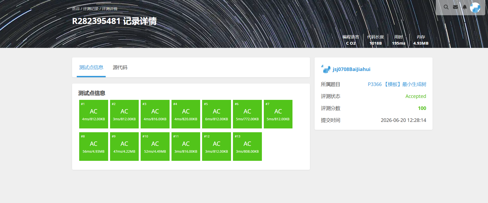
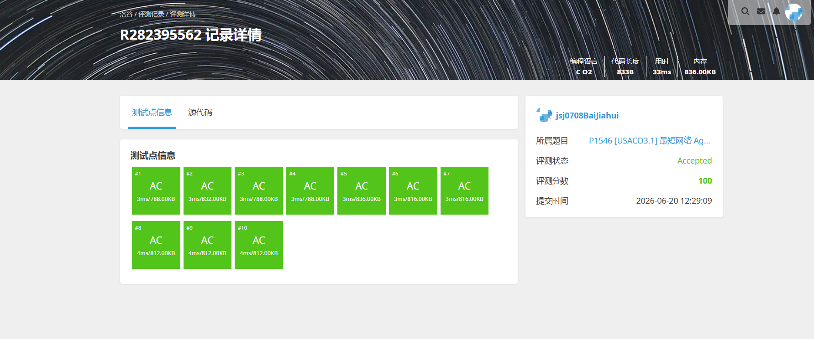

# 解题报告

姓名：白家辉

班级：计算机大类2508

学号：8208250831

日期：2026.6.13

# 总览

本次解题报告中，共完成 4 道题目。

| 题目名称 | 难度 | 知识点 |
| -------- | ---- | ------ |
|P1219 八皇后 Checker Challenge|普及/提高-|回溯搜索、状态标记、字典序|
|P3916 图的遍历|普及/提高-|反图、DFS、逆序处理|
|P3366 最小生成树|普及/提高-|最小生成树、Kruskal、并查集|
|P1546 最短网络 Agri-Net|普及/提高-|最小生成树、Prim、邻接矩阵|

# （一）八皇后 Checker Challenge

## 题目信息

题目链接：[https://www.luogu.com.cn/problem/P1219](https://www.luogu.com.cn/problem/P1219)

知识点：回溯搜索、状态标记、字典序

## 题目简述

> 在 `n * n` 的棋盘上放置 `n` 个皇后，要求每行、每列以及所有对角线都不能同时出现两个皇后。
>
> 需要按字典序输出前 `3` 个合法解，并在最后输出解的总数。对于全部数据，`6 <= n <= 13`。
>
> 1.00s，125MB。

## 题目分析

### 1. 读题
这是经典的 `n` 皇后问题。题目不仅要求统计所有方案数，还要求输出字典序最小的前三个方案，因此搜索顺序必须控制好。

### 2. 性质观察
由于每一行恰好放一个皇后，所以搜索时只需要决定“第 `i` 行放在哪一列”。判断某个位置是否合法，只取决于：
1. 该列是否已被占用；
2. 两条对角线是否已被占用。

如果按照“行从小到大、列从小到大”的顺序 DFS，那么天然就会先得到字典序更小的方案，正好满足题目要求。

### 3. 程序设计思路
1. 用数组记录每一行皇后所在列；
2. 用 `col`、`diag1`、`diag2` 标记列和两类对角线是否被占用；
3. 从第 `1` 行开始深搜，按列编号递增尝试放置；
4. 若当前位置不冲突，就标记后递归下一行；
5. 当成功放完 `n` 行时，总方案数加一；
6. 若当前仍未收集满前三个解，就把这一组方案保存并输出。

### 4. 数据结构与算法选择
本题最适合用回溯搜索。状态规模不算大，而位置信息只需要几个布尔数组就能完成快速判冲突，因此实现上直接、清晰。

### 5. 时空复杂度分析
- 时间复杂度：最坏可记为 $O(n!)$ 级别，实际会被大量剪枝显著降低。
- 空间复杂度：$O(n)$，主要用于递归栈和状态标记数组。

## 代码实现


```c
#include <stdio.h>

int n;
int ans[20];

int col[20];
int diag1[40];
int diag2[40];

long long cnt = 0;

void dfs(int row)
{
    if(row > n)
    {
        cnt++;

        if(cnt <= 3)
        {
            for(int i = 1; i <= n; i++)
            {
                printf("%d", ans[i]);

                if(i != n)
                    printf(" ");
            }
            printf("\n");
        }

        return;
    }

    for(int c = 1; c <= n; c++)
    {
        if(col[c])
            continue;

        if(diag1[row - c + n])
            continue;

        if(diag2[row + c])
            continue;

        ans[row] = c;

        col[c] = 1;
        diag1[row - c + n] = 1;
        diag2[row + c] = 1;

        dfs(row + 1);

        col[c] = 0;
        diag1[row - c + n] = 0;
        diag2[row + c] = 0;
    }
}

int main()
{
    scanf("%d", &n);

    dfs(1);

    printf("%lld\n", cnt);

    return 0;
}
```

---

# （二）图的遍历

## 题目信息

题目链接：[https://www.luogu.com.cn/problem/P3916](https://www.luogu.com.cn/problem/P3916)

知识点：反图、DFS、逆序处理

## 题目简述

> 给定一个有向图，对每个点 `v`，要求求出从 `v` 出发能够到达的编号最大的点 `A(v)`。
>
> 对于全部数据，`N,M <= 10^5`，需要输出所有点对应的 `A(v)`。
>
> 1.00s，125MB。

## 题目分析

### 1. 读题
题目不是单纯做一次遍历，而是要对每个点都求“它最终能到达的最大编号点”。如果对每个起点都单独搜索一次，复杂度会直接爆炸。

### 2. 性质观察
如果把所有边反向，那么“原图中能够到达点 `x` 的所有点”，就会变成“反图中从 `x` 出发能够走到的所有点”。

当前代码正是这样做的：读边时直接执行 `add(v,u)` 建反图，然后按编号从大到小枚举每个点 `i`，从 `i` 出发在反图上 DFS，把所有还没赋值的点答案设成 `i`。由于大的编号先处理，所以第一次被染上的值一定就是最大可达编号。

### 3. 程序设计思路
1. 用链式前向星存反图；
2. 初始化 `ans` 数组为 `0`，表示答案还没确定；
3. 从 `i = n` 倒着枚举到 `1`；
4. 每次调用 `dfs(i, i)`；
5. 在 DFS 中，如果当前点已经有答案，就立刻返回；
6. 否则把当前点答案赋成 `i`，再继续沿反图搜索；
7. 全部结束后输出整个 `ans` 数组。

### 4. 数据结构与算法选择
当前实现的关键就是“反图 + 从大到小 DFS 染色”。这种写法不需要额外拓扑排序或记忆化数组，思路很统一，也很贴合题目所求的“最大编号可达点”。

### 5. 时空复杂度分析
- 时间复杂度：$O(N+M)$，每个点只会被真正赋值一次，每条边也只会被有效扫描若干次。
- 空间复杂度：$O(N+M)$，用于保存反图和答案数组。

## 代码实现


```c
#include <stdio.h>

#define MAXN 100005
#define MAXM 100005

int head[MAXN];
int to[MAXM];
int nxt[MAXM];
int cnt;

int ans[MAXN];

void add(int u,int v)
{
    to[++cnt]=v;
    nxt[cnt]=head[u];
    head[u]=cnt;
}

void dfs(int x,int val)
{
    if(ans[x]) return;

    ans[x]=val;

    for(int i=head[x];i;i=nxt[i])
    {
        dfs(to[i],val);
    }
}

int main()
{
    int n,m;
    scanf("%d%d",&n,&m);

    for(int i=1;i<=m;i++)
    {
        int u,v;
        scanf("%d%d",&u,&v);

        add(v,u);   // 建反图
    }

    for(int i=n;i>=1;i--)
    {
        dfs(i,i);
    }

    for(int i=1;i<=n;i++)
    {
        printf("%d ",ans[i]);
    }

    return 0;
}
```

---

# （三）最小生成树

## 题目信息

题目链接：[https://www.luogu.com.cn/problem/P3366](https://www.luogu.com.cn/problem/P3366)

知识点：最小生成树、Kruskal、并查集

## 题目简述

> 给定一个无向图，需要求它的最小生成树总边权；如果图不连通，就输出 `orz`。
>
> 对于全部数据，`N <= 5000`，`M <= 2 * 10^5`，边权为正整数。
>
> 1.00s，128MB。

## 题目分析

### 1. 读题
这是最小生成树模板题。目标是在保证所有点连通的前提下，使选中的边权和最小。

### 2. 性质观察
边数很多，但点数相对不算大。对这种“给出所有边，直接选边”的题型，Kruskal 非常合适：只要把边按权值从小到大排序，优先尝试加入不会成环的边即可。

如果最后成功选出 `n-1` 条边，就说明图连通；否则说明至少有若干个连通块无法连到一起，题目要求输出 `orz`。

### 3. 程序设计思路
1. 读入全部边并存入数组；
2. 按边权从小到大排序；
3. 初始化并查集；
4. 依次扫描排序后的边；
5. 如果当前边的两个端点不在同一集合，就把它加入答案并合并两个集合；
6. 统计已选边数，若最终达到 `n-1` 则输出总权值，否则输出 `orz`。

### 4. 数据结构与算法选择
Kruskal 的核心是“排序 + 并查集判环”。在本题的数据规模下，这种做法实现稳定、思路标准，也是最常见的模板解法。

### 5. 时空复杂度分析
- 时间复杂度：$O(M\log M)$，主要来自边排序。
- 空间复杂度：$O(N+M)$，需要保存边集和并查集。

## 代码实现



```c
#include <stdio.h>
#include <stdlib.h>

#define MAXM 200005
#define MAXN 5005

typedef struct
{
    int u;
    int v;
    int w;
}Edge;

Edge edge[MAXM];

int fa[MAXN];

int cmp(const void *a,const void *b)
{
    return ((Edge *)a)->w - ((Edge *)b)->w;
}

int find(int x)
{
    if(fa[x]==x)
        return x;

    return fa[x]=find(fa[x]);
}

int main()
{
    int n,m;

    scanf("%d%d",&n,&m);

    for(int i=1;i<=m;i++)
    {
        scanf("%d%d%d",
              &edge[i].u,
              &edge[i].v,
              &edge[i].w);
    }

    for(int i=1;i<=n;i++)
        fa[i]=i;

    qsort(edge+1,m,sizeof(Edge),cmp);

    long long ans=0;
    int cnt=0;

    for(int i=1;i<=m;i++)
    {
        int fu=find(edge[i].u);
        int fv=find(edge[i].v);

        if(fu!=fv)
        {
            fa[fu]=fv;

            ans+=edge[i].w;
            cnt++;

            if(cnt==n-1)
                break;
        }
    }

    if(cnt==n-1)
        printf("%lld\n",ans);
    else
        printf("orz\n");

    return 0;
}
```

---

# （四）最短网络 Agri-Net

## 题目信息

题目链接：[https://www.luogu.com.cn/problem/P1546](https://www.luogu.com.cn/problem/P1546)

知识点：最小生成树、Prim、邻接矩阵

## 题目简述

> 给定 `N` 个农场以及它们两两之间的连线代价，要求用最小总长度的光纤把所有农场连通起来。
>
> 输入是一张 `N * N` 的代价矩阵，`3 <= N <= 100`，需要输出最小生成树总权值。
>
> 1.00s，125MB。

## 题目分析

### 1. 读题
题目本质仍然是最小生成树，只不过图是用完整的邻接矩阵形式给出的，而不是稀疏边表。

### 2. 性质观察
当 `N <= 100` 时，直接使用邻接矩阵上的 Prim 算法非常自然。因为 Prim 每轮只需要在未加入生成树的点中找一个当前连边最小的点，再用它更新其他点的最小接入代价。

在这种规模下，$O(N^2)$ 的复杂度完全足够，而且比先把矩阵拆成边集再做 Kruskal 更直接。

### 3. 程序设计思路
1. 读入整张代价矩阵 `g`；
2. 先用第 `1` 个农场初始化所有结点的 `dist`；
3. 把 `1` 号点标记为已经加入生成树；
4. 每轮在线性扫描中找出当前未访问且 `dist` 最小的结点 `k`；
5. 把 `dist[k]` 累加进答案，并将 `k` 标记为已访问；
6. 再用 `g[k][j]` 去更新其他未访问结点的最小接入代价。

### 4. 数据结构与算法选择
当前代码就是标准的“邻接矩阵朴素 Prim”。由于 `n` 最多只有 `100`，直接双重循环选点和更新就很稳妥，不需要堆优化。

### 5. 时空复杂度分析
- 时间复杂度：$O(N^2)$。
- 空间复杂度：$O(N^2)$，主要是存储代价矩阵。

## 代码实现



```c
#include <stdio.h>

#define INF 1000000000

int g[105][105];
int dist[105];
int vis[105];

int main()
{
    int n;

    scanf("%d",&n);

    for(int i=1;i<=n;i++)
    {
        for(int j=1;j<=n;j++)
        {
            scanf("%d",&g[i][j]);
        }
    }

    for(int i=1;i<=n;i++)
    {
        dist[i]=g[1][i];
    }

    vis[1]=1;

    int ans=0;

    for(int i=1;i<n;i++)
    {
        int mn=INF;
        int k=-1;

        for(int j=1;j<=n;j++)
        {
            if(!vis[j] && dist[j]<mn)
            {
                mn=dist[j];
                k=j;
            }
        }

        vis[k]=1;
        ans+=dist[k];

        for(int j=1;j<=n;j++)
        {
            if(!vis[j] && g[k][j]<dist[j])
            {
                dist[j]=g[k][j];
            }
        }
    }

    printf("%d\n",ans);

    return 0;
}
```
