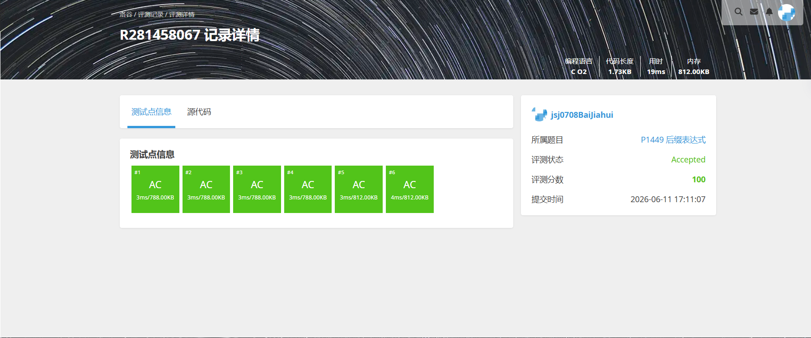
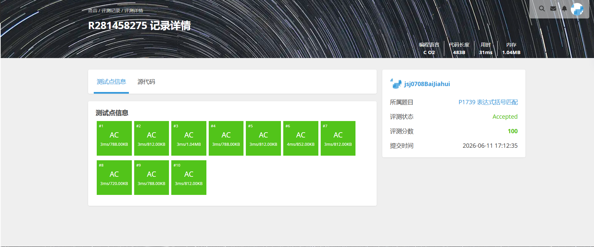
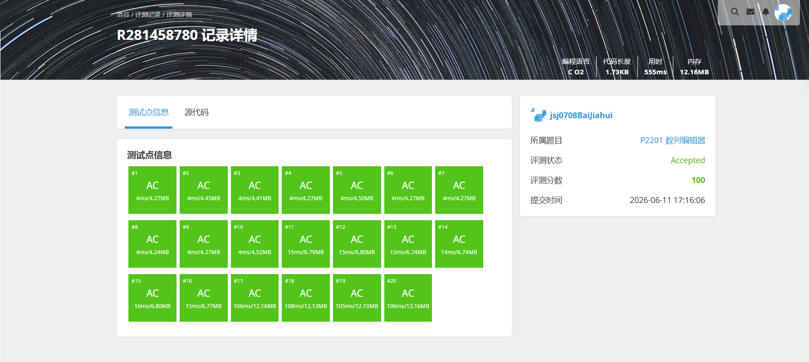

# 解题报告

姓名：白家辉

班级：计算机大类2508

学号：8208250831

日期：2026.6.11

# 总览

本次解题报告中，共完成 4 道题目。

| 题目名称 | 难度 | 知识点 |
| -------- | ---- | ------ |
|P1449 后缀表达式|普及|栈、表达式求值|
|P1739 表达式括号匹配|入门|栈、括号匹配|
|B3758 括号序列|普及|贪心、字符串模拟|
|P2201 数列编辑器|普及/提高-|栈、前缀和、最大前缀和维护|

# （一）后缀表达式

## 题目信息

题目链接：[https://www.luogu.com.cn/problem/P1449](https://www.luogu.com.cn/problem/P1449)

知识点：栈、表达式求值

## 题目简述

> 给出一个后缀表达式字符串，其中操作数以 `.` 结束，整个表达式以 `@` 结束，运算符仅包含 `+`、`-`、`*`、`/`。要求按后缀表达式的规则计算整个表达式的值。
>
> 后缀表达式的特点是：运算符写在两个操作数之后，计算时严格按照从左到右扫描的顺序进行，不需要考虑运算符优先级。除法结果需要向 $0$ 取整。
>
> 对于 $100\%$ 的数据，$1 \le |s| \le 50$，答案和计算过程中的每一个值的绝对值都不超过 $10^9$。
>
> 1.00s，128MB。

## 题目分析

### 1. 读题
题目给出的不是普通中缀表达式，而是后缀表达式。扫描过程中，数字可能由多位组成，并且以 `.` 作为结束标记；表达式整体以 `@` 结束。由于是后缀表达式，每当遇到运算符时，前面最近得到的两个数就应该参与计算。

### 2. 性质观察
后缀表达式最典型的处理方式就是使用栈。因为：
1. 读到一个完整数字时，需要把它暂存起来，等待后续运算符使用；
2. 读到运算符时，需要取出最近的两个操作数进行计算；
3. 计算后的结果又会成为新的操作数，继续压回栈中。

因此整个过程天然符合“后进先出”的栈结构。

### 3. 程序设计思路
从左到右扫描整个字符串：
1. 如果读到的是数字字符，就持续读取，拼出当前完整的整数；
2. 当读到 `.` 时，说明一个操作数结束，将刚得到的数压入栈中；
3. 当读到运算符时，从栈中弹出两个数，按照“先弹出的是右操作数，后弹出的是左操作数”的顺序进行运算；
4. 将计算结果重新压回栈中；
5. 扫描到 `@` 时结束，此时栈顶元素就是最终答案。

当前代码里专门手写了一个顺序栈结构，并用 `idx`、`start`、`end` 三个下标在字符串中切分数字片段，再配合 `calculate` 函数完成四则运算，整体属于“字符串扫描 + 自定义栈模拟”的实现方式。

### 4. 数据结构与算法选择
本题最适合使用栈。因为栈可以精确维护“最近尚未参与运算的操作数”。当前实现中使用的是手写顺序栈 `stack`，配合字符数组顺序扫描来完成求值，不需要建立表达式树，也不需要做额外转换。

### 5. 时空复杂度分析
- 时间复杂度：$O(|s|)$。整个字符串只需要顺序扫描一遍。
- 空间复杂度：$O(|s|)$。最坏情况下需要用栈存放多个尚未运算的操作数。

在题目给定的小规模字符串限制下，这一做法完全可行。

## 代码实现




```c
#define _CRT_SECURE_NO_WARNINGS
#include<stdio.h>
#include<stdlib.h>
#include<string.h>
#include<ctype.h>
#define maxsize 100
typedef struct
{
    int* data;
    int top;
}stack;
stack* initstack()
{
    stack* a = (stack*)malloc(sizeof(stack));
    a->data = (int*)malloc(maxsize * sizeof(int));
    a->top = -1;
    return a;
}
void push(int num, stack* s)
{
    s->top++;
    s->data[s->top] = num;
}
void pop(int* num, stack* s)
{
    *num = s->data[s->top];
    s->top--;
}
int calculate(int a, int b, char c)
{
    switch(c)
    {
        case '+':
            return a + b;
        case '-':
            return a - b;
        case '*':
            return a * b;
        case '/':
            return a / b;
        default:
            return 0;
    }
}
int main()
{
    stack* s = initstack();
    char str[100] = { 0 };
    scanf("%s", str);
    int idx = 0;
    int start = 0;
    int end = 0;
    while (str[idx] != '@')
    {
        char temp[10] = { 0 };
        while (str[idx] != '.'&&str[idx]!='@')
        {
            if (isdigit(str[idx]))
            {
                end++;
                idx++;
            }
            else
            {
                int a, b;
                pop(&b, s);
                pop(&a, s);
                int result = calculate(a, b, str[idx]);
                push(result, s);
                start = idx + 1;
                end = idx + 1;
                idx++;
            }
        }
        strncpy(temp, str + start, end - start);
        int num = atoi(temp);
        push(num, s);
        start = idx + 1;
        end = start;
        if(str[idx]!='@')
        idx++;
    }
    int endresult = 0;
    pop(&endresult, s);
    pop(&endresult, s);
    printf("%d", endresult);
    free(s->data);
    free(s);
}
```

---

# （二）P1739 表达式括号匹配

## 题目信息

题目链接：[https://www.luogu.com.cn/problem/P1739](https://www.luogu.com.cn/problem/P1739)

知识点：栈、括号匹配

## 题目简述

> 给出一个由小写字母、运算符、圆括号组成的表达式，并以 `@` 作为结束符。要求判断表达式中的左右圆括号是否匹配。
>
> 如果括号完全匹配则输出 `YES`，否则输出 `NO`。括号匹配不仅要求左右括号数量相同，还要求每个右括号出现时，它前面必须有尚未匹配的左括号。
>
> 表达式长度小于 $255$，左圆括号少于 $20$ 个。
>
> 1.00s，128MB。

## 题目分析

### 1. 读题
题目只关心圆括号是否匹配，其他字符如字母和运算符都不会影响判断结果。因此做题时可以把注意力集中在 `(` 和 `)` 的处理上。

### 2. 性质观察
括号匹配问题的核心在于：每遇到一个右括号，都必须能在它前面找到一个尚未匹配的左括号与之对应。对于本题来说，由于只需要判断一种括号是否平衡，其实不一定非要显式开栈，也可以直接维护一个“当前未匹配左括号数量”的计数器。

如果在扫描过程中出现下面任意一种情况，就可以直接判定不匹配：
1. 遇到右括号时，栈为空，说明没有对应的左括号；
2. 扫描结束后，栈中仍有剩余左括号，说明有括号没有被匹配。

### 3. 程序设计思路
从左到右扫描表达式，直到遇到 `@` 为止：
1. 若当前字符是左括号 `(`，就把计数器加一；
2. 若当前字符是右括号 `)`，就把计数器减一；
3. 如果扫描过程中计数器曾经变成负数，说明右括号提前出现，匹配一定错误；
4. 扫描结束后，如果计数器恰好回到 `0`，则输出 `YES`，否则输出 `NO`。

当前代码正是采用这种“平衡计数”的写法，用 `balance` 记录尚未匹配的左括号数量，因此实现会比显式栈更短。

### 4. 数据结构与算法选择
虽然这类题常见写法是栈，但当前实现选择了一个整型计数器 `balance` 来完成判断。因为题目中只有一种括号，且只需判断能否完全匹配，所以这种做法已经足够，并且实现更直接。

### 5. 时空复杂度分析
- 时间复杂度：$O(n)$。表达式只扫描一遍。
- 空间复杂度：$O(1)$。当前代码只维护了若干计数变量，没有额外开栈。

由于题目中的表达式长度很小，这样的复杂度显然能够通过。

## 代码实现



```c
#include<stdio.h>
#define maxsize 260
#include<string.h>
int main()
{
    char l[maxsize]={0};
    int lnum=0;
    int rnum=0;
    int balance=0;
    scanf("%s",l);
    int length=strlen(l);
    for(int i=0;i<length;i++)
    {
        if(l[i]=='(')
        {
            balance++;
        }
        if(l[i]==')')
             balance--;
        if(balance<0)
        {
            break;
        }
    }
    if(balance!=0)
        printf("NO\n");
    else
        printf("YES\n");
}
```

---

# （三）B3758 [信息与未来 2021] 括号序列

## 题目信息

题目链接：[https://www.luogu.com.cn/problem/B3758](https://www.luogu.com.cn/problem/B3758)

知识点：贪心、字符串模拟

## 题目简述

> 给出一个只包含 `(` 和 `)` 的括号串，但它当前并不一定完全匹配。你可以在任意位置插入任意数量的括号，但不能改变原有括号的相对顺序。
>
> 目标是在插入括号总数尽可能少的前提下，使整个字符串变成一个合法匹配的括号序列，并输出任意一个长度最短的结果。
>
> 对于 $60\%$ 的数据，字符串长度不超过 $10$；对于 $100\%$ 的数据，字符串长度不超过 $10^3$。
>
> 1.00s，128MB。

## 题目分析

### 1. 读题
题目并不是简单判断括号是否合法，而是要求通过插入尽可能少的括号，把原串补成一个合法括号序列。原串中的字符顺序不能打乱，因此本质上是在扫描原串的过程中，决定什么时候补左括号、什么时候补右括号。

### 2. 性质观察
为了使插入数量最少，每当遇到无法匹配的右括号 `)` 时，最优做法就是立刻在它前面补一个左括号 `(`。因为这个右括号无论如何都需要一个左括号来匹配，拖到以后并不会更优。

同理，扫描完整个字符串后，如果还剩下一些未匹配的左括号，那么只能在末尾补上对应数量的右括号 `)`。这样补法既满足匹配要求，也不会产生多余插入。

### 3. 程序设计思路
顺序扫描原字符串，并维护当前未匹配左括号的数量：
1. 遇到左括号 `(`，直接加入答案串，同时未匹配左括号数加一；
2. 遇到右括号 `)` 时，如果当前有未匹配左括号，就直接加入答案串并将计数减一；
3. 如果当前没有可匹配的左括号，就先在答案中补一个 `(`，再加入当前的 `)`；
4. 扫描结束后，如果还有剩余未匹配左括号，就在答案末尾补上相同数量的右括号。

最终得到的答案串一定合法，且插入数量最少。

当前代码中使用 `res` 数组保存最终构造出的答案串，用 `idx` 维护写入位置、用 `cnt` 维护当前未匹配左括号数量，属于非常直接的线性模拟。

### 4. 数据结构与算法选择
本题只需要一个计数器加一个结果字符串即可完成，不必真的维护完整栈结构。当前实现正是用字符数组 `res` 与整型计数器 `cnt` 完成构造，算法思想上属于贪心加字符串模拟。

### 5. 时空复杂度分析
- 时间复杂度：$O(n)$。每个字符只处理一次，结尾补括号也是线性的。
- 空间复杂度：$O(n)$。需要存储最终构造出的合法括号串。

数据范围只有 $10^3$，该做法非常稳妥。

## 代码实现


```c
#include <stdio.h>
#include <string.h>

#define MAXN 1005  

int main() {
    char s[MAXN];       
    char res[MAXN * 2]; 
    int idx = 0;        
    int cnt = 0;        

    scanf("%s", s);
    int len = strlen(s);

    for (int i = 0; i < len; i++) 
    {
        if (s[i] == '(') 
        {
            res[idx++] = '(';
            cnt++;
        }
        else 
        {
            if (cnt > 0) 
            {
                res[idx++] = ')';
                cnt--;
            }
            else 
            {
                res[idx++] = '(';
                res[idx++] = ')';
            }
        }
    }
    while (cnt > 0) {
        res[idx++] = ')';
        cnt--;
    }
    res[idx] = '\0';
    printf("%s\n", res);
    return 0;
}
```
---

# （四）P2201 数列编辑器

## 题目信息

题目链接：[https://www.luogu.com.cn/problem/P2201](https://www.luogu.com.cn/problem/P2201)

知识点：栈、前缀和、最大前缀和维护

## 题目简述

> 初始时编辑器中没有数字，只有一个光标。需要支持五种操作：在光标前插入数字、删除光标前数字、光标左移、光标右移，以及询问“光标前序列的前 $k$ 项中的最大前缀和”。
>
> 操作数 $N$ 很大，且每次询问都要求快速给出答案，因此不能在每次查询时重新遍历整个序列。
>
> 对于 $50\%$ 的数据，$N \le 1000$；对于 $80\%$ 的数据，$N \le 10^5$；对于 $100\%$ 的数据，$N \le 10^6$，插入数的绝对值不超过 $1000$。
>
> 1.00s，128MB。

## 题目分析

### 1. 读题
题目看起来像是一个带光标的序列编辑器，但真正困难的地方不只是插入删除，而是查询操作 `Q k`。它要求输出前 $k$ 项中的最大前缀和，这说明我们不仅要维护序列内容，还要维护与前缀和相关的信息。

### 2. 性质观察
把光标左边和右边的元素分开维护，会让移动光标这一操作变得简单。具体来说：
1. 光标左边的元素按照正常顺序存放；
2. 光标右边的元素可以倒着存放，便于左右移动时在两边之间转移元素；
3. 对于光标左边的部分，如果我们能维护“前 $i$ 项的前缀和”和“前 $i$ 项中的最大前缀和”，那么 `Q k` 就可以直接在 $O(1)$ 或近似 $O(1)$ 时间得到答案。

因此本题的关键是：用栈维护光标两侧元素，并在左侧栈中同步维护前缀和数组与最大前缀和数组。

### 3. 程序设计思路
可以使用两个栈：
1. `left` 表示光标左边的元素；
2. `right` 表示光标右边的元素。

同时对 `left` 维护辅助信息：
1. `sum[i]` 表示左侧前 $i$ 个元素的前缀和；
2. `best[i]` 表示左侧前 $i$ 个元素中的最大前缀和。

这样一来：
1. 插入一个数到左侧时，直接压入 `left`，并更新 `sum` 和 `best`；
2. 删除时，从 `left` 弹出即可；
3. 左移光标时，把 `left` 栈顶转移到 `right`；
4. 右移光标时，把 `right` 栈顶转移回 `left`，并重新更新辅助数组；
5. 查询 `Q k` 时，直接输出 `best[k]`。

当前代码里把这套结构直接落成了全局数组 `left`、`right`、`sum` 和 `max_sum`，再通过 `l_top`、`r_top` 两个栈顶指针维护光标两侧内容，因此每个操作都能用常数次数组读写完成。

### 4. 数据结构与算法选择
本题最合适的结构是“双栈模拟光标移动”，再配合前缀和和最大前缀和数组维护查询结果。当前实现采用纯数组而不是 STL 或链表结构，因此写法更贴近手工维护栈顶与辅助信息的过程，也更符合大数据规模下的效率要求。

### 5. 时空复杂度分析
- 时间复杂度：$O(N)$。每个操作只涉及常数次入栈、出栈或数组更新。
- 空间复杂度：$O(N)$。需要存储左右两个栈以及左侧的辅助前缀信息。

面对 $10^6$ 级别的操作数，这样的线性复杂度才有可能通过本题。

## 代码实现



```c
#include<stdio.h>
#include<string.h>
#include<limits.h>
#define max 1000010
int left[max];
int right[max];
long long sum[max];
int max_sum[max];
int l_top = 0;
int r_top = 0;

int main()
{
    int n = 0;
    scanf("%d", &n);
    max_sum[0] = INT_MIN;

    while (n--)
    {
        char temp;
        scanf(" %c", &temp);

        if (temp == 'I')
        {
            int num = 0;
            scanf("%d", &num);
            left[++l_top] = num;
            sum[l_top] = sum[l_top - 1] + num;
            if (sum[l_top] > max_sum[l_top - 1])
            {
                max_sum[l_top] = sum[l_top];
            }
            else
            {
                max_sum[l_top] = max_sum[l_top - 1];
            }
        }
        else if (temp == 'D')
        {
            if (l_top > 0)
            {
                l_top--;
            }
        }
        else if (temp == 'L')
        {
            // 从 left 弹出，压入 right
            if (l_top > 0)
            {
                right[++r_top] = left[l_top--];
            }
        }
        else if (temp == 'R')
        {
            // 从 right 弹出，压入 left
            if (r_top > 0)
            {
                int num = right[r_top--];
                left[++l_top] = num;
                // 重新计算 sum 和 max_sum（因为压入了新元素）
                sum[l_top] = sum[l_top - 1] + num;
                if (sum[l_top] > max_sum[l_top - 1])
                {
                    max_sum[l_top] = sum[l_top];
                }
                else
                {
                    max_sum[l_top] = max_sum[l_top - 1];
                }
            }
        }
        else if (temp == 'Q')
        {
            int k = 0;
            scanf("%d", &k);
            printf("%d\n", max_sum[k]);
        }
    }

	return 0;
}
```
