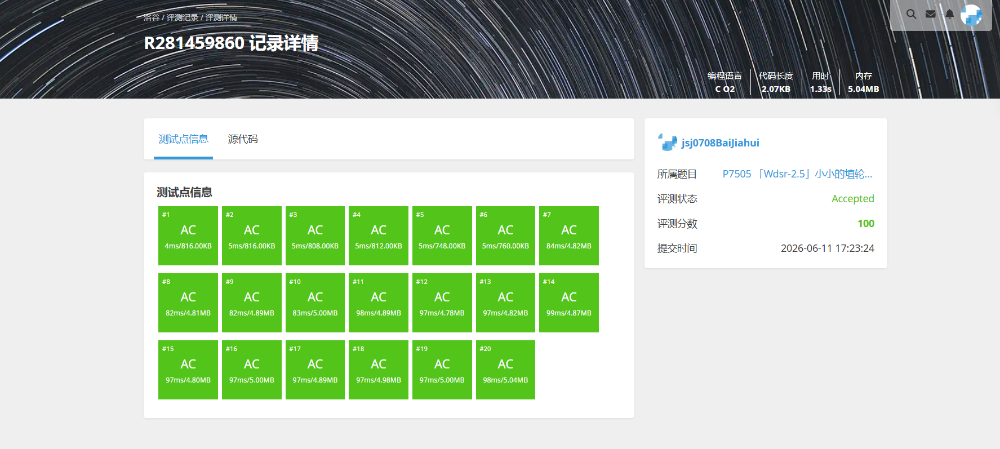

# 解题报告

姓名：白家辉

班级：计算机大类2508

学号：8208250831

日期：2026.6.11

# 总览

本次解题报告中，共完成 4 道题目。

| 题目名称 | 难度 | 知识点 |
| -------- | ---- | ------ |
|B3616 队列|普及|队列、模拟|
|P1540 机器翻译|普及|队列、模拟、缓存思想|
|P2058 海港|普及/提高-|队列、滑动窗口、计数统计|
|P7505 小小的埴轮兵团|普及|排序、二分、懒处理|

# （一）队列

## 题目信息

题目链接：[https://www.luogu.com.cn/problem/B3616](https://www.luogu.com.cn/problem/B3616)

知识点：队列、模拟

## 题目简述

> 需要维护一个初始为空的队列，并依次处理若干操作。操作包括在队尾加入一个数、弹出队首元素、查询队首元素，以及查询当前队列长度。
>
> 当执行弹出或查询队首操作时，如果队列为空，需要输出对应的错误提示信息。
>
> 对于全部数据，操作次数不超过 $10^4$，插入的整数不超过 $10^6$。
>
> 1.00s，128MB。

## 题目分析

### 1. 读题
这是一道标准的队列模板题。题目给出的四类操作都围绕“先进先出”这一规则展开，不涉及随机访问，也不需要中间插入删除。

### 2. 性质观察
由于所有操作都只会在队首和队尾发生，所以最自然的数据结构就是队列。尤其是：
1. 入队操作对应在队尾加入元素；
2. 出队操作对应删除队首元素；
3. 查询队首和队列长度也都能直接从队列状态得到。

### 3. 程序设计思路
按输入顺序依次处理每条指令：
1. 若操作为 `1 x`，就把 `x` 放入队尾；
2. 若操作为 `2`，先判断队列是否为空，不空则弹出队首，否则输出错误信息；
3. 若操作为 `3`，先判断队列是否为空，不空则输出队首，否则输出错误信息；
4. 若操作为 `4`，直接输出当前队列中的元素个数。

当前代码中没有调用现成队列容器，而是直接用数组 `arr` 配合 `front`、`rear` 两个指针手写出了一个顺序队列，因此实现和题目操作是一一对应的。

### 4. 数据结构与算法选择
本题直接选择普通队列即可。当前实现采用的是“定长数组 + 队头队尾指针”的手写写法，既贴合语义，也方便直接输出错误信息与长度。

### 5. 时空复杂度分析
- 时间复杂度：$O(n)$，每条操作都只需常数时间处理。
- 空间复杂度：$O(n)$，最坏情况下所有元素都可能仍保留在队列中。

## 代码实现


```c
#define _CRT_SECURE_NO_WARNINGS
#include<stdio.h>
#include<stdlib.h>
#define maxsize 10000
int arr[maxsize] = { 0 };
int front = 0;
int rear = 0;
void push(int x)
{
    arr[rear] = x;
    rear++;
}
void pop()
{
    if (rear == front)
        printf("ERR_CANNOT_POP\n");
    else
        front++;
}
void query()
{
    if (front == rear)
    {
        printf("ERR_CANNOT_QUERY\n");
        return;
    }
    else
    {
        printf("%d\n",arr[front]);
        return;
    }
}
void size()
{
    printf("%d\n", rear-front);
}
int main()
{
    int n;
    scanf("%d", &n);
    n;
    while (n--)
    {
        int temp = 0;
        scanf("%d",&temp);
        if (temp == 1)
        {
            int x = 0;
            scanf(" %d", &x);
            push(x);
        }
        else if (temp == 2)
        {
            pop();
        }
        else if (temp == 3)
        {
            query();
        }
        else if (temp == 4)
        {
            size();
        }
    }
    return 0;
}
```

---

# （二）机器翻译

## 题目信息

题目链接：[https://www.luogu.com.cn/problem/P1540](https://www.luogu.com.cn/problem/P1540)

知识点：队列、模拟、缓存思想

## 题目简述

> 机器的内存中最多只能同时存放 $M$ 个单词。给出一篇长度为 $N$ 的文章，每次遇到一个单词时，如果它已经在内存里，就不需要查词典；如果不在内存里，就必须查一次词典，并将它放入内存。
>
> 当内存已满又要放入新单词时，需要按照“最早进入内存的单词先被移出”的规则腾出位置。
>
> 对于全部数据，$1 \le M \le 100$，$1 \le N \le 1000$。
>
> 1.00s，128MB。

## 题目分析

### 1. 读题
题目本质是在模拟一个容量有限的单词缓存。每读到一个单词，都要判断它是否已经在缓存中；如果不在，就产生一次查词典操作。

### 2. 性质观察
内存满时按照“先进入先出去”的规则删除旧单词，这正是队列的典型特征。因此可以把当前内存中的单词看成一个队列。同时还需要支持“某个单词是否已经在内存中”的判断。

### 3. 程序设计思路
顺序处理文章中的每个单词：
1. 先判断该单词是否已经在内存中；
2. 如果已经存在，直接跳过；
3. 如果不存在，查词典次数加一；
4. 若此时内存未满，就直接加入队尾；
5. 若内存已满，就先弹出队首最早进入的单词，再把当前单词加入队尾。

由于本题数据范围较小，即使直接在线性结构中查找是否存在，也可以通过。

当前代码采用的是长度为 `M` 的数组保存当前内存内容，并用 `temp % M` 的位置循环覆盖最早装入的单词，本质上等价于用一个小型循环队列来模拟 FIFO 缓存替换。

### 4. 数据结构与算法选择
核心结构是队列，用来维护单词进入内存的先后顺序。当前实现进一步简化成“数组顺序查找 + 循环覆盖”，由于 `M` 最大只有 `100`，这样写也足够通过，不需要额外引入哈希结构。

### 5. 时空复杂度分析
- 时间复杂度：$O(MN)$，每次读单词时最多在线性范围内检查一次是否存在。
- 空间复杂度：$O(M)$，内存中最多只保存 $M$ 个单词。

在本题的限制下，这个复杂度完全可以接受。

## 代码实现


```c
#include<stdio.h>
#include<string.h>
#include<stdlib.h>
int main()
{
	int M, N;
	int temp = 0;
	scanf("%d %d", &M, &N);
	int sum = 0;
	int* arr = (int*)malloc(M * sizeof(int));
	for (int i = 0; i < M; i++)
	{
		arr[i] = -1;
	}
	for (int i = 0; i < N; i++)
	{
		int flat = 0;
		int num = 0;
		scanf("%d", &num);
		for (int j = 0; j < M; j++)
		{
			if (arr[j] == num)
				flat = 1;
		}
		if (flat == 0)
		{
			sum++;
			arr[temp % M] = num;
			temp++;
		}
	}
	printf("%d\n", sum);
}
```

---

# （三）海港

## 题目信息

题目链接：[https://www.luogu.com.cn/problem/P2058](https://www.luogu.com.cn/problem/P2058)

知识点：队列、滑动窗口、计数统计

## 题目简述

> 按时间顺序给出若干艘船到达海港的信息。每艘船有一个到达时刻，以及若干名乘客的国籍编号。
>
> 对于每一艘刚到达的船，都要统计当前时间往前推 $86400$ 秒之内到港的所有船中，一共出现过多少种不同国籍。
>
> 对于全部数据，船只数量可达到 $10^5$，所有乘客总人数不超过 $3 \times 10^5$。
>
> 1.00s，128MB。

## 题目分析

### 1. 读题
题目不是让我们统计全部历史上的国籍，而是每到一个时刻，只考虑最近一天内到港的船只。随着时间推进，旧船会失效，新船会加入，这是一个明显的动态区间统计问题。

### 2. 性质观察
由于船只按时间顺序输入，所以“最近 $86400$ 秒内的船”一定对应一个连续时间窗口。窗口左端只会不断向右移动，右端随着新船到来不断扩展，这种模式很适合用队列或双指针维护。

同时，还需要知道某个国籍在当前窗口内出现了几次，这样当某艘旧船移出窗口时，才能正确减少统计。

### 3. 程序设计思路
处理每艘船时：
1. 先把这艘船上的所有乘客加入当前窗口，并更新对应国籍出现次数；
2. 再不断检查窗口最前面的船是否已经超出最近一天的时间范围；
3. 若超出，就把该船上的所有乘客从统计中移除；
4. 每当某个国籍出现次数从 `0` 变成正数时，说明新增了一种国籍；
5. 每当某个国籍出现次数降回 `0` 时，说明当前窗口内少了一种国籍；
6. 最后输出当前不同国籍总数。

当前代码中用结构体数组 `q` 顺序保存每艘船的时间、乘客数和国籍列表，再用 `head` 指针表示窗口左端，因此实现上更像“数组模拟队列 + 计数数组维护答案”。

### 4. 数据结构与算法选择
本题适合使用队列维护“还在最近一天内”的船只，再配合计数数组或映射记录每种国籍的出现次数。当前实现用结构体数组和 `head` 下标代替真正的出队操作，因此逻辑直观，也便于在最后统一释放内存。

### 5. 时空复杂度分析
- 时间复杂度：$O(K)$，其中 $K$ 为所有乘客总人数。每位乘客只会被加入统计一次、移出统计一次。
- 空间复杂度：$O(K)$，需要保存窗口中的船只信息以及各国籍出现次数。

这一复杂度能够满足题目的大数据范围要求。

## 代码实现


```c
#include<stdio.h>
#include<string.h>
#include<stdlib.h>
#define max 100001
typedef struct ship
{
	int time;
	int num;
	int* country;
}ship;

int main()
{
	int n = 0;
	scanf("%d", &n);
	ship* q = (ship*)malloc(n * sizeof(ship));
	int* cnt = (int*)calloc(max, sizeof(int));
	int ans = 0;
	int head = 0;
	for (int i = 0; i < n; i++)
	{
		int t, k;
		scanf("%d %d", &t, &k);
		q[i].time = t;
		q[i].num = k;
		q[i].country = (int*)malloc(k * sizeof(int));
		for (int j = 0; j < k; j++)
		{
			scanf("%d", &q[i].country[j]);
			int c = q[i].country[j];
			if (cnt[c] == 0)
			{
				ans++;
			}
			cnt[c]++;
		}
		int mint = t - 86400;
		while (head <= i && q[head].time <= mint)
		{
			for (int j = 0; j < q[head].num; j++)
			{
				int temp = q[head].country[j];
				cnt[temp]--;
				if (cnt[temp] == 0)
					ans--;
			}
			head++;
		}
		printf("%d\n", ans);
	}
	for (int i = 0; i < n; i++)
	{
		free(q[i].country);
	}
	free(q);
	free(cnt);
	return 0;
}
```

---

# （四）小小的埴轮兵团

## 题目信息

题目链接：[https://www.luogu.com.cn/problem/P7505](https://www.luogu.com.cn/problem/P7505)

知识点：排序、二分、懒处理

## 题目简述

> 数轴上有 $n$ 个埴轮，初始位置都在区间 $[-k,k]$ 内。之后会进行若干次操作，可能让所有埴轮同时向左或向右移动若干距离，也可能询问当前还有多少个埴轮仍在区间 $[-k,k]$ 内。
>
> 一旦某个埴轮离开该区间，就视为消失，之后不会重新回来。
>
> 对于全部数据，$n,m \le 3 \times 10^5$，位置信息和移动距离范围都很大。
>
> 1.00s，128MB。

## 题目分析

### 1. 读题
表面上看，每次移动后都要重新判断每个埴轮是否还在合法区间内；但如果真的每次都遍历全部埴轮，在 $3 \times 10^5$ 级别的数据下显然无法接受。

### 2. 性质观察
所有仍存活的埴轮每次都会整体平移同样的距离，因此它们之间的相对顺序不会改变。也就是说，我们不需要真的去修改每个埴轮的位置，只需要记录“整体偏移量”即可。

当整体偏移量确定后，一个埴轮是否还在区间内，只取决于它的初始位置是否落在某个有效范围中。这样问题就转化成：在排序后的初始位置数组中，统计有多少元素落在某个区间里。

### 3. 程序设计思路
先将所有初始位置排序，并维护当前合法初始位置对应的区间边界：
1. 用 `l`、`r` 表示在当前整体移动下，哪些初始位置仍然会落在 `[-k,k]` 内；
2. 每次左移或右移时，只更新这两个边界值，而不真的修改每个埴轮的位置；
3. 再利用一个 `check` 函数不断收缩有序数组中的左右指针 `lowerbound`、`higherbound`；
4. 查询时，直接由这两个指针之间还剩多少个元素得到答案。

当前代码的核心不是“每次重新二分”，而是“排序后双指针只向内收缩”，因此实现上更偏向懒处理。

### 4. 数据结构与算法选择
本题不需要真的维护动态删除，而是利用“整体平移不改变相对顺序”这一性质，选择“排序 + 合法区间边界维护 + 双指针收缩”的方法。当前实现中位置数组使用 `long long` 保存，也顺带规避了大范围移动时的溢出问题。

### 5. 时空复杂度分析
- 时间复杂度：排序为 $O(n \log n)$，之后左右边界指针在所有操作过程中总共只会向内移动 $O(n)$ 次，因此后续处理可视为均摊线性，总复杂度约为 $O(n \log n + n + m)$。
- 空间复杂度：$O(n)$，只需要保存初始位置数组。

这正是应对大规模输入的高效做法。

## 代码实现



```c
#include<stdio.h>
#include<stdlib.h>

// 比较函数改为long long，避免减法溢出
int cmp_int(const void* e1, const void* e2) 
{
    long long* p1 = (long long*)e1;
    long long* p2 = (long long*)e2;
    if (*p1 < *p2) return -1;
    if (*p1 > *p2) return 1;
    return 0;
}

// pos改为long long数组，l和r改为long long指针
void check(long long pos[], int* lowerbound, int* higherbound, long long* l, long long* r) 
{
    while (*lowerbound <= *higherbound && pos[*lowerbound] < *l)
        (*lowerbound)++;
    while (*lowerbound <= *higherbound && pos[*higherbound] > *r)
        (*higherbound)--;
}

// pos改为long long数组，l和r改为long long指针，x改为long long
void op1(long long pos[], int n, long long* l, long long* r, int* lowerbound, int* higherbound) 
{
    long long x = 0;
    scanf("%lld", &x);
    (*l) -= x;
    (*r) -= x;
    check(pos, lowerbound, higherbound, l, r);
}

// 同op1的类型修改
void op2(long long pos[], int n, long long* l, long long* r, int* lowerbound, int* higherbound) 
{
    long long x = 0;
    scanf("%lld", &x);
    (*l) += x;
    (*r) += x;
    check(pos, lowerbound, higherbound, l, r);
}

void op3(int lowerbound, int higherbound) 
{
    if (lowerbound > higherbound)
        printf("0\n");
    else
        printf("%d\n", higherbound - lowerbound + 1);
}

int main() 
{
    int n, m, k;
    scanf("%d %d %d", &n, &m, &k);
    // pos数组改为long long
    long long* pos = (long long*)malloc(n * sizeof(long long));
    // l和r改为long long
    long long l = -k;
    long long r = k;
    int lowerbound = 0;
    int higherbound = n - 1;
    // 输入用%lld
    for (int i = 0; i < n; i++)
        scanf("%lld", &pos[i]);
    qsort(pos, n, sizeof(long long), cmp_int);
    check(pos, &lowerbound, &higherbound, &l, &r);
    for (int i = 0; i < m; i++) {
        int temp = 0;
        scanf("%d", &temp);
        switch (temp) {
        case 1:
            op1(pos, n, &l, &r, &lowerbound, &higherbound);
            break;
        case 2:
            op2(pos, n, &l, &r, &lowerbound, &higherbound);
            break;
        case 3:
            op3(lowerbound, higherbound);
            break;
        }
    }
    free(pos);
    return 0;
}
```
