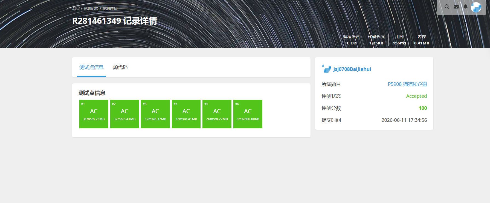
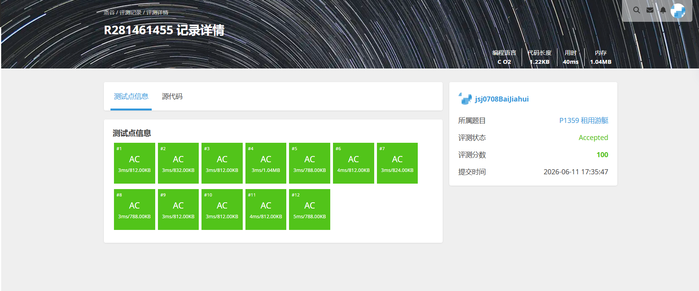
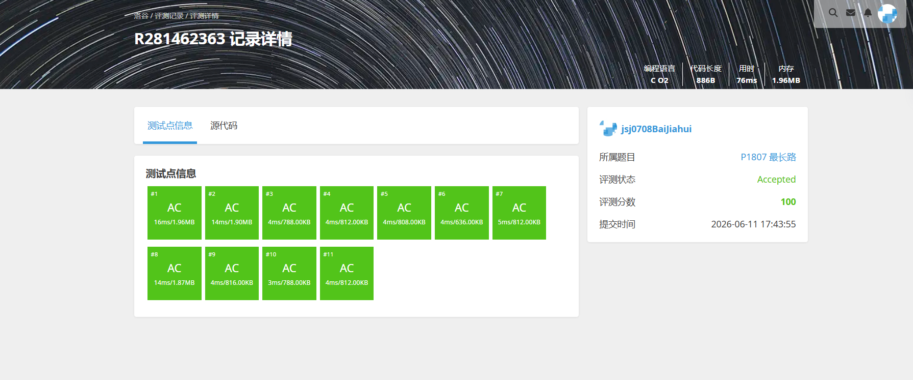

# 解题报告

姓名：白家辉

班级：计算机大类2508

学号：8208250831

日期：2026.6.11

# 总览

本次解题报告中，共完成 4 道题目。

| 题目名称 | 难度 | 知识点 |
| -------- | ---- | ------ |
|P1359 租用游艇|普及|动态规划、最短路思想|
|P5318 查找文献|普及|图遍历、DFS、BFS|
|P1807 最长路|普及/提高-|DAG 最长路、动态规划、拓扑序|
|P5908 猫猫和企鹅|普及|树遍历、深度统计、BFS|

# （一）租用游艇

## 题目信息

题目链接：[https://www.luogu.com.cn/problem/P1359](https://www.luogu.com.cn/problem/P1359)

知识点：动态规划、最短路思想

## 题目简述

> 长江上共有 $n$ 个游艇出租站，游客可以在上游某站租船，并在任意下游站还船。题目给出了任意两个满足 $i<j$ 的站点之间的租金 $r_{i,j}$。
>
> 现在要求从 $1$ 号站到 $n$ 号站，计算最少需要花费多少租金。
>
> 对于全部数据，$1 \le n \le 200$。
>
> 1.00s，128MB。

## 题目分析

### 1. 读题
虽然题目包装成“租船换乘”，但本质上是在一个编号单调递增的有向图里，从结点 `1` 走到结点 `n`，边权是租金，要求最小总代价。

### 2. 性质观察
因为只能从上游去下游，所以任意转移都满足 `i<j`。这意味着图中不存在回边，可以直接按照站点编号从小到大进行状态转移。

如果设 `dp[j]` 表示到达第 `j` 个站点的最小租金，那么最后一次租船一定是从某个 `i<j` 的站点直接到 `j`，于是有：
`dp[j] = min(dp[i] + r[i][j])`。

### 3. 程序设计思路
1. 读入上三角租金矩阵；
2. 初始化 `dp[1]=0`，其他位置为一个较大的数；
3. 按站点编号从小到大计算每个 `dp[j]`；
4. 对于每个 `j`，枚举所有 `i<j`，尝试用 `dp[i]+r[i][j]` 更新它；
5. 最终 `dp[n]` 就是答案。

### 4. 数据结构与算法选择
本题使用一维动态规划即可。虽然也可以理解成最短路，但由于结点编号天然满足拓扑顺序，直接 DP 会更简洁。

### 5. 时空复杂度分析
- 时间复杂度：$O(n^2)$，需要枚举所有可能的转移。
- 空间复杂度：$O(n^2)$ 或 $O(n)$。若保存完整租金矩阵则为 $O(n^2)$，只保留当前需要的数据也可压缩。

在 $n \le 200$ 的范围下，这样的复杂度非常轻松。

## 代码实现



```c
Talk is weak，show your code plz.
```

---

# （二）查找文献

## 题目信息

题目链接：[https://www.luogu.com.cn/problem/P5318](https://www.luogu.com.cn/problem/P5318)

知识点：图遍历、DFS、BFS

## 题目简述

> 有 $n$ 篇文章和 $m$ 条引用关系，若存在一条边 `X -> Y`，表示文章 `X` 的参考文献中包含 `Y`。现在从 `1` 号文章开始阅读，需要分别输出按规则进行 DFS 和 BFS 时的访问顺序。
>
> 如果同一时刻有多篇可以访问的文章，必须优先访问编号更小的那一篇。
>
> 对于全部数据，$n \le 10^5$，$m \le 10^6$。
>
> 1.00s，128MB。

## 题目分析

### 1. 读题
题目实际上就是一张有向图，从结点 `1` 出发做两次遍历：
1. 一次深度优先遍历；
2. 一次广度优先遍历。

需要注意的是，只遍历从 `1` 号文章能够到达的部分，不要求访问整张图中的所有结点。

### 2. 性质观察
题目要求“若有多篇可以参阅，先看编号较小的”，这意味着邻接点的访问顺序不能随意。为了让 DFS 和 BFS 都满足这个规则，通常需要先把每个结点的出边按编号从小到大排序。

### 3. 程序设计思路
1. 用邻接表存图；
2. 对每个结点的邻接表排序，使较小编号优先；
3. 从结点 `1` 出发进行 DFS，记录访问顺序；
4. 清空访问标记后，再从结点 `1` 出发进行 BFS，记录访问顺序；
5. 最后分别输出两种遍历结果。

### 4. 数据结构与算法选择
本题使用邻接表最合适，因为边数很多。算法上分别采用 DFS 和 BFS 即可，其中：
1. DFS 负责体现“尽量往深处走”；
2. BFS 负责体现“逐层扩展”；
3. 排序保证同层或同分支下的访问次序正确。

### 5. 时空复杂度分析
- 时间复杂度：遍历部分为 $O(n+m)$，若考虑排序，总复杂度可记为 $O(m \log m)$ 级别。
- 空间复杂度：$O(n+m)$，需要邻接表和访问标记。

面对 $10^6$ 级别的边数，邻接表是必要选择。

## 代码实现



```c
Talk is weak，show your code plz.
```

---

# （三）最长路

## 题目信息

题目链接：[https://www.luogu.com.cn/problem/P1807](https://www.luogu.com.cn/problem/P1807)

知识点：DAG 最长路、动态规划、拓扑序

## 题目简述

> 给定一个带权有向无环图，顶点编号为 `1` 到 `n`，边满足 `u < v`。要求求出从 `1` 到 `n` 的最长路径长度。
>
> 若 `1` 无法到达 `n`，则输出 `-1`。
>
> 对于全部数据，$n \le 1500$，$m \le 5 \times 10^4$，边权允许为负数。
>
> 1.00s，128MB。

## 题目分析

### 1. 读题
这道题要求的是最长路，而不是最短路。若图中允许有环，最长路通常会比较麻烦，但题目已经说明这是有向无环图，因此问题会简单很多。

### 2. 性质观察
由于所有边都满足 `u<v`，顶点编号本身就是一个合法的拓扑序。这样就不需要额外做拓扑排序，直接按 `1` 到 `n` 的顺序做状态转移即可。

设 `dp[v]` 表示从 `1` 走到 `v` 的最长路径长度，那么对于每条边 `u -> v`，都可以尝试用：
`dp[v] = max(dp[v], dp[u] + w)`。

需要注意的是，边权可以为负，因此不能把未到达状态初始化为 `0`，而应初始化为负无穷。

### 3. 程序设计思路
1. 用邻接表存储所有边；
2. 初始化 `dp[1]=0`，其余为负无穷；
3. 按顶点编号从小到大枚举每个 `u`；
4. 若 `dp[u]` 有效，则遍历它的所有出边，更新终点的最长路值；
5. 最后若 `dp[n]` 仍为负无穷，说明无法到达，输出 `-1`，否则输出 `dp[n]`。

### 4. 数据结构与算法选择
本题适合使用“拓扑序上的动态规划”。由于编号已经天然有序，写起来会比通用 DAG 最长路模板更直接。

### 5. 时空复杂度分析
- 时间复杂度：$O(n+m)$，每条边只会被扫描一次。
- 空间复杂度：$O(n+m)$，需要邻接表和 DP 数组。

这完全能够满足题目的数据范围。

## 代码实现


```c
Talk is weak，show your code plz.
```

---

# （四）猫猫和企鹅

## 题目信息

题目链接：[https://www.luogu.com.cn/problem/P5908](https://www.luogu.com.cn/problem/P5908)

知识点：树遍历、深度统计、BFS

## 题目简述

> 有 $n$ 个居住区和 $n-1$ 条道路，保证整张图连通，因此它本质上是一棵树。除 `1` 号居住区外，每个居住区住着一只小企鹅。
>
> 一只猫猫从 `1` 号居住区出发，只愿意拜访距离自己不超过 `d` 的小企鹅。要求输出它最多能拜访多少只。
>
> 对于全部数据，$1 \le n,d \le 10^5$。
>
> 1.00s，128MB。

## 题目分析

### 1. 读题
题目中的“道路长度都为 1，整张图连通且边数为 `n-1`”说明这是一个无权树。问题就转化成：求整棵树中，有多少个结点到根结点 `1` 的距离不超过 `d`。

### 2. 性质观察
在树中，从根到任意结点的路径唯一，所以“距离”实际上就是该结点的深度。于是只要统计深度不超过 `d` 的结点数即可。

但要注意 `1` 号居住区没有企鹅，因此即使它的深度为 `0`，也不应被计入答案。

### 3. 程序设计思路
1. 用邻接表建树；
2. 从结点 `1` 开始做一次 BFS 或 DFS；
3. 在遍历过程中记录每个结点到根的距离；
4. 若某个结点的距离 `<= d` 且它不是根结点，就把答案加一；
5. 所有结点处理完成后输出答案。

### 4. 数据结构与算法选择
本题适合使用邻接表配合 BFS。因为边权全为 `1`，BFS 天然可以按层扩展，第一层对应距离 `1`，第二层对应距离 `2`，统计起来很自然。

### 5. 时空复杂度分析
- 时间复杂度：$O(n)$，整棵树的每条边和每个结点最多访问一次。
- 空间复杂度：$O(n)$，需要邻接表、队列和访问标记。

在线性复杂度下可以稳妥通过 `10^5` 规模的数据。

## 代码实现



```c
Talk is weak，show your code plz.
```
